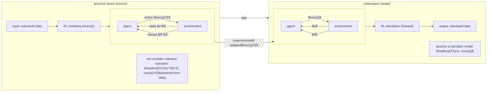

# Adaptive action supervision in reinforcement learning from real-world multi-agent demonstrations

Keisuke Fujii1,2,3 ORCID icona, Kazushi Tsutsui1, Atom Scott1, Hiroshi Nakahara1, Naoya Takeishi4,2, Yoshinobu Kawahara5,2

1 *Graduate School of Informatics, Nagoya University, Nagoya, Aichi, Japan.*

2 *Center for Advanced Intelligence Project, RIKEN, Osaka, Osaka, Japan.*

3 *PRESTO, Japan Science and Technology Agency, Tokyo, Japan*

4 *The Graduate School of Engineering, The University of Tokyo, Tokyo, Japan*

5 *Graduate School of Information Science and Technology, Osaka University, Osaka, Japan*

a fujii@i.nagoya-u.ac.jp

**Keywords:** Neural networks, Trajectory, Simulation, Multi-agent

**Abstract:** Modeling of real-world biological multi-agents is a fundamental problem in various scientific and engineering fields. Reinforcement learning (RL) is a powerful framework to generate flexible and diverse behaviors in cyberspace; however, when modeling real-world biological multi-agents, there is a domain gap between behaviors in the source (i.e., real-world data) and the target (i.e., cyberspace for RL), and the source environment parameters are usually unknown. In this paper, we propose a method for adaptive action supervision in RL from real-world demonstrations in multi-agent scenarios. We adopt an approach that combines RL and supervised learning by selecting actions of demonstrations in RL based on the minimum distance of dynamic time warping for utilizing the information of the unknown source dynamics. This approach can be easily applied to many existing neural network architectures and provide us with an RL model balanced between reproducibility as imitation and generalization ability to obtain rewards in cyberspace. In the experiments, using chase-and-escape and football tasks with the different dynamics between the unknown source and target environments, we show that our approach achieved a balance between the reproducibility and the generalization ability compared with the baselines. In particular, we used the tracking data of professional football players as expert demonstrations in football and show successful performances despite the larger gap between behaviors in the source and target environments than the chase-and-escape task.

# 1 INTRODUCTION

Modeling real-world biological multi-agents is a fundamental problem in various scientific and engineering fields. For example, animals, vehicles, pedestrians, and athletes observe others' states and execute their own actions in complex situations. Pioneering works have proposed rule-based modeling approaches such as in human pedestrians (Helbing and Molnar, 1995) and animal groups (Couzin et al., 2002) for each domain using hand-crafted functions (e.g., social forces). Recent advances in reinforcement learning (RL) with neural network approaches have enabled flexible and diverse modeling of such behaviors often in cyberspace (Ross and Bagnell, 2010; Ho and Ermon, 2016).

However, when modeling real-world biological multi-agents, domain gaps may occur between behaviors in the sources (real-world data) with unknown dynamics and targets (cyberspace in RL) as shown in Fig. 1. The opposite configuration of the source and target has been actively studied and known as Sim-to-Real (Rusu et al., 2017), which transfers the knowledge from cyberspace or human demonstrations to almost known source dynamics (simulation in Sim-to-Real) such as real-world robotics (Schaal, 1996; Kolter et al., 2007). In contrast, domain adaptation in real-world situations where the parameters of the source environment are often unknown cannot utilize explicit dynamics regarding source environments (e.g. transition model). In other words, we consider a Real-to-Sim domain adaptation problem in which the unknown source and the target are real-world data

Figure 1: Our problem setting and solution. We consider a Real-to-Sim domain adaptation problem in which the source and target are real-world data in a physical space and simulated data in cyberspace, respectively. We first perform inverse RL modeling from real-world data, but we do not consider unknown transition model $\mathcal{T}^E$ because we can obtain the next state from demonstration data. We then perform forward RL with a temporal transition model $\mathcal{T}$, but there should be a discrepancy between $\mathcal{T}^E$ and $\mathcal{T}$. Since we cannot access the information of $\mathcal{T}^E$, our solution comprises the supervised learning using the observed joint action $\vec{a}$ and adapted $\vec{a}^E$ in cyberspace for the learning of the Q function (see also Section 3).

in a physical space and simulated data in cyberspace, respectively (Fig. 1). Team sports (e.g., football) and biological multi-agent motions (e.g., chase-and-escape) are examples that can be addressed with the above approach. Agents observe others' states and execute planned actions (Fujii, 2021), and particularly in team sports, most of the governing equations are unknown. In such complex real-world behaviors, studies have separately investigated RL in cyberspace for flexible adaptation to complex environments (Kurach et al., 2020; Li et al., 2021) and data-driven modeling for reproducing real-world behaviors (Zheng et al., 2016; Le et al., 2017; Fujii et al., 2021). However, given the gap between these forward and backward approaches (see Fig. 1) in multi-agent RL (MARL) scenarios, an integrated approach to combine both strengths will be required.

In this paper, we propose a method for adaptive action supervision in RL from real-world multi-agent demonstrations. To utilize the information of unknown source dynamics, we adopt an approach that combines RL and supervised learning by selecting the action of demonstrations based on the minimum distance between trajectories in source and target environments. Our goal is to balance reproducibility as imitations and generalization ability to obtain rewards (e.g., when different initial values are given in the same environment). These are mutually independent in general, and our approach that combines RL and supervised learning will help us achieve our goal. Compared with the case of Sim-to-Real in robotics, there have been no simulators for real-world agents with explicit dynamics in biological multi-agent scenarios. In our experiments, we use simple chase-and-escape and football tasks with different dynamics between unknown source and target environments.

In summary, our main contributions are as follows.

(1) We propose a novel method for adaptive action supervision in RL from multi-agent demonstration, which will bridge the gap between RL in cyberspace and real-world data-driven modeling. (2) We adopt an approach that combines RL and supervised learning by selecting actions of demonstrations in RL based on the minimum distance of dynamic time warping (DTW) (Vintsyuk, 1968) to utilize the information of the unknown source dynamics. This approach can be easily applied to existing neural network architectures and provide an RL model balanced between reproducibility as imitation and generalization ability. (3) In the experiments, using a chase-and-escape and football tasks with the different dynamics between the unknown source and target environments, our approach struck a balance between the reproducibility and generalization compared with the baselines. In particular, we used the tracking data of professional football players as expert demonstrations in a football RL environment and show successful performances. Our framework can estimate values for real agent behaviors and decision making if the model can imitate behaviors of players, which may be difficult for either data-driven and RL approaches.

In the remainder, we describe the background of our problem and our method in Sections 2 and 3, overview related works in Section 4, and present results and conclusions in Sections 5 and 6.

## 2 BACKGROUND

Here, we consider a sequential decision-making setting of multiple agents interacting with a fully observable environment. We consider a forward RL model in Fig. 1 right, defined as a tuple $(K, S, A, \mathcal{T}, R, \gamma)$, where $K$ is the fixed number of agents; $S$ is the set of states $s$; $A = [A_1, \dots, A_K]$ represents the set of joint action $\vec{a} \in A$ (for a variable number of agents), and

$A_k$ is the set of local action $a_k$ that agent $k$ can take; $\mathcal{T}(s'|s, \vec{a}) : S \times A \times S \rightarrow [0, 1]$ is the transition model for all agents; $R = [R_1, \dots, R_K] : S \times A \rightarrow \mathbb{R}^K$ is the joint reward function; and $\gamma \in (0, 1]$ is the discount factor. In on-policy RL, the agent learns a policy $\pi_k : S_k \times A \rightarrow [0, 1]$, where $S_k$ is a set of states for $k$.

The objective of agent $k$ is to discover the policy $\pi_k$ that maps states to actions, thereby maximizing the expected total reward over the agent's lifespan, i.e., $G_k = \sum_t^T \gamma^t R_{k,t}$, where $R_{k,t}$ is the reward of agent $k$ at time $t$ and $T$ is the time horizon. The value $Q_k^\pi(s_k, a_k)$ related to a specific state-action pair $(s_k, a_k)$ serves as a expected future reward that can be acquired from $(s_k, a_k)$ when adhering to policy $\pi_k$. The optimal value function $Q^*(s, a)$, offering the maximal values across all states, is determined by the Bellman equation:

$$Q_k^*(s_k, a_k) = \mathbb{E} \left[ R_k(s_k, a_k) + \gamma \sum_{s'_k} \mathcal{T}_k(s'_k|s_k, a_k) \max_{a'_k} Q_k^*(s'_k, a'_k) \right], \tag{1}$$

where $\mathcal{T}_k$ is the transition model of agent $k$. The optimal policy $\pi_k$ is then $\pi_k(s_k) = \text{argmax}_{a_k \in A} Q_k^*(s_k, a_k)$. Since our approach can be easily applied to existing neural network in model-free RL, we consider both independent policy for each agent and the joint policy $\vec{\pi}$ inducing the joint action-value function $Q_{tot}^{\vec{\pi}}(s, \vec{a}) = \mathbb{E}_{s_{0:\infty}, \vec{a}_{0:\infty}} [\sum_{t=0}^\infty \gamma^t R_t \mid s_0 = s, \vec{a}_0 = \vec{a}, \vec{\pi}]$, where $R_t$ is the value of the joint reward at time $t$.

In a multi-agent system in complex real-world environments (e.g., team sports), (i) transition functions are difficult to design explicitly. Instead, (ii) if we can utilize the demonstrations of expert behaviors (e.g., trajectories of professional sports players), we can formulate and solve it as a machine learning problem (e.g., learning from demonstration). In other words, if the problem falls in the case that satisfies the two conditions, (i) and (ii), learning from demonstration is a better option than a pure RL approach by constructing the environment without demonstrations. As shown in Fig. 1 right, we perform forward RL with a temporal transition model $\mathcal{T}(s'|s, \vec{a})$, but there should be a discrepancy between $\mathcal{T}$ and $\mathcal{T}^E(s'^E|s^E, \vec{a}^E)$ in Fig. 1 left. Since we cannot access the information of $\mathcal{T}^E$, our solution is the supervised learning using the observed joint action $\vec{a}$ and adapted $\vec{a}^E$ in cyberspace for the learning of the $Q$ function (see also Section 3). Next, we introduce DQN framework according to the previous work (Hester et al., 2018). For simplicity, we describe the following explanation using a single-agent RL framework and omit the agent index $k$.

DQN leverages a deep neural network to approximate the value function $Q(s, a)$ (Mnih et al., 2015). The network is designed to generate a set action values $Q(s, \cdot; \theta)$ for a given state input $s$, where $\theta$ represents the network's parameters. DQN employs a separate target network, which is duplicated from the 

 main network after every $\tau$ steps to ensure more consistent target Q-values. The agent records all of its experiences in a replay buffer $\mathcal{D}_{replay}$, which is subsequently uniformly sampled for network updates.

The double Q-learning updates the current network by computing the argmax over the subsequent state values and uses the target network for action value (Van Hasselt et al., 2016). The loss for Double DQN (DDQN) is defined as:

$$J_{DQ}(Q) = \sum_t^{T-1} (R_t + \gamma Q(s_{t+1}, a_{t+1}^{\max}; \theta') - Q(s_t, a_t; \theta))^2, \tag{2}$$

where $\theta'$ refers to the parameters of the target network, and $a_{t+1}^{\max} = \text{argmax}_{a_t} Q(s_{t+1}, a_t; \theta)$. The upward bias typically associated with regular Q-learning updates is reduced by separating the value functions employed for these two variables. For more efficient learning, e.g., to sample more significant transitions more frequently from its replay buffer, prioritized experience replay (Schaul et al., 2016) have been used.

# 3 ADAPTIVE ACTION SUPERVISION IN RL

In many real-world settings of RL, we can access observation data of the multi-agent system, but we cannot access an accurate model of the system. To construct an alternative simulator, we want the agent to learn as much as possible from the demonstration data. In particular, we aim to decrease the domain gap between behaviors in the source data and the target environments. Here, we describe our adaptive action supervision approach for RL from demonstrations. We adopt the following three steps according to the deep Q-learning from demonstrations (DQfD) (Hester et al., 2018). The first is pre-training, which learns to imitate the demonstrator. The second is sampling actions from the pre-trained RL model in the target RL environment. The third is training in the RL environment. During the pre-training and training phases, the network is updated with mainly two losses: the 1-step double Q-learning loss in Eq. (2) and a dynamic time-warping supervised classification loss. As mentioned above, the Q-learning loss ensures that the network satisfies the Bellman equation and can be used as a starting point for TD learning. For the second loss, we propose a simple supervised loss for actions and a dynamic time-warping action assignment for efficient pre-training and RL.

The supervised loss is crucial for pre-training because the demonstration data usually covers a narrow part of the state space and does not take all possible actions. Here we consider a single agent case for simplicity (i.e., we removed the notation of agent $k$, but

we can easily extend it to multi-agent cases). The previous DQfD (Hester et al., 2018) introduces a large margin classification loss (Piot et al., 2014):

$$J_{MS}(Q) = \sum_{t}^{T} \max_{a_{t} \in A} [Q(s_{t}, a_{t}) + l(a_{t}^{E}, a_{t})] - Q(s_{t}, a_{t}^{E}), \tag{3}$$

where $a_{t}^{E}$ is the action the expert demonstrator takes in state $s_{t}$ and $l(a_{t}^{E}, a_{t})$ is a margin function that is 0 when $a_{t} = a_{t}^{E}$ and positive otherwise. This loss makes the value of the expert's action higher than the other actions' values, at least by the margin $l$. This approach would be effective for learning maximum Q-function values; however, when limited data are available, the direct approach to maximize the Q-function values for the action of the demonstration may be efficient. Therefore, we propose a simple supervised loss for actions represented by the cross-entropy of softmax values of the Q-function such that

$$J_{AS}(Q_{t}) = - \sum_{t}^{T} \mathbf{a}_{t}^{E} \cdot \log \left(\text{softmax}(\mathbf{q}_{s_{t}})\right), \tag{4}$$

where $\mathbf{a}_{t}^{E} \in \{0, 1\}^{|A|}$ (i.e., one-hot vector of expert actions), $\mathbf{q}_{s_{t}} = [Q(s_{t}, a_{t} = 1), \dots, Q(s_{t}, a = |A|)]$, and the log applies element-wise. Ideally, Q-functions in the source and target domains should be compared, but when using limited data, it would be better that more reliable action data is used as supervised data (rather than using approximated Q-function from data). This loss aims to achieve both reproducibility and generalization by maximizing the Q-function values for the action of the demonstration. A similar idea has been used (Hester et al., 2018; Lakshminarayanan et al., 2016), which used only similar supervised losses in pre-training or RL, respectively, but we explicitly define and use this loss for both pre-training and RL to balance reproducibility and generalization.

Eq. (4) and the large margin classification loss in DQfD (Piot et al., 2014) in Eq. (3) assume that the timestamp of expert action $a_{t}^{E}$ should be the same as that of the RL model $a_{t}$. However, when there is a discrepancy between the source and target environments, the appropriate timestamp of expert actions can vary from that of the RL model actions. Thus, we propose a dynamic time-warping supervised loss for actions, which does not require prior knowledge, utilizing DTW framework (Vintsyuk, 1968), a well-known algorithm in many domains (Sakoe and Chiba, 1978; Myers et al., 1980; Tappert et al., 1990).

Here, we first consider two state sequences in RL and demonstration: $s = s_{1}, \dots, s_{t}, \dots, s_{n}$ and $s^{E} = s_{1}^{E}, \dots, s_{j}^{E}, \dots, s_{m}^{E}$, where $n$ and $m$ are the lengths of the sequences. We select $a_{t'}^{E}$ at $t'$ (which is not necessarily equal to $t$) for demonstration defined as:

$$t' = \underset{j}{\text{argmin}} W(s, s^{E})_{t,j}, \tag{5)$$

where $W(s, s^{E}) \in \mathbb{R}^{n \times m}$ is a warping path matrix based on a local distance matrix $d(s, s^{E}) \in \mathbb{R}^{n \times m}$ (e.g., Euclidean distance) and some constraints such as monotonicity, continuity, and boundary (Sakoe and Chiba, 1978). $W(s, s^{E})_{t,j} \in \mathbb{R}$ is the $(t, j)$ component of $W(s, s^{E})$. Then we obtain the supervised action loss with adaptive action supervision by modifying Eq. (4) such that

$$J_{AS+DA}(Q_{t}) = - \sum_{t}^{T} \mathbf{a}_{t'}^{E} \cdot \log \left(\text{softmax}(\mathbf{q}_{s_{t}})\right). \tag{6}$$

Additionally, we introduce an $\mathcal{L}_{2}$ regularization loss that targets the weights and biases of the network, aiming to avoid overfitting given the small size of the demonstration dataset. The total loss used to update the network is as follows:

$$J(Q) = J_{DQ}(Q) + \lambda_{1} J_{AS+DA}(Q) + \lambda_{2} J_{L_{2}}(Q). \tag{7}$$

The $\lambda$ parameters control the weight of these losses. As an ablation study, we examine removing some of these losses in Section 5. The behavior policy is $\varepsilon$-greedy based on the Q-values. Note that, similarly to DQfD (Hester et al., 2018), after the pre-training phase is finished, the agent starts interacting with the environment, collecting its own data, and adding it to its replay buffer $\mathcal{D}_{replay}$. The agent overwrites the buffer when the buffer is full, but does not overwrite the demonstration data.

# 4 RELATED WORK

In RL from demonstration (Schaal, 1996), the direct approach recovers experts' policies from demonstrations by supervised learning (Pomerleau, 1991; Ross and Bagnell, 2010; Ross et al., 2011) or generative adversarial learning (Ho and Ermon, 2016; Song et al., 2018), which make the learned policies similar to the expert policies (reviewed e.g., by (Ramírez et al., 2022) and (Da Silva and Costa, 2019; Zhu et al., 2020) as transfer learning). However, it is sometimes challenging to collect high-quality (e.g., optimal) demonstrations in many tasks. To obtain better policies from demonstrations, several methods combine imitation learning and RL such as (Silver et al., 2016; Hu et al., 2018; Lakshminarayanan et al., 2016). Some approaches (Vecerik et al., 2017; Hester et al., 2018) have been proposed to explore the sparse-reward environment by learning from demonstrations. Recently, cross domain adaptation problems have been considered to achieve the desired movements such as when changing morphologies (Raychaudhuri et al., 2021; Fickinger et al., 2022). In this case, imitation in terms of reproducibility would be difficult in principle because the problem (e.g., morphology) is changed. Our problem setting is different in terms of achieving both the ability to maximize a reward and

reproducibility (imitation ability) rather than only the former.

These methods are often designed for single-agent tasks and attempt to find better policies by exploring demonstration actions. Many MARL algorithms have been proposed by modifying single-agent RL algorithms for a multi-agent environment. One of the early approaches is independent learning where an agent learns its own policy independently of the other agents (Omidshafiei et al., 2017; Tampuu et al., 2017). Recently, in learning from demonstrations, for example, researchers have proposed MARL as a rehearsal for decentralized planning (Kraemer and Banerjee, 2016), MARL augmented by mixing demonstrations from a centralized policy (Lee and Lee, 2019) with sub-optimal demonstrations, and centralized learning and decentralized execution (Peng et al., 2021). Other researchers have proposed imitation learning from observations under transition model disparity (Gangwani et al., 2022) between the dynamics of the expert and the learner by changing different configuration parameters in cyberspace. However, domain adaptation in RL to cyberspace from real-world multi-agent demonstrations has been rarely investigated.

In RL applications, grid-world, robot Soccer, video games, and robotics have been intensively investigated. Among these domains, robotics and robot soccer are specifically related to real-world problems. In robotics, noise in sensors and actuators, limited computational resources, and the harmfulness of random exploration to people or animals are some of the many challenges (Hua et al., 2021). There have been successful applications of transfer learning in robotics (Schaal, 1996; Kolter et al., 2007; Sakato et al., 2014) (reviewed by e.g., (Zhu and Zhao, 2021)). These are mostly transferred from cyberspace or human demonstrations to real-world robotics (sometimes called Sim-to-Real (Rusu et al., 2017)), which utilize almost known dynamics about the (at least) target dynamics. In contrast, our Real-to-Sim problem cannot utilize explicit dynamics about both source and target environments, and thus such domain adaptation in RL is challenging.

Robot soccer is similar to our task, in particular, RoboCup (the Robot World Cup Initiative) involves attempts by robot teams to actually play a soccer game (Kitano et al., 1997). Some researchers have adopted imitation learning approaches (Hussein et al., 2018; Nguyen and Prokopenko, 2020), but the source and target environments are basically the same. In terms of simulators based on real-world data for data analysis, to our knowledge, there have been no domain adaptation methods in RL from real-world data 

 to simulation environments.

In the tactical behaviors of team sports, agents select an action that follows a policy (or strategy) in a state, receives a reward from the environment and others, and updates the state (Fujii, 2021). Due to the difficulty in modeling the entire framework from data for various reasons (Van Roy et al., 2021), we can adopt two approaches: to estimate the related variables and functions from data (i.e., inverse approach) as a sub-problem, and to build a model (e.g., RL) to generate data in cyberspace (i.e., forward approach, e.g., (Kurach et al., 2020; Li et al., 2021)).

For the former, there have been many studies on inverse approaches. There have been many studies on estimating reward functions by inverse RL (Luo et al., 2020; Rahimian and Toka, 2020) and the state-action value function (Q-function) (Liu and Schulte, 2018; Liu et al., 2020; Ding et al., 2022; Nakahara et al., 2023). Researchers have performed trajectory prediction in terms of the policy function estimation, as imitation learning (Le et al., 2017; Teranishi et al., 2020; Fujii et al., 2020) and behavioral modeling (Zheng et al., 2016; Zhan et al., 2019; Yeh et al., 2019; Fujii et al., 2022; Teranishi et al., 2022) to mimic (not optimize) the policy using neural network approaches. This approach did not consider the reward in RL (and simulation) and usually performed a trajectory prediction.

For the latter approach, researchers have proposed new MARL algorithms with efficient learning, computation, and communication (Roy et al., 2020; Espeholt et al., 2019; Liu et al., 2021; Li et al., 2021). Recently, the ball-passing behaviors in artificial agents of Google Research Football (GFootball) (Kurach et al., 2020) and professional football players were compared (Scott et al., 2022), but a gap still exists between these forward and backward approaches. In other research fields, e.g., for animal behavioral analysis, forward (Banino et al., 2018; Ishiwaka et al., 2022) and backward approaches (Ashwood et al., 2022; Fujii et al., 2021) have also been used separately. Our approach integrates both approaches to combine the reproducibility as imitation and generalization to obtain rewards.

# 5 EXPERIMENTS

The purpose of our experiments is to validate the proposed methods for application to real-world multi-agent modeling, which usually has no explicit equations in a source environment. Hence, for verification of our methods, we first examined a simple but different simulation environment from the demonstration: a predator-prey cooperative and competitive interaction, namely a chase-and-escape task. Next, we in-

Three diagrams showing RL problem settings: (a) Chase-and-escape 2vs1, (b) Football 2vs2, and (c) Football 4vs8.

Figure 2: Our RL problem setting. (a) the predators and prey are represented as gray and black disks, respectively. (b) and (c) are football 2vs2 and 4vs8 tasks, respectively. Yellow circle, yellow line, gray and black circles are ball, goal line, attackers, and defenders, respectively. The play areas are represented by a black square/rectangle surrounding them.

vestigated a football environment with the demonstra-tions of real-world football players. We considered a 2vs2 task for a simple extension of the 2vs1 chase-and-escape task and then a 4vs8 task (4 attackers) for more realistic situations. We basically considered de-centralized multi-agent models, which do not com-municate with each other (i.e., without central con-trol) for simplicity, but in the football 4vs8 task, we also examined centralized models.

Here, we commonly compared our full model DQAAS (deep q-learning with adaptive action su-pervision) to four baseline methods: a simple DQN with DDQN and prioritized experience replay intro-duced in Section 2 (without demonstration), DQfD (Hester et al., 2018), DQAS (deep q-learning with ac-tion supervision), and DQfAD (DQfD with adaptive demonstration using DTW). Using these baselines with the same network architectures for fair compar-isons, we investigated the effect of adaptive action su-pervision. Note that our approach was also used in the pre-trained phase in all tasks. We hypothesized that our approach would find a balance between imi-tation reproducibility and generalization compared to the baselines. In addition, only for the football 4vs8 task requiring more agent interaction, we examined CDS (Li et al., 2021), which is a recent centralized MARL method in GFootball, as a base model. That is, by replacing it with the above DQN, we also in-vestigated the effectiveness of our approach as a cen-tralized MARL method. Our evaluation metrics in the test phase were twofold: one is the DTW distance be-tween the RL model and demonstration trajectories representing imitation reproducibility, and another is the obtained reward by RL agents. We used well-known DTW distance here because it would be easy to verify whether the learning of our model is suc-cessful or not. During the test phase, $\epsilon$ in $\epsilon$-greedy exploration was set to 0 and each agent was made to take greedy actions. With 5 different random seeds, we evaluated the mean and standard error of the per-

formances. We used different initial settings for the test. In the source environment, we did not use the RL environment and just pre-trained the model from demonstration data. It should be noted that our pur-pose is not to develop a state-of-the-art MARL algo-rithms and the strengths of our approach are to enable us to apply it to many existing methods and to pro-vide us with an RL model striking a balance between reproducibility as imitation and generalization.

## 5.1 Performance on Chase-and-escape

First, we verified our method using a chase-and-escape task, in which the predators and prey inter-acted in a two-dimensional world with continuous space and discrete time. The numbers of predators and prey were 2 and 1, respectively. We first describe the common setting between the source (demonstra-tion) and target RL tasks. The environment was constructed by modifying an environment called the predator-prey in Multi-Agent Particle Environment (MAPE) (Lowe et al., 2017; Tsutsui et al., 2022b; Tsutsui et al., 2022a). Following (Tsutsui et al., 2022a), the play area size was constrained to the range of -1 to 1 on the $x$ and $y$ axes, all agent (predator/prey) disk diameters were set to 0.1, obstacles were elimi-nated, and predator-to-predator contact was ignored for simplicity. The predators were rewarded for cap-turing the prey (+1), namely contacting the disks, and punished for moving out of the area (−1), and the prey was punished for being captured by the preda-tor or for moving out of the area (−1).

Fig. 2a shows an example of the chase-and-escape task. The time step was 0.1 s and the time limit in each episode was set to 30 s. The initial position of each episode was randomly selected from a range of -0.5 to 0.5 on the $x$ and $y$ axes. If the predator cap-tured the prey within the time limit, the predator was successful; otherwise, the prey was successful. If one side (predators/prey) moved out of the area, the other side (prey/predators) was deemed successful. There are 13 actions including acceleration in 12 directions

Example RL results of Demonstration, DQfD, and DQAAS in 2vs1 chase-and-escape task.

Figure 3: Example RL results of the baseline (DQfD (Hester et al., 2018), center) and our approach (DQAAS, right), and the demonstration in the source domain (left) in the 2vs1 chase-and-escape task. Histograms are the Q-function values for each action. There are 13 actions including acceleration in 12 directions every 30 degrees in the relative coordinate system (action 0 means moving towards the prey) and doing nothing (action 12: round point).

at every 30 degrees in relative coordinate system and doing nothing. For the relative mobility of predators and prey in both environments, to examine the effect of domain adaptation, we set the same mobility of the prey in the source and target RL environments, but for the predators, we set 120% and 110% of the prey mobility in the source and target RL environments, respectively. The predators did not share the rewards for simplicity.

Before using RL algorithm, we first created the demonstration dataset using the DQN (without data). After learning 10 million episodes based on the previous setting (Tsutsui et al., 2022b), we obtained 500 episodes for demonstration with randomized initial conditions (locations). We split the datasets into 400, 50, and 50 for training, validation, and testing during pre-training, respectively. Then we pretrained and trained the models according to Section 3. To examine the learning performance of the predator movements with the fixed prey movements, we performed RL of all predators with the learned (and fixed) prey. For the target RL, we used 50 train and 10 test episodes from the above 100 episodes for pretrain validation and testing (i.e., we did not use the test condition in the target RL during the pre-training and training phases).

The model performance was evaluated by computational simulation of the 10 test episodes as the test phase using the trained models. The termination conditions in each episode were the same as in training. We calculated and analyzed the proportion of successful predation and DTW distance between the source and target trajectories in the test phase.

We then show the proportion of successful predation and DTW distance between the source and target trajectories for each model in Table 1. The results show that our approaches (DQAAS) achieved better performances for both indicators than baselines. The

<table>
  <thead>
    <tr>
        <th> </th>
        <th colspan="2">Reward</th>
        <th colspan="2">DTW distance</th>
    </tr>
    <tr>
        <th> </th>
        <th>pre-trained</th>
        <th>0.5M steps</th>
        <th>pre-trained</th>
        <th>0.5M steps</th>
    </tr>
  </thead>
  <tbody>
    <tr>
        <td>DQN</td>
        <td>0.04 ± 0.06</td>
        <td>0.11 ± 0.03</td>
        <td><strong>4.12 ± 0.73</strong></td>
        <td>5.70 ± 0.62</td>
    </tr>
    <tr>
        <td>DQfD</td>
        <td>0.00 ± 0.00</td>
        <td>0.04 ± 0.03</td>
        <td>5.02 ± 0.34</td>
        <td>4.94 ± 0.23</td>
    </tr>
    <tr>
        <td>DQfAD</td>
        <td>0.00 ± 0.00</td>
        <td>0.06 ± 0.03</td>
        <td>5.02 ± 0.34</td>
        <td>4.80 ± 0.57</td>
    </tr>
    <tr>
        <td>DQAS</td>
        <td><strong>0.25 ± 0.08</strong></td>
        <td><strong>0.26 ± 0.08</strong></td>
        <td>5.37 ± 0.40</td>
        <td>4.97 ± 1.16</td>
    </tr>
    <tr>
        <td>DQAAS</td>
        <td><strong>0.25 ± 0.08</strong></td>
        <td><strong>0.29 ± 0.09</strong></td>
        <td>5.37 ± 0.40</td>
        <td><strong>4.73 ± 1.07</strong></td>
    </tr>
  </tbody>
</table>

Table 1: Performance on 2vs1 chase-and-escape task.

obtained rewards and DTW distance had a trade-off relationship. In general, how to strike a balance is not obvious. In this task, with increased training steps, the DQAAS first learned the ability to maximize a reward and then learned the reproducibility at the expense of the reward.

Here we show example results of the baseline (DQfD (Hester et al., 2018)) and our approach (DQAAS) in Fig 3. The demonstration (left) shows that two predators chased the prey almost linearly and caught the prey in this scenario. In the source domain (demonstration), the predators were much faster than the prey (120 %), but in the target domain (RL), the predators were only slightly faster than the prey (110 %). Then, the task becomes more challenging than in the source domain and learning the Q-function correctly becomes more important to catch prey. Compared with the baseline, our approach correctly learned Q-function values in which the distribution concentrated near action 0 (here action 0 means moving toward the prey). These results imply the effectiveness of our approach quantitatively and qualitatively.

## 5.2 Performance on Football Tasks

Next, we used real-world demonstrations of football players and verified our method. We created an original football environment (called NFootball) in our provided code because in a recent popular environment (GFootball (Kurach et al., 2020)) the transition

Visual representation of football tasks comparing Demonstration, DQN, and DQAAS results with action probability charts for agents.

Figure 4: Example RL results of the baseline (DQN, center) and our approach (DQAAS, right), and the demonstration (left) in the 2vs2 football task. In the demonstration and DQAAS, the agents obtained the goal, but the DQN failed. Configurations are the same as Fig. 3. There are 12 actions including the movement in 8 directions (with constant velocity) every 45 degrees in the relative coordinate system (actions 0-7 and action 0 means moving toward the center of the goal), doing nothing (action 8: round point), and high pass (action 9: $p_h$), short pass (action 10: $p_s$), and shot (action 11: $s$), which are partially based on GFootball (Kurach et al., 2020).

algorithms are difficult to customize and some commands (e.g., pass) did not work well within our intended timings. NFootball has a simple football environment and all algorithms are written in Python and then transparent. Similarly to GFootball and MAPE environments, players interacted in a two-dimensional world with continuous space and discrete time. The play pitch size was the same as GFootball (Kurach et al., 2020): a range of -1 to 1 and -0.42 to 0.42 on the x and y axes, respectively, and the goal on the y axis was in the range of -0.044 to 0.044.

Figs. 2b and c show examples of two football tasks: 2vs2 and 4vs8, respectively. The initial position of each episode was selected as the last passer's possession in the goal scenes based on real-world data as explained below. The time step was 0.1 s and the time limit in each episode was set to 8.5 s (based on the maximum time length of the real-world data with a margin). All attackers and defenders were rewarded and punished for goal (+10) and concede (-10), respectively. Also, all defenders and attackers were rewarded and punished for ball gain (+1) and lost (-1), respectively. To complete matches, each player is punished for moving out of the pitch (-5). If any reward or punishment is obtained, the episode is finished. We consider the 2vs2 task for a simple extension of the 2vs1 chase-and-escape task and the 4vs8 task (4 attackers) for more realistic situations. Note that currently, the learning of 11vs11 is difficult and time-consuming, and thus we limited the scenarios. To examine the learning performances of the attacking movements with the fixed defenders' movements, we first performed the RL of all players with the DQAAS algorithm, and then we performed RL of all attackers with the learned (and fixed) defenders. The mobilities of the attackers and defenders are the same. There are 12 actions including the movement in

8 directions (with constant velocity) every 45 degrees in the relative coordinate system, doing nothing, and high pass, short pass, and shot, which are partially based on GFootball (Kurach et al., 2020).

Before using RL algorithm, we first created the demonstration dataset using real-world player location data in professional soccer league games. We used the data of 54 games in the Meiji J1 League 2019 season held in Japan. The dataset includes event data (i.e., labels of actions, e.g., passing and shooting, recorded at 30 Hz and the xy coordinates of the ball) and tracking data (i.e., xy coordinates of all players recorded at 25 Hz) provided by Data Stadium Inc. We extracted 198 last-pass-and-goal sequences and 1,385 last-pass sequences (including a ball lost) for training and pre-training of the RL model from the dataset. In pre-training, we split the dataset into 1,121 training, 125 validation, and 139 test sequences (or episodes). We set shot rewards (+1) for the attacker in addition to the above rewards and punishments (but we did not use the out-of-pitch punishment) because the goal reward was sparse and limited. In the target RL, we used 16 train and 5 test episodes from the above 198 episodes (we did not use the test condition in the target RL during the pre-training and training phases). We calculated and analyzed the obtained reward and DTW distance between the source and target trajectories in the test phase.

<table>
  <thead>
    <tr>
        <th> </th>
        <th colspan="2">Reward</th>
        <th colspan="2">DTW distance</th>
    </tr>
    <tr>
        <th> </th>
        <th>pre-trained</th>
        <th>0.5M steps</th>
        <th>pre-trained</th>
        <th>0.5M steps</th>
    </tr>
  </thead>
  <tbody>
    <tr>
        <td>DQN</td>
        <td>0.00 ± 0.00</td>
        <td>1.40 ± 1.16</td>
        <td>3.15 ± 0.47</td>
        <td>2.69 ± 0.53</td>
    </tr>
    <tr>
        <td>DQfD</td>
        <td>0.00 ± 0.00</td>
        <td>0.00 ± 0.00</td>
        <td>4.58 ± 0.00</td>
        <td>5.18 ± 0.00</td>
    </tr>
    <tr>
        <td>DQfAD</td>
        <td>0.00 ± 0.00</td>
        <td>0.00 ± 0.00</td>
        <td>4.58 ± 0.00</td>
        <td>5.29 ± 0.01</td>
    </tr>
    <tr>
        <td>DQAS</td>
        <td><strong>8.00 ± 0.00</strong></td>
        <td><strong>8.00 ± 0.00</strong></td>
        <td><strong>2.25 ± 0.00</strong></td>
        <td><strong>2.25 ± 0.00</strong></td>
    </tr>
    <tr>
        <td>DQAAS</td>
        <td><strong>8.00 ± 0.00</strong></td>
        <td><strong>8.00 ± 0.00</strong></td>
        <td><strong>2.25 ± 0.00</strong></td>
        <td><strong>2.25 ± 0.00</strong></td>
    </tr>
  </tbody>
</table>

Table 2: Performance on 2vs2 football task.

Next, we show the quantitative and qualitative per-

Visual representation of RL results in 4vs8 football task showing Demonstration, DQN, and DQAAS agents with corresponding Q-value bar charts for four agents.

Figure 5: Example RL results of the baseline (DQN, center) and our approach (DQAAS, right), and the demonstration (left) in the 4vs8 football task. Configurations are similar to Fig. 4 (in this task, 4 attackers are learned). In the demonstration and DQAAS, the agents obtained the goal, but the DQN failed. The action space is the same as the 2vs2 football task.

formances in the 2vs2 and 4vs8 tasks in this order. First, we show the average return and the DTW distance between the source and target trajectories for each model of the 2vs2 task in Table 2. The results show that our approaches (DQAS and DQAAS) achieved better performances for both indicators than baselines with demonstrations (DQfD and DQfAD). However, the two performance indicators in the learning models from demonstrations (except for DQN) did not change according to the learning steps. It suggests that the pre-trained models from demonstrations obtained other local solutions and may be struggle to obtain better solutions (in particular, in terms of reproducibility). For example, in Fig 4, we show the demonstration, example results of the baseline without demonstration (DQN), and our approach (DQAAS). The demonstration (left) shows that the attacker #1 passed the ball to the attacker #0 during moving toward the goal. However, in our approach (right), agents learned movements simply to pass the ball and shoot without moving toward the goal. In contrast, the model without demonstration (center) learned moving toward the goal without passing and shooting the ball. Ideally, combining both generalization and reproducibility will be expected but the domain-specific modeling and reality of the simulator is left for future work in this task. In terms of the Q-learning, as shown in Fig. 4, the agents obtained the goal in the demonstration (left) and DQAAS (right), but the DQN (center) failed. Although our approach did not reproduce the demon-

stration movements toward the goal, compared with DQN, our approach correctly learned Q-function values in which the higher values were observed in actions 10 and 11 for the passer (agent 1) and shooter (agent 0), respectively.

<table>
  <thead>
    <tr>
        <th> </th>
        <th colspan="2">Reward</th>
        <th colspan="2">DTW distance</th>
    </tr>
    <tr>
        <th> </th>
        <th>pre-trained</th>
        <th>0.5M steps</th>
        <th>pre-trained</th>
        <th>0.5M steps</th>
    </tr>
  </thead>
  <tbody>
    <tr>
        <td>DQN</td>
        <td>0.00 ± 0.00</td>
        <td>0.16 ± 0.13</td>
        <td><strong>3.22 ± 0.22</strong></td>
        <td><strong>3.24 ± 0.22</strong></td>
    </tr>
    <tr>
        <td>CDS</td>
        <td>0.12 ± 0.24</td>
        <td>0.12 ± 0.24</td>
        <td><strong>3.10 ± 0.07</strong></td>
        <td><strong>3.25 ± 0.12</strong></td>
    </tr>
    <tr>
        <td>DQfD</td>
        <td>0.00 ± 0.00</td>
        <td>0.00 ± 0.00</td>
        <td>3.35 ± 0.00</td>
        <td>3.78 ± 0.00</td>
    </tr>
    <tr>
        <td>DQfAD</td>
        <td>0.00 ± 0.00</td>
        <td>0.00 ± 0.00</td>
        <td>3.35 ± 0.00</td>
        <td>4.28 ± 0.00</td>
    </tr>
    <tr>
        <td>CDS+fD</td>
        <td>0.00 ± 0.00</td>
        <td>0.00 ± 0.00</td>
        <td>3.71 ± 0.00</td>
        <td>3.76 ± 0.00</td>
    </tr>
    <tr>
        <td>CDS+fAD</td>
        <td>0.00 ± 0.00</td>
        <td>0.00 ± 0.00</td>
        <td>3.71 ± 0.00</td>
        <td>3.76 ± 0.00</td>
    </tr>
    <tr>
        <td>DQAS</td>
        <td>0.00 ± 0.00</td>
        <td><strong>6.00 ± 0.00</strong></td>
        <td>4.54 ± 0.00</td>
        <td><strong>3.27 ± 0.00</strong></td>
    </tr>
    <tr>
        <td>DQAAS</td>
        <td>0.00 ± 0.00</td>
        <td><strong>6.00 ± 0.00</strong></td>
        <td>4.54 ± 0.00</td>
        <td><strong>3.30 ± 0.00</strong></td>
    </tr>
    <tr>
        <td>CDS+AS</td>
        <td><strong>6.00 ± 0.00</strong></td>
        <td><strong>6.00 ± 0.00</strong></td>
        <td><strong>3.25 ± 0.00</strong></td>
        <td><strong>3.30 ± 0.00</strong></td>
    </tr>
    <tr>
        <td>CDS+AAS</td>
        <td><strong>6.00 ± 0.00</strong></td>
        <td><strong>6.00 ± 0.00</strong></td>
        <td><strong>3.25 ± 0.00</strong></td>
        <td><strong>3.30 ± 0.00</strong></td>
    </tr>
  </tbody>
</table>

Table 3: Performance on 4vs8 football task.

Next, we show the results of the 4vs8 football task. The quantitative results in Tables 3 in DQN-based RL models show that our approaches (DQAS and DQAAS) achieved better performances for both indicators than baselines with demonstrations (DQfD and DQAAS). These results and discussions were similar to those in the 2vs2 task shown in Table 2. In addition, we examined the centralized learning approach using CDS (Li et al., 2021). These results shown in Table 3 in CDS-based RL models were very similar to those in Table 3 in DQN-based RL models. We confirmed that the cause of the reproducibility issue may not be the centralized/decentralized or classic/recent deep RL. More task-specific modeling using domain knowledge (Zare et al., 2021; Nguyen and

Prokopenko, 2020) can be a possible solution, which is left for future work. In terms of Q-learning (Fig. 5), compared with DQN (center), our approach (rights) correctly learned Q-function values for actions 10 and 11 for the passer and shooter, which were similar results to those in Fig. 4. If the model can imitate behaviors of players in the real-world football, we can estimate values for their behaviors and decision making using estimated Q-function values, which may be difficult for either data-driven and RL approaches.

# 6 CONCLUSION

We proposed a novel method for domain adaptation in RL from real-world multi-agent demonstration, which will bridge the gap between RL in cyberspace and data-driven modeling. In the experiments, using chase-and-escape and football tasks with the different dynamics between the unknown source and target environments, we showed that our approach balanced between the reproducibility and generalization more effectively than the baselines. In particular, we used the tracking data of professional football players as expert demonstrations in a football RL environment and demonstrated successful performances in both despite the larger gap between behaviors in the source and target environments than in the chase-and-escape task. Possible future research directions are to create a better multi-agent simulator and RL model utilizing domain knowledge for reproducing not only actions but also movements such as used by (Tsutsui et al., 2023). In another direction, although modeling football movements would be currently challenging, for example, application to multi-animal behaviors will provide more scientifically valuable insights.

# ACKNOWLEDGEMENTS

This work was supported by JSPS KAKENHI (Grant Numbers 21H04892, 21H05300 and 23H03282) and JST PRESTO (JPMJPR20CA).

# REFERENCES

Ashwood, Z., Jha, A., and Pillow, J. W. (2022). Dynamic inverse reinforcement learning for characterizing animal behavior. Advances in Neural Information Processing Systems, 35.

Banino, A., Barry, C., Uria, B., Blundell, C., Lillicrap, T., Mirowski, P., Pritzel, A., Chadwick, M. J., Degris, T., Modayil, J., et al. (2018). Vector-based navigation using grid-like representations in artificial agents. Nature, 557(7705):429–433.

Couzin, I. D., Krause, J., James, R., Ruxton, G. D., and Franks, N. R. (2002). Collective memory and spatial sorting in animal groups. Journal of Theoretical Biology, 218(1):1–11.

Da Silva, F. L. and Costa, A. H. R. (2019). A survey on transfer learning for multiagent reinforcement learning systems. Journal of Artificial Intelligence Research, 64:645–703.

Ding, N., Takeda, K., and Fujii, K. (2022). Deep reinforcement learning in a racket sport for player evaluation with technical and tactical contexts. IEEE Access, 10:54764–54772.

Espeholt, L., Marinier, R., Stanczyk, P., Wang, K., and Michalski, M. (2019). Seed rl: Scalable and efficient deep-rl with accelerated central inference. In International Conference on Learning Representations.

Fickinger, A., Cohen, S., Russell, S., and Amos, B. (2022). Cross-domain imitation learning via optimal transport. In International Conference on Learning Representations.

Fujii, K. (2021). Data-driven analysis for understanding team sports behaviors. Journal of Robotics and Mechatronics, 33(3):505–514.

Fujii, K., Takeishi, N., Kawahara, Y., and Takeda, K. (2020). Policy learning with partial observation and mechanical constraints for multi-person modeling. arXiv preprint arXiv:2007.03155.

Fujii, K., Takeishi, N., Tsutsui, K., Fujioka, E., Nishiumi, N., Tanaka, R., Fukushiro, M., Ide, K., Kohno, H., Yoda, K., Takahashi, S., Hiryu, S., and Kawahara, Y. (2021). Learning interaction rules from multi-animal trajectories via augmented behavioral models. In Advances in Neural Information Processing Systems 34, pages 11108–11122.

Fujii, K., Takeuchi, K., Kuribayashi, A., Takeishi, N., Kawahara, Y., and Takeda, K. (2022). Estimating counterfactual treatment outcomes over time in complex multi-agent scenarios. arXiv preprint arXiv:2206.01900.

Gangwani, T., Zhou, Y., and Peng, J. (2022). Imitation learning from observations under transition model disparity. In International Conference on Learning Representations.

Helbing, D. and Molnar, P. (1995). Social force model for pedestrian dynamics. Physical Review E, 51(5):4282.

Hester, T., Vecerik, M., Pietquin, O., Lanctot, M., Schaul, T., Piot, B., Horgan, D., Quan, J., Sendonaris, A., Osband, I., et al. (2018). Deep q-learning from demonstrations. In Proceedings of the Thirty-Second AAAI Conference on Artificial Intelligence and Thirtieth Innovative Applications of Artificial Intelligence Conference, pages 3223–3230.

Ho, J. and Ermon, S. (2016). Generative adversarial imitation learning. In Proceedings of the 30th International Conference on Neural Information Processing Systems, pages 4572–4580.

Hu, Y., Li, J., Li, X., Pan, G., and Xu, M. (2018). Knowledge-guided agent-tactic-aware learning for starcraft micromanagement. In Proceedings of the 27th International Joint Conference on Artificial Intelligence, pages 1471–1477.

Hua, J., Zeng, L., Li, G., and Ju, Z. (2021). Learning for a robot: Deep reinforcement learning, imitation learning, transfer learning. *Sensors*, 21(4):1278.

Hussein, A., Elyan, E., and Jayne, C. (2018). Deep imitation learning with memory for robocup soccer simulation. In *International Conference on Engineering Applications of Neural Networks*, pages 31–43. Springer.

Ishiwaka, Y., Zeng, X. S., Ogawa, S., Westwater, D. M., Tone, T., and Nakada, M. (2022). Deepfoids: Adaptive bio-inspired fish simulation with deep reinforcement learning. *Advances in Neural Information Processing Systems*, 35.

Kitano, H., Asada, M., Kuniyoshi, Y., Noda, I., and Osawa, E. (1997). Robocup: The robot world cup initiative. In *Proceedings of the First International Conference on Autonomous Agents*, pages 340–347.

Kolter, J., Abbeel, P., and Ng, A. (2007). Hierarchical apprenticeship learning with application to quadruped locomotion. *Advances in Neural Information Processing Systems*, 20.

Kraemer, L. and Banerjee, B. (2016). Multi-agent reinforcement learning as a rehearsal for decentralized planning. *Neurocomputing*, 190:82–94.

Kurach, K., Raichuk, A., Stańczyk, P., Zając, M., Bachem, O., Espeholt, L., Riquelme, C., Vincent, D., Michalski, M., Bousquet, O., et al. (2020). Google research football: A novel reinforcement learning environment. In *Proceedings of the AAAI Conference on Artificial Intelligence*, volume 34, pages 4501–4510.

Lakshminarayanan, A. S., Ozair, S., and Bengio, Y. (2016). Reinforcement learning with few expert demonstrations. In *NIPS Workshop on Deep Learning for Action and Interaction*.

Le, H. M., Yue, Y., Carr, P., and Lucey, P. (2017). Coordinated multi-agent imitation learning. In *Proceedings of the 34th International Conference on Machine Learning-Volume 70*, pages 1995–2003. JMLR. org.

Lee, H.-R. and Lee, T. (2019). Improved cooperative multi-agent reinforcement learning algorithm augmented by mixing demonstrations from centralized policy. In *Proceedings of the 18th International Conference on Autonomous Agents and MultiAgent Systems*, pages 1089–1098.

Li, C., Wang, T., Wu, C., Zhao, Q., Yang, J., and Zhang, C. (2021). Celebrating diversity in shared multi-agent reinforcement learning. *Advances in Neural Information Processing Systems*, 34:3991–4002.

Liu, G., Luo, Y., Schulte, O., and Kharrat, T. (2020). Deep soccer analytics: learning an action-value function for evaluating soccer players. *Data Mining and Knowledge Discovery*, 34(5):1531–1559.

Liu, G. and Schulte, O. (2018). Deep reinforcement learning in ice hockey for context-aware player evaluation. *arXiv preprint arXiv:1805.11088*.

Liu, I.-J., Ren, Z., Yeh, R. A., and Schwing, A. G. (2021). Semantic tracklets: An object-centric representation for visual multi-agent reinforcement learning. In *2021 IEEE/RSJ International Conference on Intelligent Robots and Systems (IROS)*, pages 5603–5610. IEEE.

Lowe, R., Wu, Y. I., Tamar, A., Harb, J., Pieter Abbeel, O., and Mordatch, I. (2017). Multi-agent actor-critic for mixed cooperative-competitive environments. *Advances in Neural Information Processing Systems*, 30:6382–6393.

Luo, Y., Schulte, O., and Poupart, P. (2020). Inverse reinforcement learning for team sports: Valuing actions and players. In Bessiere, C., editor, *Proceedings of the Twenty-Ninth International Joint Conference on Artificial Intelligence, IJCAI-20*, pages 3356–3363. International Joint Conferences on Artificial Intelligence Organization.

Mnih, V., Kavukcuoglu, K., Silver, D., Rusu, A. A., Veness, J., Bellemare, M. G., Graves, A., Riedmiller, M., Fidjeland, A. K., Ostrovski, G., et al. (2015). Human-level control through deep reinforcement learning. *Nature*, 518(7540):529–533.

Myers, C., Rabiner, L., and Rosenberg, A. (1980). Performance tradeoffs in dynamic time warping algorithms for isolated word recognition. *IEEE Transactions on Acoustics, Speech, and Signal Processing*, 28(6):623–635.

Nakahara, H., Tsutsui, K., Takeda, K., and Fujii, K. (2023). Action valuation of on-and off-ball soccer players based on multi-agent deep reinforcement learning. *IEEE Access*, 11:131237–131244.

Nguyen, Q. D. and Prokopenko, M. (2020). Structure-preserving imitation learning with delayed reward: An evaluation within the robocup soccer 2d simulation environment. *Frontiers in Robotics and AI*, 7:123.

Omidshafiei, S., Pazis, J., Amato, C., How, J. P., and Vian, J. (2017). Deep decentralized multi-task multi-agent reinforcement learning under partial observability. In *International Conference on Machine Learning*, pages 2681–2690. PMLR.

Peng, P., Xing, J., and Cao, L. (2021). Hybrid learning for multi-agent cooperation with sub-optimal demonstrations. In *Proceedings of the Twenty-Ninth International Conference on International Joint Conferences on Artificial Intelligence*, pages 3037–3043.

Piot, B., Geist, M., and Pietquin, O. (2014). Boosted bellman residual minimization handling expert demonstrations. In *Joint European Conference on machine learning and knowledge discovery in databases*, pages 549–564. Springer.

Pomerleau, D. A. (1991). Efficient training of artificial neural networks for autonomous navigation. *Neural Computation*, 3(1):88–97.

Rahimian, P. and Toka, L. (2020). Inferring the strategy of offensive and defensive play in soccer with inverse reinforcement learning. In *Machine Learning and Data Mining for Sports Analytics (MLSA 2018) in ECML-PKDD Workshop*.

Ramírez, J., Yu, W., and Perrusquía, A. (2022). Model-free reinforcement learning from expert demonstrations: a survey. *Artificial Intelligence Review*, 55(4):3213–3241.

Raychaudhuri, D. S., Paul, S., Vanbaar, J., and Roy-Chowdhury, A. K. (2021). Cross-domain imitation from observations. In *International Conference on Machine Learning*, pages 8902–8912. PMLR.

Ross, S. and Bagnell, D. (2010). Efficient reductions for imitation learning. In *Proceedings of the thirteenth international conference on artificial intelligence and statistics*, pages 661–668. JMLR Workshop and Conference Proceedings.

Ross, S., Gordon, G., and Bagnell, D. (2011). A reduction of imitation learning and structured prediction to no-regret online learning. In *Proceedings of the fourteenth International Conference on Artificial Intelligence and Statistics*, pages 627–635.

Roy, J., Barde, P., Harvey, F., Nowrouzezahrai, D., and Pal, C. (2020). Promoting coordination through policy regularization in multi-agent deep reinforcement learning. *Advances in Neural Information Processing Systems*, 33:15774–15785.

Rusu, A. A., Večerík, M., Rothörl, T., Heess, N., Pascanu, R., and Hadsell, R. (2017). Sim-to-real robot learning from pixels with progressive nets. In *Conference on Robot Learning*, pages 262–270. PMLR.

Sakato, T., Ozeki, M., and Oka, N. (2014). Learning through imitation and reinforcement learning: Toward the acquisition of painting motions. In *2014 IIAI 3rd International Conference on Advanced Applied Informatics*, pages 873–880. IEEE.

Sakoe, H. and Chiba, S. (1978). Dynamic programming algorithm optimization for spoken word recognition. *IEEE transactions on acoustics, speech, and signal processing*, 26(1):43–49.

Schaal, S. (1996). Learning from demonstration. *Advances in Neural Information Processing Systems*, 9:1040–1046.

Schaul, T., Quan, J., Antonoglou, I., and Silver, D. (2016). Prioritized experience replay. In *International Conference on Learning Representations*.

Scott, A., Fujii, K., and Onishi, M. (2022). How does AI play football? An analysis of RL and real-world football strategies. In *14th International Conference on Agents and Artificial Intelligence (ICAART’ 22)*, volume 1, pages 42–52.

Silver, D., Huang, A., Maddison, C. J., Guez, A., Sifre, L., Van Den Driessche, G., Schrittwieser, J., Antonoglou, I., Panneershelvam, V., Lanctot, M., et al. (2016). Mastering the game of go with deep neural networks and tree search. *nature*, 529(7587):484–489.

Song, J., Ren, H., Sadigh, D., and Ermon, S. (2018). Multi-agent generative adversarial imitation learning. In *Proceedings of the 32nd International Conference on Neural Information Processing Systems*, pages 7472–7483.

Tampuu, A., Matiisen, T., Kodelja, D., Kuzovkin, I., Korjus, K., Aru, J., Aru, J., and Vicente, R. (2017). Multiagent cooperation and competition with deep reinforcement learning. *PloS one*, 12(4):e0172395.

Tappert, C. C., Suen, C. Y., and Wakahara, T. (1990). The state of the art in online handwriting recognition. *IEEE Transactions on Pattern Analysis and Machine Intelligence*, 12(8):787–808.

Teranishi, M., Fujii, K., and Takeda, K. (2020). Trajectory prediction with imitation learning reflecting defensive evaluation in team sports. In *2020 IEEE 9th Global Conference on Consumer Electronics (GCCE)*, pages 124–125. IEEE.

Teranishi, M., Tsutsui, K., Takeda, K., and Fujii, K. (2022). Evaluation of creating scoring opportunities for teammates in soccer via trajectory prediction. In *International Workshop on Machine Learning and Data Mining for Sports Analytics*. Springer.

Tsutsui, K., Takeda, K., and Fujii, K. (2023). Synergizing deep reinforcement learning and biological pursuit behavioral rule for robust and interpretable navigation. In *1st Workshop on the Synergy of Scientific and Machine Learning Modeling in International Conference on Machine Learning*.

Tsutsui, K., Tanaka, R., Takeda, K., and Fujii, K. (2022a). Collaborative hunting in artificial agents with deep reinforcement learning. *bioRxiv*.

Tsutsui, K., Tanaka, R., Takeda, K., and Fujii, K. (2022b). Emergence of collaborative hunting via multi-agent deep reinforcement learning. In *ICPR Workshop on Human Behavior Understanding*. Springer.

Van Hasselt, H., Guez, A., and Silver, D. (2016). Deep reinforcement learning with double q-learning. In *Proceedings of the AAAI Conference on Artificial Intelligence*, volume 30.

Van Roy, M., Robberechts, P., Yang, W.-C., De Raedt, L., and Davis, J. (2021). Learning a markov model for evaluating soccer decision making. In *Reinforcement Learning for Real Life (RL4RealLife) Workshop at ICML 2021*.

Vecerik, M., Hester, T., Scholz, J., Wang, F., Pietquin, O., Piot, B., Heess, N., Rothörl, T., Lampe, T., and Riedmiller, M. (2017). Leveraging demonstrations for deep reinforcement learning on robotics problems with sparse rewards. *arXiv preprint arXiv:1707.08817*.

Vintsyuk, T. K. (1968). Speech discrimination by dynamic programming. *Cybernetics*, 4(1):52–57.

Yeh, R. A., Schwing, A. G., Huang, J., and Murphy, K. (2019). Diverse generation for multi-agent sports games. In *The IEEE Conference on Computer Vision and Pattern Recognition (CVPR)*.

Zare, N., Amini, O., Sayareh, A., Sarvmaili, M., Firouzkouhi, A., Matwin, S., and Soares, A. (2021). Improving dribbling, passing, and marking actions in soccer simulation 2d games using machine learning. In *Robot World Cup*, pages 340–351. Springer.

Zhan, E., Zheng, S., Yue, Y., Sha, L., and Lucey, P. (2019). Generating multi-agent trajectories using programmatic weak supervision. In *International Conference on Learning Representations*.

Zheng, S., Yue, Y., and Hobbs, J. (2016). Generating long-term trajectories using deep hierarchical networks. In *Advances in Neural Information Processing Systems 29*, pages 1543–1551.

Zhu, Z., Lin, K., and Zhou, J. (2020). Transfer learning in deep reinforcement learning: A survey. *arXiv preprint arXiv:2009.07888*.

Zhu, Z. and Zhao, H. (2021). A survey of deep rl and il for autonomous driving policy learning. *IEEE Transactions on Intelligent Transportation Systems*.