# Amateur Football Analytics using Computer Vision

by

Panagiotis Mavrogiannis

Submitted

in partial fulfilment of the requirements for the degree of

Master of Artificial Intelligence

at the

UNIVERSITY OF PIRAEUS

July 2021

**Author**: Panagiotis Mavrogiannis

II-MSc "Artificial Intelligence"
July 13, 2021

**Certified by**: Ilias Maglogiannis, Professor, Thesis Supervisor

**Certified by**: Theodoros Giannakopoulos, Researcher (B), Member of Examination Commitee

**Certified by**: Orestis Telelis, Assistant Professor, Member of Examination Commitee

# Amateur Football Analytics using Computer Vision

**By**

**Panagiotis Mavrogiannis**

Submitted to the II-MSc “Artificial Intelligence” on July 13, 2021,
in partial fulfillment of the
requirements for the MSc degree.

### Abstract

Purpose of this thesis is to develop an application that draws conclusions from football games that have been obtained through a single point of view, like TV broadcast, for the needs of which the minimum necessary equipment is used in terms of cost, so that it is accessible by football clubs with low-budget. The results of the application can be used by coaches of clubs to identify useful insights in order to improve the performance of the clubs. It is based on the use of existing research in the field of football, computer vision and deep learning, combining methods that have been developed and further improving them where possible, without the need to generate additional training data. Another purpose of this work is to achieve the fastest possible processing of input data, while at the end, theoretical solutions are proposed to further improve the presented method.

### Περίληψη

Σκοπός αυτής της διπλωματικής εργασίας είναι η αναπτυξη μίας εφαρμογής για την εξαγωγή συμπερασμάτων από πλάνα ποδοσφαιρικών αγώνων, τα οποία έχουν ληφθεί μέσω κλασσικής τηλεοπτικής κάλυψης, για τις ανάγκες της οποίας αξιοποιείται ο ελάχιστος απαραίτητος εξοπλισμός από πλευράς κόστους, ώστε αυτή να καθίσταται προσβάσιμη από ποδοσφαικούς συλλόγους με χαμηλό - περιορισμένο προϋπολογισμό. Τα αποτελέσματα της εφαρμογής μπορούν να αξιοποιηθούν από τους προπονητές των συλλόγων για τον εντοπισμό χρήσιμων συμπερασμάτων με στόχο της τελική βελτίωση της απόδοσης των συλλόγων. Η ίδια η μέθοδος δε, βασίζεται στην αξιοποίηση της υπάρχουσας έρευνας που έχει γίνει στο χώρο του ποδοσφαίρου, την μηχανική όραση και τη βαθιά μάθηση, συνδυάζοντας μεθόδους που έχουν αναπτυχθεί και βελτιώνοντας ’τες περαιτέρω όπου αυτό ήταν εφικτό, χωρίς την ανάγκη δημιουργίας επιπλέον δεδομένων εκπαίδευσης. Άλλος σκοπός της εργασίας είναι η κατά το δυνατό ταχύτερη επεξεργασία των δεδομένων εισόδου, ενώ στο τέλος προτείνονται και θεωρητικές λύσεις για τη περαιτέρω βελτίωση της παρουσιαζόμενης μεθόδου.

# Acknowledgments

First of all, I would like to sincerely thank my supervisor Dr. Ilias Maglogiannis, for his guidance, advice and cooperation during this thesis project, as well as, Dr. Theodoros Giannakopoulos and Dr. Orestis Telelis.

This thesis is dedicated to my beloved parents who helped me accomplish my goals all this time. I would also like to thank my sister Katerina, my close friends: Panagiotis, Efi, Saif, Eirini, Manos and Kostas all of whom supported me psychologically to accomplish this master’s course. Apart from them, I would also like to thank my classmates Vicky, Panagiotis and Eirini for their collaboration, knowledge sharing, and primarily, support we gave each other for the last two years. Last but not least, I would like to thank one of my best friends, Pavlos, who believed in me more than I did and was present with his counseling from the very beginning of this journey. Finally, my cat who stood literally by my side, accompanying me all those long days and nights.

Any opinions, findings, conclusions or recommendations expressed in this material are those of the author(s) and do not necessarily reflect the views of the «funding body» or the view of University of Piraeus and Inst. of Informatics and Telecom. of NCSR “Demokritos”.

# Contents

**1 Introduction** **1**
1.1 Problem Definition  1
1.2 Challenges  2
1.3 Initial Implementation  3

**2 Related Work** **5**
2.1 Existing works  5
2.2 Contribution  10

**3 Methodology** **10**
3.1 Architecture  12
3.2 Computer Vision Packages & Tools  13
3.3 Court Detection  13
3.3.1 Pix2Pix model  14
3.3.2 Grass mask refinement  16
3.4 Camera Estimation  17
3.4.1 Initial camera pose estimation  19
3.4.2 Tracking - ECC method  21
3.4.3 Tracking - Lucas-Kanade method  23
3.4.4 Feature-camera pose database  26
3.5 Team Detection  26
3.5.1 Object detection  27
3.5.2 Team classification  31
3.5.3 Object tracking  35
3.6 Analytics Extraction & Visualization  36

**4 Experiments & Results** **41**
4.1 Court Detection - Dataset  41
4.2 Camera Estimation  42
4.2.1 Initial approach  42
4.2.2 Synthetic Camera Pose Dataset  43
4.2.3 Current approach  46
4.3 Object Detection  46

4.3.1 Data sets 46
4.3.2 Data augmentation 47
4.4 Team Classification 48
4.5 Real World Videos 51

# 5 Conclusions & Future Work 52

# List of Figures

1 Initial implementation architecture 4
2 Application architecture 12
3 Court detection functionality 14
4 From left to right: Masked edge map output - Unmasked edge map with false-positive line behind goal post. 16
5 From left to right: Original grass mask - Contour points (red marks) found on mask - The contour that corresponds to the largest group of points - Result after applying Gaussian blur. 17
6 Camera estimation procedure 18
7 Image coordinates of the static, binary, top view of the court, represented as image 19
8 Camera estimation task. First row shows how an inferred-inverted homography matrix translates points from TV broadcast view to static top-view. Second row shows schematic representation of camera poses (in red) depending on current frames 19
9 Distance transformation for edge maps. First row shows target edge map on the left and source edge map on the right. Second row shows respective edge maps after distance transformation 21
10 Original frames with edge map outputs applied on top. From left to right: Edge map from Court Detector - Edge map estimation from database search - Edge map estimation after homography refinement 22
11 Siamese network training 25
12 Feature-camera pose database generation 26
13 Team detection procedure 27

14 High-level architecture of FootAndBall detector. The input image is processed bottom-up by five convolutional blocks producing feature maps with decreasing spatial resolution and increasing number of channels. The feature maps are then processed in the top-down direction. Upsampled feature map from the higher pyramid level is added to the feature map from the lower level. 1x1 convolution blocks decrease the number of channels to the same value (32 in our implementation). Resultant feature maps are processed by three components: ball classification component, player classification component and player bounding box regression component. Numbers in brackets denote size of feature maps (width, height, number of channels) produced by each block, where w, h is the input image width and height. 28

15 Input image and the related player confidence map. Confidence map has been resized; its original dimensions are $45 \times 80$. White marks in black background represent cells with higher confidence values for player presence. 29

16 Color histogram classifier architecture 33

17 Segmentation classifier architecture 34

18 Game analytics architecture 37

19 Team sides inference process 38

20 Information about team sides is represented with a colored line in each goal post. Line color is the same as the team it relates to. 38

21 Logistic regression is used to determine team sides from player top view points 39

22 Current way of depicting analytics results. On the left, TV broadcast frame is shown, with player color markings that represent their identified team and court line markings in white color. On the right, static top view with players and ball represented as colored dots. Note that red team defends left side, denoted by a red line in left goal post. Accordingly, blue team defends right side. Semantic information are shown below top view. 40

23 Exemplary images from World Cup data set. Right: pairs of images used for image segmentation task. Left: pairs of images used for feature extraction task. 41

24 Initial implementation example output. For cases such as this, intersection points do not suffice for robust perspective transformation. 42

25 The origin of the world coordinate is at the left bottom of the football court template. 44
26 Pinhole camera model 44
27 Use cases that depict failed camera estimations. Note that top-left image estimation is not fixed even after refinement process 45
28 Exemplary images from ISSIA-CNR (top-right image) and Soccer Player Detection data sets (rest images) 47
29 Developed tool to simulate PyTorch transformations results on image during augmentation 48
30 Color models used during experimentations. From left to right: RGB model- HSV model- Spherical model 48
31 Test images used for validation. From top to bottom: AEK - Belgium - ISSIA-CNR - Manchester - Egaleo. There is annotation above each image: G_T represents ground truth, Pred represents predicted value. Ground truth and Pred take values 0, 1, 2 according to the cluster they belong. Predicted values in this figure are the results from Color Histogram method. 50
32 Source image for Egaleo test images. 51

# List of Tables

1 Team classification methods comparison 49

# 1 Introduction

## 1.1 Problem Definition

Sports analytics are used to extract information regarding game plays, playing style, tactics, performance and insights, among other. Such information is invaluable to professionals in order to increase the competitiveness of a player or a team, by identifying strengths and weaknesses of players. Furthermore, useful game statistics can be deduced automatically for applications that aim consumption or entertainment.

Especially regarding football games, such information requires large amounts of tedious manual work and sometimes, expensive equipment, thus restricting the privilege of acquiring such insights only to high profile sport events and prestigious football clubs who can afford such costs.

However, basis for meaningful extraction of any information in a football match,

is the ability for a viewer to determine the positions of all players from his/her point of view and render them on a top-down view of football court. Given the possibility of having a panoramic view of his/her team and the opponent team, a coach could have a better grip of a situation, in real time or after game, just like he/she does on his/her tactical map during team coaching sessions. During such sessions, team formation is a principal component of any strategy, in order to adapt to and eventually, counter the opponent’s game style/strategy. Deriving the selected formation of a football team is an achievable target for a computer vision application, given a central viewpoint of the game, with a decent elevation and a decent low-end pan-tilt-zoom camera.

## 1.2 Challenges

Important challenges regarding the implementation of the aforementioned application range among the following areas:

**Player Occlusion** during which players hide one another at certain moments, when they strive for ball possession. Such cases necessitate player inference from previous frames or implementing an approach that utilizes a person’s still visible members to detect his/her presence. Another challenge regards the fact that the application uses only one PTZ camera to cover the entire game. Thus, viewing all the players is not possible unless, someone uses additional cameras or use the same one camera from a greater elevation, for a more panoramic view in order to cover a larger space of the court, if not all of it.

**Ball occlusion** may happen partially or completely owing to a player’s body. Also, it maybe too close to a player so that, given a case where a player wears white shoes-socks and the ball is white, the object detector can miss ball presence. Same approach as with player occlusion, can be used so that missing ball is predicted from previous frames. Final case for ball occlusion is when the ball is sent high up in the air in which case it is blended with the audience or parts of the frame, outside the court area. In that case, perhaps extracting information from ball trajectory, may help determine its mid-air position along with the help of object movement physics.

**Court recognition** is affected by factors such as lighting conditions, court field maintenance and image resolution of used camera, therefore play a significant part. Court lighting can either be artificial or natural. Natural lighting may vary in different locations within the court or different times during the game, depending on the time of the day, especially when the sun is low enough in the sky, so that

shadows are cast from objects outside football terrain. Furthermore, depending on weather conditions, due to humidity increased levels inside the court, ”glaring” may occur on the grass, also depending on camera point of view. This problem may obstruct important elements such as court lines, players or the ball. Regarding court field maintenance, low contrast between grass and court lines due to poor maintenance, results to difficulties in line detection which in turn deteriorates the procedure of determining court boundaries. Finally, images with low resolution may obscure terrain boundaries, notably those in the far edges of the court.

**Camera registration** is perhaps the most significant of all challenges and relates to the ability of an application to determine the location of the court that is depicted in a given moment. In general, camera-based applications for sport analytics, mainly use court lines for localization but, what happens when frames are not panoramic enough to include useful lines or marks on terrain. Such frames may result from zoomed in camera takes, particularly around midfield areas. Some approaches have been implemented so far but also, there is certainly a continuity in frames taken, which maybe prove helpful.

**Team formation** inference relates much to player occlusion. That is because some team formations slightly differ depending on the position of each player, in conjunction with others from the same team and so, every one must be visible. More panoramic views of the terrain help with this scenario but, so does placing one or two more static, non-PTZ cameras. All the same, even knowing the exact location of each player, can result to multiple inferred team formations, due to the aforementioned slight difference between some of them. This is a difficult task even for an expert human annotator.

## 1.3 Initial Implementation

The initial implementation consists mainly of two basic modules, as shown in Figure 1 the object detector and the court detector, with parallelograms representing functionalities and ellipses representing feature outputs. Object detector utilizes an *YOLO v3* CNN which is a general purpose object detector and then, filters YOLO output detections that are neither person, nor ball. Court detector identifies court lines in order to extract their intersection points. Both modules take as input a preprocessed frame, in which everything except for the grass area of the image, has been discarded, so that detector takes into account only information inside the court. Additionally, a team classifier handles the team classification of players between teams.

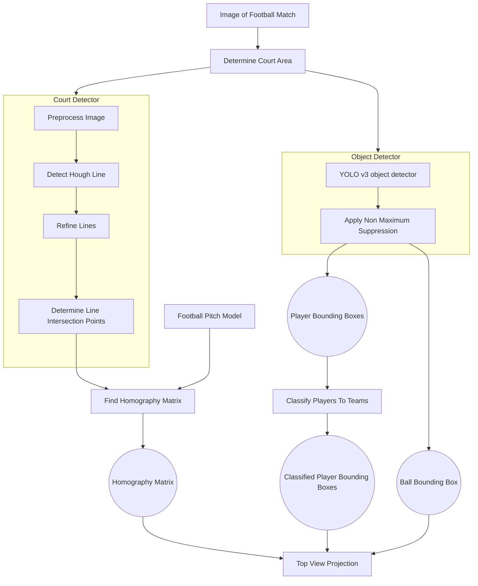

Figure 1: Initial implementation architecture

# 2 Related Work

Related work has been studied in the premises of this thesis. A review of milestone works is done and papers are cited below according to problem they are related to.

## 2.1 Existing works

**Player & ball detection** on football matches has been addressed numerous times in the past, using a variety of methods. A common approach has been to extract foreground information from an image, since players and the ball are the only objects constantly in motion, then extract higher level features from the image which will finally be used as input for a classifier.

Gaussian mixture model has been used to divide image pixels into background and foreground pixels [2]. Another method is to apply a global color filter to extract player regions from background [6]. Features based on edge orientations, like histograms of oriented gradient (HOG) [9] and edge orientation histograms (EOH) [29], [8] have been used for human detection and finally, SVM is the preferred algorithm for the classification task [9], [8]. Multiple detections relating to the same object may occur in which case, non-maximum suppression method is applied [16]. For ball detection, circular Hough transform has been used for ball detection [11], [38]. Especially for the cases of partial or total occlusion of the ball, motion history images, along with Freeman chain-code have been employed [21].

Deep learning methods have been proved to be more robust with the advent of CNNs for object detection. There are two-stage methods like R-CNN [18] that combine two key insights: a) one can apply high-capacity convolutional neural networks (CNNs) to bottom-up region proposals in order to localize and segment objects and b) when labeled training data is scarce, supervised pre-training for an auxiliary task, followed by domain-specific fine-tuning, yields a significant performance boost. R-CNN employs Selective Search [46] which combines the strength of both an exhaustive search and segmentation, to generate candidate bounding boxes (object proposals) then, applies CNNs to classify objects from these proposals. Thereafter, Fast R-CNN [17] employs several innovations to improve training and testing speed while also increasing detection accuracy, through training the very deep VGG16 network and exposing region proposal computation as a bottleneck. Faster R-CNN [40] introduced a Region Proposal Network (RPN) that shares full-image convolutional features with the detection network, thus enabling nearly cost-free region proposals. The RPN is trained end-to-end to generate high-quality region proposals, which are used by Fast R-CNN for detection and both networks are merged into a single network by sharing their convolutional features

using "attention" mechanisms. Though R-CNNs ([18], [17] & [40]) have improved performance over their predecessors however, they have objectively slow inference times.

One-stage approaches like *You Only Look Once - YOLO*, Redmon et al., 2016 [39] utilize a single neural network to predict bounding boxes and class probabilities directly from full images in one evaluation. This is done by framing object detection as a regression problem to spatially separated bounding boxes and associated class probabilities. Liu et al., 2016 in their Single Shot MultiBox Detector (SSD) [32] also use a single deep neural network to discretize the output space of bounding boxes into a set of default boxes over different aspect ratios and scales per feature map location. Scores are generated for the presence of each object category in each default box and adjustments are produced to the box to better match the object shape. Both methods are simple relatively to others that require object proposals because, they completely eliminate proposal generation and subsequent pixel or feature re-sampling stages and encapsulates all computation in a single network. They boast fastest inference times, though with less accuracy since their small object detection performance is unsatisfactory. Such networks of course, due to their general purpose nature, tend to be large, with millions of parameters.

Following the successful applications of convolutional neural networks to solve many computer vision problems, a few neural network-based ball and player detection methods were recently proposed. Lu et al., 2017 [33], which is modelled after AlexNet [1], presents a cascaded convolutional neural network (CNN) for player detection. The network is lightweight and thanks to cascaded architecture the inference is efficient. The training consists of two phases: branch-level training and whole network training. Cascade thresholds are found using grid search. Advancements have also been done on ball detection with DeepBall, Komorowski et al., 2019 [27] and [26] where a deep network based detector is presented. It specializes in ball detection in long shot videos by means of using hypercolumn concept, where feature maps from different hierarchy levels of the deep convolutional network are combined and jointly fed to the convolutional classification layer. Hypercolumn concept introduced in Hariharan et al., 2015 [22], utilizes larger visual context into consideration in order to correctly classify fragments of the scene containing objects similar to a ball. DeepBall itself is inspired from methods like SSD and YOLO networks and its purpose is small objects detection and reduced processing time. It eventually became part of FootAndBall detector [28], a method which operates on a single video frame and is intended as the first stage in the soccer video analysis pipeline. The detection network is designed with performance in mind to allow efficient processing of high definition video. Compared to the generic deep neural-network based object detector it has two or-

ders of magnitude less parameters (e.g. 199 thousand parameters versus 24 million parameters in SSD300 [32]. Feature Pyramid Network design pattern [31] exploits the inherent multi-scale, pyramidal hierarchy of deep convolutional networks to construct feature pyramids with marginal extra cost. A top-down architecture with lateral connections is developed for building high-level semantic feature maps at all scales. This method is applied in the aforementioned [28] to achieve detection of the two different in size classes, small objects such as the ball and large ones, such as players.

**Object tracking** is also utilized in this application in conjunction with object detection. The Lucas-Kanade algorithm [34], as originally proposed in 1981, can be applied in a sparse context because it relies only on local information that is derived from some small window surrounding each of the points of interest. The disadvantage of using small local windows in Lucas-Kanade is that large motions can move points outside of the local window and thus become impossible for the algorithm to find. This problem led to development of the "pyramidal" Lucas-Kanade algorithm [5], which tracks starting from highest level of an image pyramid (lowest detail) and works down to lower levels (finer detail). Tracking over image pyramids allows large motions to be caught by local windows. Danelljan et al., 2014 [10] proposed approach works by learning discriminative correlation filters based on a scale pyramid representation. It learns separate filters for translation and scale estimation, and showed that this improves the performance compared to an exhaustive scale search.

**Color classification** regarding players, is handled in this application in order for them to be grouped into their respective teams. In specific, players have to be distinct in their bounding boxes and afterwards, colors features are extracted from their outfits. GrabCut algorithm [42] was studied to that end and other papers inspired by it. In Li et al., 2015 [30] *KM_GrabCut* algorithm uses K-means clustering to cluster pixels in foreground and background respectively, and then constructs a Gaussian Mixture Model based on each clustering result and cuts the corresponding weighted graph only once. Works that utilize deep learning for the task have also been studied like Gunduz et al., 2021 [19] who sought to extract the dominant colors of a salient object from an image even if the objects overlap each other. Their method *SALGAN* is a network that follows Inception-ResNet architecture to semantically segment objects in an image. They apply *SALGAN* to find the salient object in the image and eventually, apply k-means clustering on the combined resulting outputs, to partitions samples. However, finding a salient object (player) in a more or less stable background (grass), is much simpler task. Inspired from the aforementioned papers and techniques, classic machine learn-

ing practices are utilized for image segmentation and color classification.

**Camera registration** in court-based sports, like football, requires identifying the court within image, then find the homography that relates to the court as depicted. (homography is a $3 \times 3$ matrix that allows perspective transformation of a point $y$ from an image, to a point $y'$ in the same image.) In certain cases, homography estimation has been done manually for key frames of the court, then propagated to the next ones or it was estimated through searching over a large parameter space, with the purpose of initializing the system.

Previous methods have been exploiting geometric primitives such as lines and circles for court detection, using Hough transform or RANSAC in conjunction with color and texture heuristics that are specified manually [15], [14], [23]. In his work for tennis courts, Farin et al. [15], [14] performs system initialization using a few frames from the beginning of a video sequence, depicting a whole court during which, lines are detected using the aforementioned methods and refined. Then, lines are divided in vertical-horizontal couples and used in search for the best set whose intersection points correspond to the four corners of the court. Those were used to estimate camera parameters, concluding the initialization process. For each next frame, lines are tracked and camera registration is updated.

However, football fields are enormous and a single frame cannot contain all four corners. In this case, Homayounfar et al. [24] formulated this problem as a branch and bound inference in a Markov random field where an energy function is defined in terms of semantic cues such as the field surface, lines and circles obtained from a deep semantic segmentation network. Sharma et al. [43], exploiting the edge information from the line markings on the field, they formulated the registration problem as a nearest neighbour search over a synthetically generated dictionary of edge map and homography pairs. The synthetic dictionary generation allows them to exhaustively cover a wide variety of camera angles and positions and reduces this problem to a minimal per-frame edge map matching problem. Chen & Little, 2019 [7] developed a novel camera pose engine that generates camera poses by randomly sampling camera parameters. The camera pose engine has only three significant free parameters [7] so that it can effectively generate diverse camera poses and corresponding edge (i.e. field marking) images. Then, they learn compact feature descriptors via a siamese network and build a feature-pose database. After that, they use a novel generative adversarial network (GAN) model to detect field markings in real images. Finally, they query an initial camera pose from the feature-pose database and refine the camera pose by using distance images.

**Camera pose tracking** can help in the reduction of processing time during camera registration task. In their work, Evangelidis et al.,2008 [13] proposed using a new similarity measure called Enhanced Correlation Coefficient (ECC) for estimating the parameters of the motion model. There are two advantages of using their approach. Firstly, unlike the traditional similarity measure of difference in pixel intensities, ECC is invariant to photometric distortions in contrast and brightness. Secondly, although the objective function is nonlinear function of the parameters, the iterative scheme they developed to solve the optimization problem is linear. In other words, they took a problem that looks computationally expensive on the surface and found a simpler way to solve it iteratively. ECC is used in this work, both for camera registration as well as for tracking camera motion. It does so by aligning an initially estimated camera pose or previous frame camera pose, to a target desirable one that corresponds much more to ground truth. Previously mentioned “pyramidal” Lucas-Kanade algorithm [5] can also handle camera motion tracking, given right conditions. It is used in experiments and while it has issues regarding its results, due to its processing speed, may evolve to a decent solution.

**Team formation recognition** is a complex task during a football match because players constantly change positions. In his work, Bialkowski et al. [4] introduce an algorithm that defines the formation as a set of role-aligned player positions. However, it is assumed that the dominant formation is stable within a halftime but, in fact modern football tactics change according to current phases in order to cope with opponent’s playstyle, thus making the problem more complex.

In addition, Bialkowski et al. [3] extend their work and utilize the role-assignment algorithm to discover in-match formation variations, using two methods as a proof-of-concept: (1) clustering of role-aligned player positions and (2) calculating the distance of each frame to the mean formation of the halftime.

Nevertheless, the aforementioned application relies on the detection of the most prominent formations and so, such an approach cannot automatically predict a numerical tactical scheme such as ”4-4-2” for short match phases. Alternatively, Machado et al. [35] developed a match analysis tool and applied k-means clustering to the one dimensional $y$ player positions with respect to the field length (from goal to goal) itself. Each player is then assigned to one of three tactical groups to create a rough but well-known numeric representation. However, this approach completely neglects the x-coordinates of the players’ positions for classification.

Recently, Muller et al. [37] proposed a methodology to create a visual formation summary that serves to classify the team formation played in single of a football match. Finally, Shaw & Glickman [44] presented a data-driven technique that

classifies team formations, divides them into offensive-defensive and detects major changes tactical changes during the course of a match.

## 2.2 Contribution

What is missing from existing work is a method that unifies progress done so far on the fields of object detection, camera registration and information extraction from sports, in order to tackle a realistic problem, like sport analytics in football, with an end-to-end approach. Existing work examines specific cases, based on image datasets that have been produced to allow training and evaluation purposes however, the process of producing such data is rather expensive; objects have to be annotated within images regarding object detection task and camera registration requires researchers to estimate camera poses for different point of views for the court along with the ground truth. Finally, football experts have to watch numerous snapshots from games and decide related facts that will serve as ground truth for a method to be trained. Sometimes concluding some facts requires a sequence of images, a period of seconds in other words, than merely an image from the same sequence.

This work is a prototype method that observes football games, recognizes players, ball and their location in the court and exports conclusions about the teams while at the same time, it does not require any preparation to do this job. Input video sequence may come from any football match that was shot with a simple HD camera, from the middle field area, with a decent elevation regarding point of view, just like TV broadcasts. It learns from the first moments to distinct the teams, their respective goal posts and during course of the game, is able to extract basic, useful information. At the same time, it achieves a frame processing rate of 2.5-3 FPS while using low-end hardware and a simplistic implementation that does utilize neither parallel jobs, except for the GPU part that runs deep learning models, nor any sophisticated software development methods to minimize processing time, though there is room for such improvements, analyzed later on.

# 3 Methodology

As mentioned before, video frames are used as input for the application. Each frame is segmented in grass/non-grass area, then court lines are detected from the grass area, a task that is handled by a dual-GAN model [7] which forms the basis of Court Detector module. Afterwards, both outputs are used by subsequent modules for object detection and camera registration tasks.

Regarding object detection, the FootAndBall CNN model implemented and analyzed in [28], initially helps to detect players and the ball within football court, in

each frame. The grass mask output from previous segmentation task is applied on each frame in order to narrow searching space. Detected players and ball are then tracked for a series of N frames until next detection, which helps to correct any misses during tracking phase. The selected object tracking method is based on Lucas-Kanade algorithm for optical flow described in [5]. Apart from the ball, detected individuals are clustered in groups according to the coloured-pixel values of their bounding box images using a dual K-means module called Team Classifier which handles the task of labeling each one as a member of a group. This label is carried across each frame during tracking. The aforementioned functionality comprises Team Detector module, which outputs are detected bounding boxes that contain information about their location in the frame and their group-team label, should they relate to players or the referees.

Regarding camera registration task, detected court lines or "edge map" as it will be called from now on, is used as input for Camera Estimator module which is used to estimate a camera pose for the original frame. Work done in [7] forms the basis for this module which in essence, extracts a feature vector from the edge map, then uses this as a key to search the closest camera pose representation within a database. The resulting candidate from the search helps as an initial camera pose estimation, used for further refinement by means of applying the Enhanced Correlation Coefficient Maximization method [13]. Said method is also used for N subsequent frames, to help track camera pose updates and also, reduce processing time.

Acquiring both object bounding boxes and their related camera pose, unlocks the ability to map those objects on a static top-view of the football court and gives the ability to deduce useful insights, a task that is handled by Game Analytics module. Specifically, both teams and their players are extracted as information from the retrieved, labeled groups, leaving out any detected referees. Given a top-view, Game Analytics module infers which goal post belongs to which team, whether a team possesses the ball and finally, whether or not teams are in defensive or attacking position.

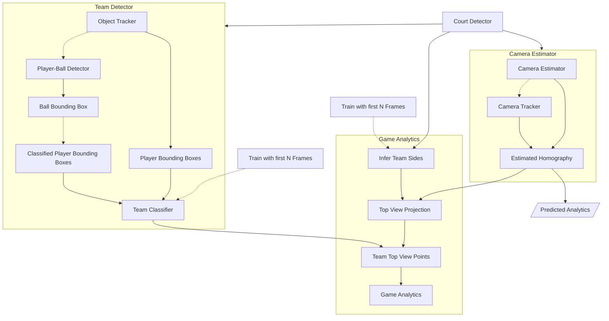

Figure 2: Application architecture

## 3.1 Architecture

Application architecture (Figure 2) consists of four modules with distinct roles, described below:

* Court Detector module handles detection of the lines that comprise the court and its limits. It precedes in the processing pipeline.(3.3)

* Team Detector module handles the tasks of detecting individuals players and grouping them in teams, alongside the referees and the soccer ball, using court limits from Court Detector to narrow its field of search.(3.5)

* Camera Estimator module registers broadcast video frames on the static top-view model of the court surface, using court lines from Court Detector.(3.4)

* Game Analytics module accepts input from the latter two modules and visualizes top-view model while also, infers semantics about the teams.(3.6)

The first three modules make use of computer vision techniques and deep learning thus, are explained in the 3.2 Computer Vision Modules section. Game Analytics makes use of simpler methods and we delve in its implementation at the 3.6 section.

## 3.2 Computer Vision Packages & Tools

While Tensorflow-Keras 2.3 was the initial choice as a deep learning library, PyTorch 0.8.2 with CUDA support was eventually used to implement the neural network models mentioned in related papers. The reason behind this decision is its ease of use and the considerable training speed achieved during experimentation, compared to Tensorflow - Keras library. The comparison was made by implementing court detector module using both deep learning libraries and observing training results.

OpenCV library has also been used for the rest of computer vision tasks. Version 4.2.0 was selected because it is compatible with the available GPU hardware. The library was compiled natively so that it utilizes available CUDA support, which proved useful since processing speed is improved compared to the default CPU version of OpenCV library.

Apart from those, NumPy 1.20.2 and SciPy 1.5.4 libraries are used for computation tasks, scikit-learn 0.23.2 library is used for the clustering task described in Team Detector module, PyFlann 0.1.0 (Fast Library for Approximate Nearest Neighbor) is used for database search in Camera Estimator module and finally, Dlib 19.22.0 library is used to track objects in Team Detector module.

Hardware equipment used for development is a low-end gaming laptop with an Intel i7 - 2.8GHz - 8core CPU and a Nvidia GTX 1060 graphics card with 6GB of virtual memory.

## 3.3 Court Detection

Court detection task is handled solely by Court Detector module (Figure 3) which helps to extract features regarding the court. It utilizes two identical Pix2Pix neural networks [25], which in essence are conditional generative adversarial networks - CGANs. A conditional GAN differs from simple GAN model regarding its input during training. A CGAN has both the generator and discriminator conditioned on some extra input information, while a simple GAN does not.

The idea for this dual-CGAN concept is described in [7] where the first CGAN handles an image segmentation task, then feeds its output to the second CGAN which handles a feature detection task.

In this work, the dual-CGAN model has been kept intact and has been programmatically wrapped within module. The module is instantiated on application launch by loading both pre-trained CGANs. It uses a user-defined image resolution which corresponds to the output resolution. Its API contains only a single method which purpose is to retrieve module outputs, described above, and its inner workings are shown in Figure 3. Regarding grass mask retrieval, a refinement

process is applied in order to eliminated any random mask ”islands” that may exist in the mask. The process is described later on.

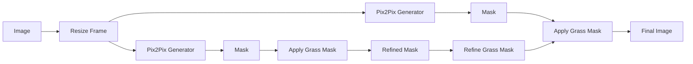

Figure 3: Court detection functionality

### 3.3.1 Pix2Pix model

, Pix2Pix model as a conditional GAN, learns a mapping for y, from observed image x and random noise vector z, $G : \{x, z\} \rightarrow y$. In contrast, a simple GAN learns a mapping for y, from a random noise vector z, $G : z \rightarrow y$. The generator G is trained to produce outputs that cannot be distinguished from “real” images by an adversarially trained discriminator D, which is trained to do as well as possible at detecting the generator’s ”fakes”.

Image-to-image translation problems include image segmentation and feature extraction in the current context since the desired output is a translation of information from the original input frame. A defining feature of image-to-image translation is that it maps a certain resolution input grid to an output grid of the same resolution. Input and output differ in surface appearance, but both are renderings of the same underlying structure. Therefore, structure in the input is roughly aligned with structure in the output.

**Architecture** for Pix2Pix uses encoder-decoder network architecture regarding its generator G, where the input is passed through a sequence of layers that progressively reduce feature map resolution, until a bottleneck layer. Then the process is inverted until final output resolution achieves same resolution as the input. For many image translation problems, there is a great deal of low-level information shared between the input-output and in order to achieve described results, information is required to be transfered directly across the net.

To give the generator G a means to circumvent the bottleneck for information, skip connections are used, following the general shape of a “U-Net”. For a network with N layers, each skip connection simply concatenates all channels at layer i with those at layer N − i.

Regarding, discriminator D architecture, it is known that the L2 and L1 losses produce blurry results on image generation and in the current context, this is the case. This drives discriminator D to model high-frequency structure, relying on an L1 term for low-frequency correctness. High-frequency structure is modeled by attending structure in local image patches. Isola et al. 2017 [25] termed their designed discriminator architerture *PatchGAN* which only penalizes structure at the scale of patches. This discriminator tries to determine whether each N × N patch is fake or real. It is run convolutionally across the image, averaging all responses to provide the ultimate output of D.

**Loss function** for a CGAN is described from

$$ \mathcal{L}_{cGAN}(G, D) = \mathbb{E}_{x,y}[\log D(x, y)] + \mathbb{E}_{x,z}[\log(1 - D(x, G(x, z)))] \tag{1} $$

where x represents the observed image, z a random noise vector and y the desirable output. Generator G tries to minimize this loss against an adversarial D that tries to maximize it. For comparison, unconditional GAN discriminator does not observe x

$$ \mathcal{L}_{GAN}(G, D) = \mathbb{E}_{y}[\log D(y)] + \mathbb{E}_{x,z}[\log(1 - D(G(x, z)))] \tag{2} $$

Generator G loss function uses L1 distance,

$$ \mathcal{L}_{L1}(G) = \mathbb{E}_{x,y,z}[\| y - G(x, z) \|_1] \tag{3} $$

and so, the final objective is modeled as follows

$$ G^* = \arg \min_{G} \max_{D} \mathcal{L}_{cGAN}(G, D) + \lambda \mathcal{L}_{l1}(G) \tag{4} $$

**Training** procedure has been implemented from scratch and additional code has been added so that now is possible to save model and continue training from selected checkpoints. This helped very much with experimentation. Modifications have also been made so that training procedure utilizes the available GPU properly.

During training phase, each Pix2Pix model accepts a pair of source-target images and input pairs differ for each trained model. Before forward propagation,

data augmentation part has been kept as in the original paper, where each input image is converted to tensor, then cropped to $256 \times 256$ size using a random offset, from an initial size of $286 \times 286$, then normalized, then flipped horizontally at random and finally loaded to GPU memory as CUDA tensors. Thus, each model is trained on partially different data each epoch, achieving a form of data augmentation. Models are set to train independently, without interfering with one another, however the original implementation has the option for them to train jointly, which was not tested for its performance. Input tensors for both segmentation and feature extraction tasks have shape $3 \times 256 \times 256$ for the RGB input image and $1 \times 256 \times 256$ shape for the input binary mask, with values ranging in [-1.0, 1.0] for both all tensors. Training duration is set to 200 epochs with batch size equal to 1. Learning rate is set $2 \times 10^{-4}$ and is reduced linearly by $2 \times 10^{-6}$ for each epoch after 100th epoch.

**Inference** process utilizes the generator parts of each Pix2Pix model as shown in Figure 3. Input images are resized and fed to the first Pix2Pix generator that handles segmentation and returns an estimated grass mask which is then applied on the input image. The resulting image becomes input for the second Pix2Pix generator which outputs an edge map of the court. Grass mask is also applied on the edge map output from the second Pix2Pix generator. The reason for this is the fact that Camera Estimator module was found to achieve better results on its part because, Court Detector found false-positive lines on some cases like in Figure 4.

Masked edge map output vs Unmasked edge map with false-positive line

Figure 4: From left to right: Masked edge map output - Unmasked edge map with false-positive line behind goal post.

### 3.3.2 Grass mask refinement

process, removes any island-like white or black patches, within binary grass mask. It does so by finding image contours, then assumes the largest group of points that form a contour, as the one corresponding to the grass mask. That contour is drawn in white color on a black image which assumes the role of grass mask. Finally, a Gaussian blur is applied along the edges of the mask so that lines that may reside

on those edges, can still be detected from feature extraction task. Figure 5 displays outputs from this process.

It must be noted that both grass mask and edge map outputs from CGANs are tensors with shape $256 \times 256 \times 1$ and may be translated to binary images. However they are reshaped to $256 \times 256 \times 3$, to be further used around the application. Court Detector's processing speed is estimated at 15.5FPS.

From left to right: Original grass mask, Contour points (red marks) found on mask, The contour that corresponds to the largest group of points, Result after applying Gaussian blur.

Figure 5: From left to right: Original grass mask - Contour points (red marks) found on mask - The contour that corresponds to the largest group of points - Result after applying Gaussian blur.

## 3.4 Camera Estimation

Camera estimation task contains two distinct phases: a) estimation and b) tracking phase. Estimation phase is handled by Camera Estimator module itself which is initialized on application launch and remains alive indefinitely, while tracking phase is handled by a camera tracker that "lives" for the duration of each tracking period. Both estimator and tracker share functionality though their inner workings differ in the way they achieve their purpose and those workings are specified below. After each frame, both phases output a homography matrix that results from an estimated camera pose.

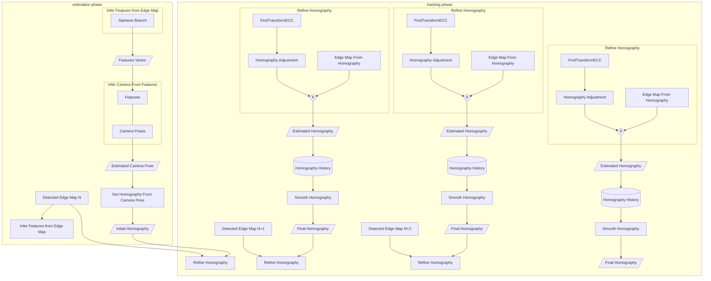

Figure 6: Camera estimation procedure

**Camera pose model** used to describe a camera pose in this work is the Pinhole camera model (it is explained in more detail at 4.2 section)

$$P = KR[I | - \mathbf{C}], \tag{5}$$

where K is the intrinsic matrix, R is a rotation matrix from world to camera coordinates, I is an identity matrix and C is the camera's center of projection in the world coordinate. P is the $3 \times 4$ projection matrix from which homography results. This is a $3 \times 3$ matrix H that maps the homogeneous normalized image coordinates y to he homogeneous transformed image coordinates y':

$$\mathbf{y'} = \mathbf{H} \mathbf{y} \tag{6}$$

In the current context and given a homography $H$, perspective transformation of image coordinates y produces the corresponding edge map. These coordinates represent a static, binary, top view of the court when depicted as an image (Figure 7). Inverse homography $H^{-1}$ is used to map player coordinates back on top view

as described before (Figure 8).

Static, binary, top view of the football court

Figure 7: Image coordinates of the static, binary, top view of the court, represented as image

TV broadcast view translated to static top-view via homography matrix H^-1

TV broadcast frames and their corresponding schematic camera poses

Figure 8: Camera estimation task. First row shows how an inferred-inverted homography matrix translates points from TV broadcast view to static top-view. Second row shows schematic representation of camera poses (in red) depending on current frames

### 3.4.1 Initial camera pose estimation

done by Camera Estimator module is based on previous work from [43] and mainly [7] where a database was used for the task of camera estimation. Module consists of a siamese model [20] and a database containing feature-camera pose pairs. Siamese model extracts a feature vector from the edge map output of Court Detector. This features vector is used to search within a database for the closest match. Each database record is a pair of a features vector and a camera pose, with the feature vector functioning as the search key which has been generated with the

aforementioned siamese model. The resulting camera pose is a set of parameters that correspond to the best approximate neighbor of the point of view the RGB court image-frame was shot. Given this camera pose, homography matrix can be extracted.

Even the best camera pose approximation however, still differs, significantly on occasion, from ground truth camera pose and the reason for this depends on the number of available poses stored in database. Current implementation makes use of a database with the same specifications as the ones used in [7] and contains 90,000 records, in order to approximate ground truth camera pose, a procedure that is time-consuming. Thus, there must be a balance between approximation performance and time constraints, given the fact that a real time processing speed is among the purposes of the application.

**Homography refinement** method, applied in source code¹ implementation of [7], solves the problem of inaccuracy after camera pose approximation, by applying a refinement process that makes use of Enhanced Correlation Coefficient Maximization - ECC method [13], a method that is built-in function in OpenCV². The process accepts an initial homography estimation that resulted from database search and produces the corresponding edge map, which we will refer to as "source" edge map. Ground truth camera pose has also a related homography and a corresponding edge map which resembles the edge map output from Court Detector module. We will refer to it as "target" edge map. Given source and target edge maps, distance transformation is applied for both and the resulting images are used as input for ECC method, which is tasked with finding a homography matrix adjustment. Finally, the adjustment is applied on source homography, resulting to a close-to-target homography which is returned as output from refinement. This procedure is also time expensive, depending on selected parameters but, results are rather satisfying.

Distance transformation for source-target edge maps (Figure 9) is proven to benefit ECC method in terms of speed, while retaining quality of result. In specific, inverted binary threshold is applies on both edge maps and then, euclidean distance transformation is applied. Pixel values for resulting images are float numbers that represent distances from nearest black pixel (zero valued pixels). In the end, distance threshold is applied with a selected value of 15. This sets a maximum pixel value and is the actual reason why ECC method gets benefited from the transformation.

¹https://github.com/lood339/SCCvSD, June 2021

²though in their paper, they refer to Lucas-Kanade algorithm as their selected solution for the problem

Figure 9: Distance transformation for edge maps. First row shows target edge map on the left and source edge map on the right. Second row shows respective edge maps after distance transformation

Figure 9: Distance transformation for edge maps. First row shows target edge map on the left and source edge map on the right. Second row shows respective edge maps after distance transformation

### 3.4.2 Tracking - ECC method

ECC method explained just below, resulted as further optimization from the refinement process but this time, regarding processing speed. The implemented tracking method is in essence the repeated application of the refinement process discussed above, with updated input data for each consecutive frame. Changes regarding the part of the court currently displayed, are usually small between consecutive frames, owing to the panoramic point of view that ensures coverage of actions within court. Given also a decent frame rate of at least 24 FPS and no abrupt changes in broadcast camera shots (i.e. due to a ball kick from players), after initial estimation and refinement for a frame, resulting output can be used as the new "source". Thus, the expensive process of database search is removed and furthermore, it may be an even better initial estimation than the result from the search. "Target" edge map becomes the output from Court Detector for the current frame and so, refinement process is applied as described.

Three frames of a football match showing the penalty area with edge map overlays.

Three frames of a football match showing the center circle with edge map overlays.

Figure 10: Original frames with edge map outputs applied on top. From left to right: Edge map from Court Detector - Edge map estimation from database search - Edge map estimation after homography refinement

**Enhanced Correlation Coefficient Maximization method** [13] is an $L_2$-based iterative algorithm tailored to solve the image alignment problem. It is used in both estimation and tracking phases, though with different hyperparameters in each case. Hyperparameters refer to the number of maximum iterations and the accuracy threshold used by the algorithm to converge. In our context, ECC is given two similar edge maps and running iteratively, seeks to align them and thus, calculate the homography matrix that will transform the source image to the target one. It was observed during experiments that source edge map has to be as similar to the target as possible because it took less time for the algorithm to converge.

During estimation phase, this similarity is affected by the output from database search, which depends on the number of database records and their specifications; the distributions used to generated the camera pose records. Less database records means less probable similarity between source edge map and the target, which in turn is translated to more iterations for ECC algorithm. On the other hand, more database records take more time for the search to complete. Keeping

database specifications and record number intact, it was decided that estimation phase should use ECC algorithm with 1000 iterations and epsilon/accuracy value $1 \times 10^{-4}$.

During tracking phase, similarity is greatly affected from camera pan/tilt movements, especially when those are quick or abrupt. Even so, a source edge map resulting from previous, either estimated or tracked frame, is definitely more similar to the target than a source edge map that results from a database search during estimation. Given these conclusion after experimentation, it was decided that this phase should use ECC algorithm with only 50 iterations and epsilon value $1 \times 10^{-3}$.

**Output stabilization** is applied in the end for both estimation and tracking phases and aims to smooth differences between homography estimations for a sequence of frames. Without smoothing estimations so that they are more coherent to their previous ones, the result would be a jittery display of players' depicted positions on static top-view as if they were constantly jumping. Thus, a homography history is kept by the module for the selected N frames of a video sequence. Each homography estimation is saved and then, an weighted average is produced among the frames. The process result is the final output for Camera Estimator module.

### 3.4.3 Tracking - Lucas-Kanade method

Lucas-Kanade method [5] was an initial thought on how to tackle the tracking problem, apart from the ECC tracking method. The method would track camera movement itself from four points depicted on the original frame then, a perspective transformation would calculate the homography adjustment. This approach however has issues that render its use impractical. First of all there must be a credible way to acquire the necessary points to be tracked. Shi-Tomasi method [45] which is a built-in function in OpenCV3, was used to detect good features to track, such as corners, both in the original input frame and the edge map from Court Detector. From output points, those four that were most far apart from each other were used with poor results. This is due to the fact that each of the four points to be tracked, must tend to be as much close to the corners of the frame as it gets so, the next thought was to acquire arbitrary points from the neighborhood of each corner. Though this solution yields better results than the previous, it still fares poorly because the points close to the corners are not necessarily unique; bottom corners usually depict some grassy area which is hard to track and top corners usually depict the bleachers where image gets a noisy due to the crowd. Additionally, even unique points in this case would require more frequent camera pose estima-

\*3https://docs.opencv.org/4.5.2/d4/d8c/tutorial_py_shi_tomasi.html, June 2021 accessed in June 2021

tion than ECC method because due to camera pan movement, left or right points are bound to get lost, thus untrackable, so new ones must be acquired. Lucas-Kanade method is further explained in 3.5 where it is used for object tracking.

**Siamese model** is used as an approach by Chen et al [7] who trained one in order to use its trained branch to produce encodings from input edge maps. To do so, they also generated a synthetic data set which contains camera poses and used it to train their network. Network learns to distinct similar edge maps from dissimilar ones and eventually produce similar encodings from similar edge maps. Specifically, the more similar are two edge maps, the closer are their respective encodings and vice versa. After the training, they used the trained branch to encode edge maps that resulted from all synthetic camera poses and then stored each camera pose along with its encoding, inside a database. Camera Estimator database resulted with that procedure.

**Network architecture** has been kept intact as in the original paper. Each branch of the network contains a CNN that ends up to a linear output layer. Branch accepts input tensors of shape $1 \times 180 \times 320$ that correspond to binary edge maps, while output tensor is of shape $1 \times 16$ and serves as an encoding of the input image, henceforth referred to as *features vector* and contains normalized values. During forward propagation, input images A and B are pushed through the same branch, hence the siamese nature of the model, producing a features vector per image.

**Loss function** accepts as inputs the resulting features vectors along with an image similarity label, which represents the level of similarity between images A and B:

$$L(w, x_1, x_2, y) = yD_{\mathbf{w}}(x_1, x_2) + (1 - y) \max(0, m - D_{\mathbf{w}}(x_1, x_2)) \qquad (7)$$

where $D_{\mathbf{w}}(x_1, x_2)$ represents the Euclidean distance between features vectors $x_1$ and $x_2$, $y$ represents the similarity label and $m$ stands for margin, a value that helps the model maximize the distance between dissimilar features vectors.

**Training phase** is shown in Figure 11. Model accepts pairs of edge maps as input images A-B and a similarity label. A similar/positive pair input consists of edge maps that correspond to camera poses that differ minimally and a label equal to 1. A dissimilar/negative pair input consists of edge maps that correspond to camera poses that differ greatly and a label equal to 0. Positive-negative pairs succeed each other during epoch iterations, meaning that each positive pair input is followed by a negative one in the next iteration, then a positive, then a negative,

etc.. A pair of positive-negative pairs share the same image A and differ in the image B that each pair uses. This is demonstrated in Figure 11 and basically means that image A is used once as an input with the positive pair, and then a second time with the negative pair. An iteration during training is completed using a pair of positive-negative pairs for a total of 4 input images per iteration step. Before forward propagation, input images are resized to 320x180, then converted to tensor and finally, normalized with mean=0.0188 and std=0.128 as in the original paper.

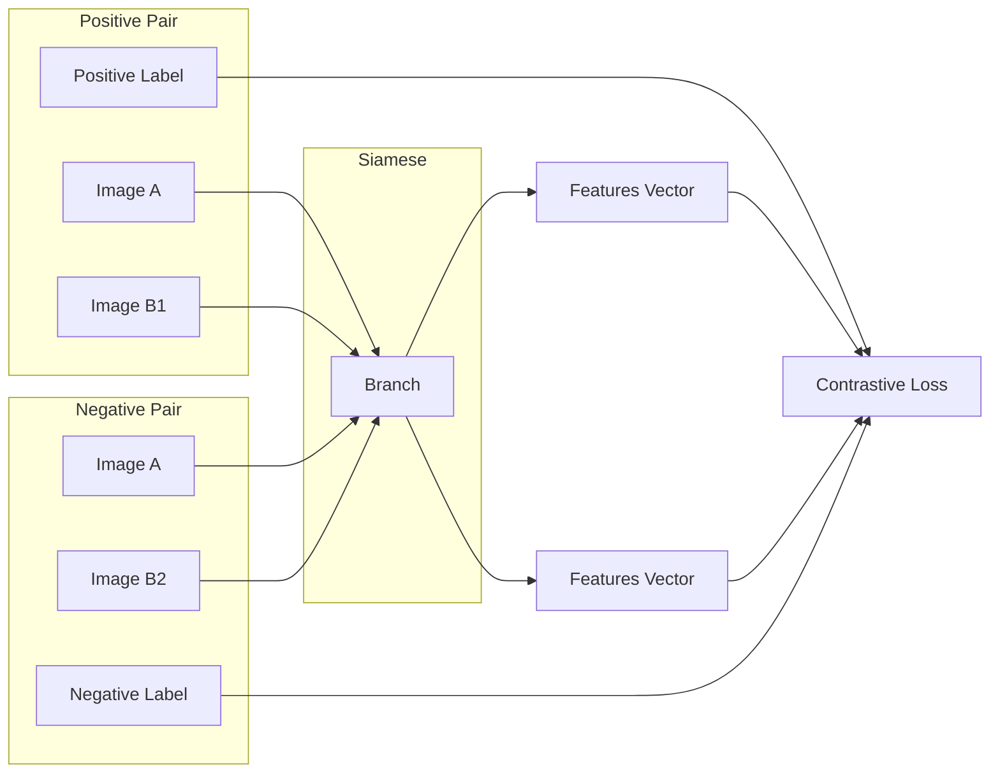

Figure 11: Siamese network training

Training duration was set to 10 epochs, with 128 batches of 64 image pairs per epoch and a static learning rate of 0.01 was used. Training for more epochs results in an increased positive-negative pair distance ratio and reduced loss, however that doesn't matter since model achieves its purpose with only 10 epochs of training.

### 3.4.4 Feature-camera pose database

As mentioned previously, it contains camera poses along with the features vectors of their respective edge maps. The procedure that populates the database is fairly simple and is shown in Figure 12. For each of the 90,000 camera poses, the relevant edge map is produced, then is used as input for the siamese model and a features vector is returned. The latter is saved in the database along with the camera pose. The produced database file is then ready to be used by Camera Estimator during test/inference, as has been already described. Note that alternating siamese model architecture, makes it necessary to re-create the database since the siamese is the mechanism that creates search keys for the database.

The database file is loaded from memory by Camera Estimator during its initialization, on runtime. Fast Library for Approximate Nearest Neighbors - FLANN4 is the method used to search within database. It takes the features vector output from Siamese branch and the list of features vectors from database, as input arguments. The result is an index for the closest features vector match, which corresponds to a unique camera pose.

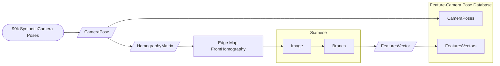

Figure 12: Feature-camera pose database generation

### 3.5 Team Detection

Team detection task (Figure 13) follows the same philosophy as in camera estimation and contains two distinct phases: a) detection and b) tracking phase. Detection phase consists of an object detection task followed by a color classification task for each detected object, except for the ball. Tasks are handled by Player-Ball Detector and Team Classifier sub-modules respectively, both of them are initialized on application launch and remain alive indefinitely. Results are used both as output for Team Detector module and as input for tracking task. Object trackers

\*4https://github.com/primetang/pyflann, June 2021

handle the latter and they are initialized when detection phase ends while live for the duration of each tracking phase.

### 3.5.1 Object detection

The task is handled by Player-Ball Detector sub-module which has the sole purpose to detect persons and the ball within image. Input used for the task comes from Court Detector and as mentioned before, it is a masked version of the original video frame so that people or balls outside football court are ignored. Team classification task is the main beneficiary from the frame masking; it uses the first N frames from a video sequence to group players into teams using their outfits and so, there is no point in training its classifier using irrelevant individuals from outside the court.

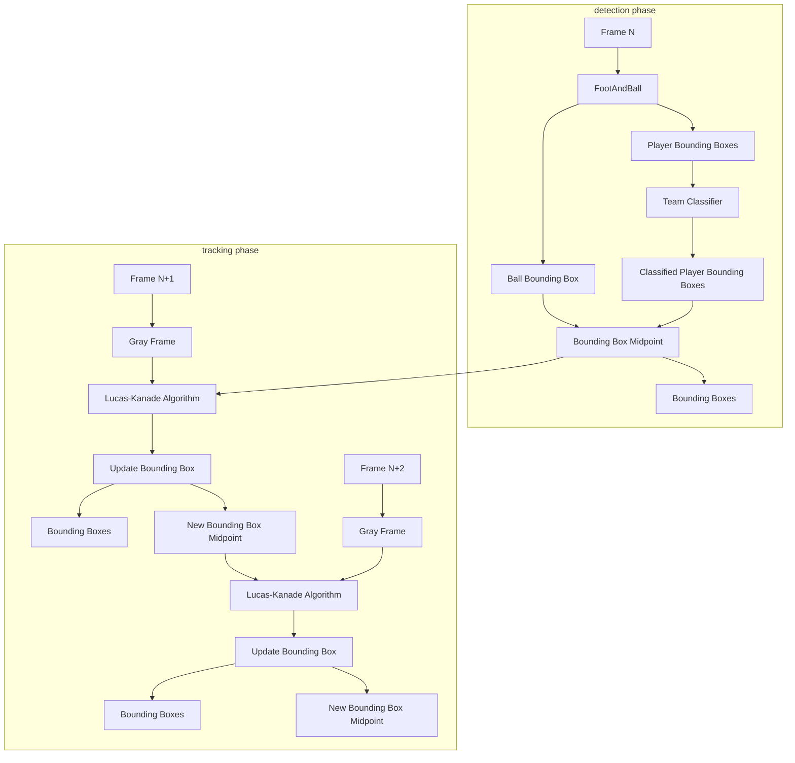

Figure 13: Team detection procedure

**FootAndBall deep neural network** [28] forms the basis for the object detection task. It is single stage detector, developed specifically for person and ball detection which means that compared to other object detectors, has small number of train-

able parameters (198,840 trainable parameters) and therefore is much faster. It lacks anchor boxes since it detects only two classes, with specific shape and size variance, from a relatively default distance. High-level architecture from original paper, is shown in Figure 14 and is based on Feature Pyramid Network [31] which is the basic building block for the network. It produces feature maps, each cell of which corresponds to a group of pixels from the input image. Feature maps are then processed by three components: player classifier, player bounding box regressor and ball classifier. Given an image with $w \times h$ dimensions:

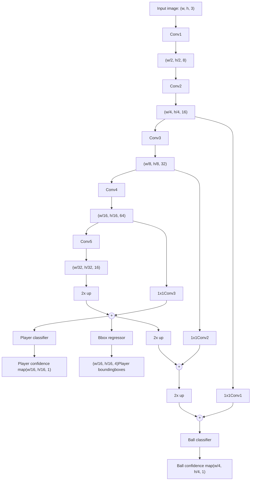

Figure 14: High-level architecture of FootAndBall detector. The input image is processed bottom-up by five convolutional blocks producing feature maps with decreasing spatial resolution and increasing number of channels. The feature maps are then processed in the top-down direction. Upsampled feature map from the higher pyramid level is added to the feature map from the lower level. 1x1 convolution blocks decrease the number of channels to the same value (32 in our implementation). Resultant feature maps are processed by three components: ball classification component, player classification component and player bounding box regression component. Numbers in brackets denote size of feature maps (width, height, number of channels) produced by each block, where w, h is the input image width and height.

* Player classifier extracts a $1 \times w/16 \times h/16$ confidence map that denotes detected player locations, from a feature map with spatial resolution $2 \times w/16 \times h/16$. Each location in the player confidence map corresponds to a $16 \times 16$ pixel block in the input image.

* Player bounding box regressor extracts a $4 \times w/4 \times h/4$ tensor that denotes player bounding box coordinates for each location in player confidence map

and uses the same feature map as player classifier.

* Ball classifier extracts a $1 \times w/4 \times h/4$ confidence map that denotes probable ball locations, from a feature map with spatial resolution $2 \times w/4 \times h/4$. Each location in the player confidence map corresponds to a $4 \times 4$ pixel block in the input image.

Given above for ball classifier, along with the fact that there is only one ball per image, there is no need to have ball bounding box regressor.

Non-maximum suppression method is applied on both confidence maps so that grouped boxes with high confidence value are merged into the one with the highest value. Regarding player bounding boxes, each one is represented with 4 values: its center point coordinates, width and height, all of which are normalized and relative. Center point values x and y represent the offset of each box center within bounding box map cells. Width and height values represent a percentage value of width and height of player feature map (where 1 is the width/height of the player feature map). A default size bounding box is used for ball predictions.

Input image and the related player confidence map Player confidence map visualization

Figure 15: Input image and the related player confidence map. Confidence map has been resized; its original dimensions are $45 \times 80$. White marks in black background represent cells with higher confidence values for player presence.

Final bounding box values are translated to absolute image values while also, midpoint coordinates, width and height are substituted by coordinates for top left and bottom right bounding box corners. Before used as output, a confidence threshold is applied to reject probable false positives.

**Feature Pyramid Network** design pattern allows using both low-level features from the first convolutional layers and high-level features computed by higher convolutional layers. Precision in spatial location of the object results from the first convolution layers contrary to later layers operate on lower spatial resolution feature maps. On the other hand, later layers have greater receptive field, therefore improve classification accuracy.

**Loss function** for the neural network is a modified version of the loss used in SSD [32] and consists of three component losses: player classification loss, ball classification loss and player bounding box loss. Both player and ball classifiers use binary cross-entropy loss function:

$$ \mathcal{L}_O = - \sum_{(i,j) \in Pos^O} \log c_{ij}^O - \sum_{(i,j) \in Neg^O} \log(1 - c_{ij}^O) \eqno(8) $$

where $O$ notation is substituted either by $B$ for ball classifier or $P$ for player classifier case, $c_{ij}^O$ is the value of the object confidence map at the spatial location $(i, j)$. $Pos^O$ is a set of positive object examples, that is the set of locations in the object confidence map corresponding to the ground truth object position (for ball classifier and for one input image it's only one location). $Neg^O$ is a set of negative examples, that is the set of locations that does not correspond to any ground truth player position. Player bounding box loss is Smooth L1 loss as in [40] between the predicted and ground truth bounding boxes. As in SSD [32] detector, the offset of the bounding box is regressed with respect to the cell center and its width and height:

$$ \mathcal{L}_{bbox} = \sum_{(i,j) \in Pos^P} smooth_{L1}(l_{(i,j)} - g_{(i,j)}) \eqno(9) $$

where $l_{(i,j)} \in \mathbb{R}^4$ denotes coordinates for a predicted bounding box in the location $(i, j)$ and $g_{(i,j)} \in \mathbb{R}^4$ are coordinates for a ground truth bounding box in the location $(i, j)$. Finally, the total loss sums all component losses, averaged by the number of training examples N:

$$ \mathcal{L} = \frac{1}{N} (\alpha_B \mathcal{L}_B + \beta_P \mathcal{L}_P + \mathcal{L}_{bbox}), \eqno(10) $$

where $\alpha_B$ and $\beta_P$ are weights for the $\mathcal{L}_B$ and $\mathcal{L}_P$ respectively and are chosen experimentally.

**Training phase** makes use of ISSIA-CNR Soccer [12] and Soccer Player Detection [33] data sets. The former contains Full-HD, long shot views of football court from a specific match, with player-ball annotations and is used for both training and evaluation purposes. The latter contains HD long shots of 3 other matches, with player-only annotations and is only used during training.

A pre-trained model is available in GitHub from the authors of [28]. It was used during experiments with ISSIA-CNR and real world videos. In summary, it was concluded that it seems to lack performance in very long shots of players and there was also a great problem in ball detection even in more close shots. Available GPU hardware made impossible for training process to have the exact same parameterisation as in the original paper thus, using described model as a

baseline for further improvements, was not an option. Be that as it may, hyper-parameter tuning revolved around achieving a better result in selected real world videos. No annotated video sequences (like ISSIA-CNR) were found in order to be used for metrics and so, model evaluation was done by sight.

Parameters that differ from the original paper are image resolution used for training samples and batch size. Thorough experimentation was conducted to achieve the final model that is used by Object Detector. Adam optimizer was used and learning rate was set to 0.001 (both same as original) and decreased by a factor of 0.1 at epochs 8, 16 and 20. Total training epochs were 22, with batch size set to 10.

Regarding image training samples, resolution was changed from Full-HD to HD for ISSIA-CNR data. This improved detection results for HD video sequences compared to original model. The reason for this is that original model is trained mostly with Full-HD samples through ISSIA-CNR and less with simple HD through SPD data set. In addition, only ISSIA-CNR contains ball annotations so, ball detection on HD real world videos is definitely low.

**Data augmentation** procedure was also changed. Apart from random affine transformation which remained the same, random image distortions were completely changed to simulate better images from real video. Distortions include changing brightness, contrast, saturation and hue with random values from certain ranges. Random scaling was also applied, contrary to original model which did not use it, to improve long shot detections. Random cropping image was removed from augmentation. Ground truth object bounding boxes were updated accordingly to comply with image transformations during augmentation. Finally, checkpoints are saved after each training epoch. Code was refit so that it is possible to continue training from a specific checkpoint in order to acquire better results. This is the main reason why only 22 epochs were used.

Due to network architecture, input tensors may have both Full-HD or HD dimensions. Because most real world videos are at least HD and since Full-HD resolution can be resized to HD, training samples use HD resolution. Input tensor during training have shape $batch\_size \times 3 \times 720 \times 1280$. Output consists of three tensors, mentioned earlier: a) player confidence map tensor with shape $batch\_size \times 45 \times 80 \times 2$, b) player bounding boxes tensor with shape $batch\_size \times 45 \times 80 \times 4$ and c) ball confidence map tensor with shape $batch\_size \times 180 \times 320 \times 2$

### 3.5.2 Team classification

task is handled by Team Classifier sub-module, given output from object detection task. It involves only-player related bounding boxes and is called only at detec-

tion phase. Inferred labels per box are carried for the duration of tracking phase. Current implementation as well as other experimented methods, are initialized automatically using the first N frames from a video sequence, to train a K-means classifier for the task. Team Classifier uses the trained model during the rest of the video sequence to distinct the 2 teams and the referee. Goalkeepers are required from FIFA to wear different colors than their teams and in this implementation are not handled so they are classified randomly.

**Training procedure** relies heavily on Object Detector’s precision and accuracy. Bounding boxes have to be precise so that only players are include, ignoring any human-looking objects. Masking frame during object detection so that only court field is depicted, works to that end as mentioned earlier or else non-player individuals would be detected, thus affecting team classification task with garbage data. Bounding boxes have also to be accurate meaning that they have to have just the size of each player, depicting exactly one player per box, as possible as that may be given the nature of the sport. This affects team classification in cases where players contest for the control of the ball, an area or tackling each other etc.

Currently, player bounding boxes are extracted from the first 50 frames, using object detection, no tracking. Ideally, in real world this would require camera to shot players for 2 seconds before game starts, given 24 FPS video capture. From said boxes, color features are extracted which are different for each method and are explained per case later on. Each feature extraction returns samples to be used during training process of Team Classifier model. Training samples differ in dimension for each method and the eventually selected one is the segmentation method.

**Dominant colors method** is used in the initial implementation described in section 1.3. In short, color features used for training, are the dominant pair of 2 or more colors per bounding box. The insight for this method is that players of the same team, will have the same dominant colors on their outfits.

Number of dominant colors within pair is a hyper-parameter. Before extracting those pairs, pre-processing bounding boxes is necessary because green pixels from grass, dominate against other colors inside boxes. This is considered background noise and has to be handled or else green color is guaranteed to be one of the dominant colors within pair. As a problem, it is a recurring one among methods tested. A fixed green color mask is applied to help remove those pixels, leaving only those of different colors which are converted from RGB to HSV color model. Resulting pixels are clustered in M clusters using a relevant algorithm, such as K-means and with M representing number of dominant colors within pair. Consequently, colors for each pair are sorted by frequency, with the aid of histograms,

so that the most dominant color of all is the first element of each pair. Pairs from this process are finally used as color features for training.

To deduce the dominant colors, apart from K-means, experiments were also conducted with Gaussian Mixture and different parameterizations. Polar coordinates were also used to model colors in space

Fixed green color mask has the disadvantage of not adapting to different lighting conditions, whether they may be natural or artificial. Remaining non-suppressed green pixels affect estimation for dominant colors, leading to misclassifications depending on the court setting where the player is located. Another issue is when a team's outfit is green where in this case, the only colors left after green pixel suppression, is the color of players skin or hair.

**Color histograms method** is the one used in this application for team classification task. Its workings are simple as it relies on extracting color histograms that will be used as color features for training. Green color suppression is applied as before. RGB and HSV histograms were tested for their results, along with different number of histogram bins. It seems that an HSV histogram, with 36 bins for hue value and 32 + 32 bins for saturation and value properties, is the most robust color feature to be used. Histograms are normalized before used.

This method is susceptible to fixed green color mask drawback regarding players with green outfits but, it is not affected much from non-suppressed green pixels to during classification. It is also the fastest among the methods described here.

```mermaid
graph LR
    subgraph Extract_Color_Features [Extract Color Features]
        direction TB
        subgraph Row1
            direction LR
            P1[Image] --> PBD[Player-Ball Detector]
            PBD --> P2[Cropped Player]
            P2 --> B2H[BGR2HSV]
            B2H --> P3[HSV Image]
            P3 --> EGM[Extract Green Mask]
            EGM --> P4[Green Mask]
        end
        subgraph Row2
            direction RL
            P4 --> IM[Invert Mask]
            IM --> P5[Inverted Mask]
            P5 --> AM[Apply Mask]
            AM --> P6[Masked Player]
            P6 --> GHH[Get HSV Histogram]
        end
        subgraph Row3
            direction LR
            GHH --> HH[HSV Histogram]
            HH --> CBC[Crop Black Color]
            CBC --> NH[Normalize Histogram]
            NH --> NHSV[Normalized HSV Histogram]
        end
    end
    NHSV --> TKC[Train KMeans Classifier]
    NHSV --> PPT[Predict Player Team]
```

Figure 16: Color histogram classifier architecture

**Segmentation method**, as its name suggests, segments the image, inferring any salient objects (player) and subsequently extracting color information to be used

for training. Inspiration came from GrabCut method and its implementation in OpenCV library alongside related work in image segmentation and implementations from internet⁵. The difference from the previous method is the way of handling green color suppression problem.

Described methods above do not handle grass masking dynamically. Here, foreground/background segmentation is done with the admission that green will always be the dominant segment in the bounding box image. Apart from that, there has to be at least one or two colors (depending on player uniforms) that will be translated to equal number of segments. Number of segments to be identified is a hyper-parameter and is set to 3. That is, to handle dual-color uniforms or else, if a uniform is single-colored, the third segment usually is assigned to player's color skin which pretty much is ignored since all people have brownish skin color and thus, is common among bounding boxes. Segmentation task is handled by OpenCV implementation of K-means in order to benefit from GPU processing speed. Input for the algorithm is the bounding box image itself.

Consequently, dominant segment correlates to grass image part and it is removed using a masking process, leaving the rest of the image as foreground. From this, an HSV color histogram is produced, which is then, normalized and used as color feature for training.

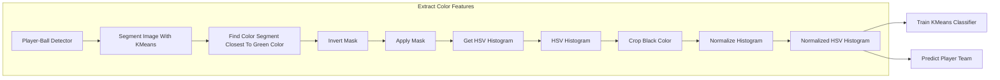

Figure 17: Segmentation classifier architecture

**Inference** process for each method is the same. Each image bounding box has its color features extracted. All of them together are used as input for Team Classifier model which returns related team labels.

⁵https://www.kdnuggets.com/2019/08/introduction-image-segmentation-k-means-clustering.html, June 2021

### 3.5.3 Object tracking

It is executed for N frames and detection task has to precede before tracking. De-tections are used to initialize trackers, after each bounding box is assigned a team label, at the end of detection phase. Current implementation has N value set to 5 which resulted after experimentation. Trackers process each subsequent frame, during tracking phase, using it as input along with information from their respective bounding boxes. They update boxes in each iteration and then, return them as outputs. Two implementations were mainly tested during development: a) Lucas-Kanade and b) Correlation method, both using implementation from OpenCV and dlib libraries respectively. OpenCV provides a number of other tracking methods as well, but produced poor results at first, compared to the ones described below and were also not tested so much.

**Lucas-Kanade method** [5] is an approach for which inspiration came during camera estimation task development and after reading relevant paper [7] where the authors of cite it as an improvement method for camera pose refinement. OpenCV documentation describes the use of this algorithm6 and it was found more suitable for object tracking task.

The original method [34] is an optical flow algorithm which can provide an estimate of the movement of interesting features in successive images of a scene. It makes some implicit assumptions:

* Two successive images are separated by a small time increment $\Delta t$, in such a way that objects have not been displaced significantly (that is, the algorithm works best with relatively, slow moving objects)

* The images depict textured objects that exhibit shades which change smoothly.

Also, it does not use color information. It works by trying to guess in which direction an object has moved so that local changes in intensity can be explained. The method used for the tracking task is a pyramidal implementation of the original algorithm described in [5]. It basically reduces resolution of images first and then applies the algorithm. This improves performance in cases were the motion between two images is larger than what the original algorithm is able to handle.

During tracker initialization, parameters and termination criteria for the algorithm are set. Window size was set to $50 \times 50$, max iterations was set to 10 and epsilon was set to 0.03. Also, a feature to be tracked is extracted from the input bounding box image.

6https://docs.opencv.org/3.4/d4/dee/tutorial_optical_flow.html, June 2021

*Good features to track* method by Shi-Tomasi [45] was initially considered to extract a trackable feature. Multiple corners were identified in the image box then, a middle point among them was calculated. The insight is that corners would be found on player’s feet, hands and head thus, the middle point would lie somewhere at player’s abdomen. However, this method did not always yield points from which a middle point could result. In that case, $(cx, cy)$ point was used where $cx = h/2, cy = w/2$ and $w, h$ refer to the height and width of the bounding box.

Eventually, using $(cx, cy)$ from the beginning of the procedure was tested and was used as default. This was because there were no noticeable differences in the output.

The process executed for a frame by a tracker is simple. Existing middle point is used as input, along with previous and current frame, for Lucas-Kanade algorithm. The resulting point is considered the new middle point and is used to update position of the bounding box.

**Correlation method** is an out-of-the-box implementation of dlib library that is based on Danelljan et al., 2014 [10]. Its use is inspired from examples in pyimagesearch website 7.

Tracker initialization is done more or less in the same way as in the previous method. Input bounding box along with the current frame are used fed to the tracker’s initialization method. Afterwards, each frame is used as input to track each bounding box, a new pair $(x1, y1)$ and $(x2, y2)$ coordinates that relate to upper-left and bottom-right corners respectively, is returned. Finally, bounding box is updated.

**Method comparison** Lucas-Kanade (LK) method seems more accurate and faster than correlation method. A group of LK trackers processes a frame with about 15 players to track, in no more than 0.02” while a group of correlation trackers needs 0.06” to 0.08”. Real time processing threshold is 0.041” for comparison. Since LK method was the initial way to go, correlation method and others were examined out of curiosity but not in depth. Correlation method is decent and further experimentation needs to be done in object tracking performance, with a proper evaluation procedure.

# 3.6 Analytics Extraction & Visualization

NumPy and scikit-learn libraries are used for football analytics task which is handled by Game Analytics module. Its first purpose is to combine outputs from other modules in order to determine location of players and the ball on the static top

7https://www.pyimagesearch.com/2018/10/22/object-tracking-with-dlib/, June 2021

view of the football court. Top Viewer sub-module undertakes this task by executing perspective transformations for said locations while also holds a model of the static top view. The view is initialized with information regarding time sides and is updated after each frame to display the new player-ball locations.

Furthermore, using simple methods, the module extracts useful insights regarding the players and the game. It relies heavily on camera estimation and object detection tasks in its workings and their performance is directly correlated to the quality of inferred analytics results. A second purpose of this module is to visualize the aforementioned results which are updated on each frame. Architecture for the task is shown in Figure 18.

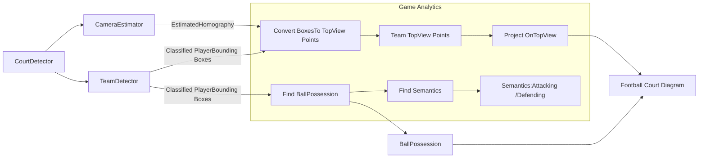

Figure 18: Game analytics architecture

**Team sides inference** is the first task executed, after initializing Game Analytics module. Camera estimation and team detection outputs from the first N frames, are used to determine which side corresponds to which team. Colors used to denote sides, come from Team Classifier and the color of referee team/group is ignored. Basic concept is that players of the same team on average, closer to their side than the opposite side. If most players of team A are closer to the left side, then they must be defending left side and attacking right side. This general rule surely applies at game start when players are divided to each side but, it seems that, apart from corner kicks, during normal game runtime, players follow that rule in general. Current implementation needs only 1 frame to determine team side, given the aforementioned constraint.

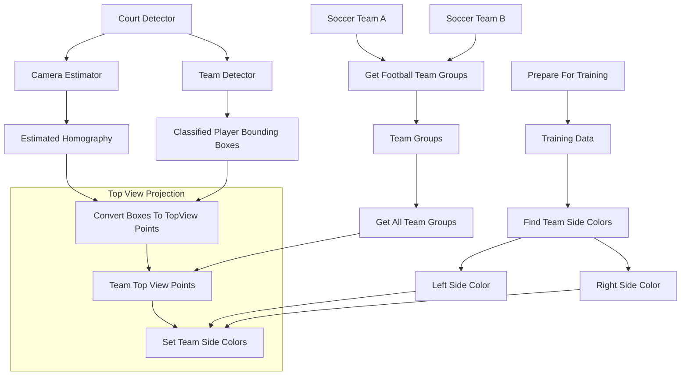

Figure 19: Team sides inference process

Detailed depiction of the process is shown in Figure 19. Having converted player bounding box locations to top view locations, next step is to suppress the team group that corresponds to the referee in order to acquire only the opponent football team groups of points. These points are used as training examples: location coordinates per point are used as features X and color label is used as label Y. Afterwards, a logistic regression model is trained and finally, it is used to determine the color label for the leftmost and the rightmost points in the court (Figure 21). Logistic regression method is selected because of its short training time.

Top-down view of a soccer field with colored lines on goal posts indicating team sides

Figure 20: Information about team sides is represented with a colored line in each goal post. Line color is the same as the team it relates to.

A two-part image showing a soccer match frame on top with player tracking points and a corresponding top-down tactical view below with a logistic regression decision boundary separating the two teams into red and blue zones.

Figure 21: Logistic regression is used to determine team sides from player top view points

**Semantics extraction** is done after processing each frame, as mentioned previously. Outputs from camera estimation and object detection are used for the update process, during which Top Viewer sub-module translates current location points. Ball location history is also updated during the process. From this point on, rest of the processing is handled by Game Analytics module alone.

Ball possession is estimated using top view location points. Ball is considered in possession of a player if he exists within a radius around its location. If more than one players exist within radius, ball may considered as "contested" however, this is a matter of interpretation to be decided by experts. Currently, the closest player to the ball, is considered to have it in his possession so long as the ball is visible. If that's not the case, ball is considered "free". Euclidean distance is used to estimate proximity to the ball.

Rest of semantics relate to information about the team that currently has the ball. Team A is in defensive movement/action if the player who has the ball, is located in team's A side. Alternatively, if the same player is in opponent team's B side, then team A is on the attack. These conclusions result using if-else programming logic.

**Visualization** of analytics results in current implementation is achieved as shown in Figure 22. On the right side, original TV broadcast frames from video sequence are shown. Each player is identified as a member of a team, by the colored mark on his feet. Ball has its own white marking. Court lines are shown in white colored lines, on top of the frame.

Current way of depicting analytics results showing a TV broadcast frame with player markings on the left and a static top view with colored dots and semantic information on the right.

Figure 22: Current way of depicting analytics results. On the left, TV broadcast frame is shown, with player color markings that represent their identified team and court line markings in white color. On the right, static top view with players and ball represented as colored dots. Note that red team defends left side, denoted by a red line in left goal post. Accordingly, blue team defends right side. Semantic information are shown below top view.

On the left side, a static top view of the football court is shown. Colored markings for players-ball are depicted along with a fading ball trail that from last N locations of the ball. Team sides are represented using colored goal posts. Below static top view, there is a semantics board where all semantic information are displayed. Ball possession is shown in grey color if no team possesses the ball or else the sentence changes color to the possessing team's color. Attacking/defending

stance for the team that possesses the ball is also shown. Top view and its board are updated synchronously to the video sequence.

It must be noted that player marking colors do not relate to team outfits. They are different per team-group and are the same for both sides in Figure 22. They are related though, with the color of "Team in ball possession" phrase at semantics info board.

# 4 Experiments & Results

This sections contains experiments during thesis development, results and insights from experiments and data set descriptions.

Exemplary images from World Cup data set showing pairs for image segmentation and feature extraction tasks.

Figure 23: Exemplary images from World Cup data set. Right: pairs of images used for image segmentation task. Left: pairs of images used for feature extraction task.

## 4.1 Court Detection - Dataset

World Cup data set was created by Homayounfar et al. [24] using 20 recorded games from the World Cup 2014 held in Brazil. It contains images 395 annotated images with the ground truth fields and also the grass segmentations. The games were randomly split into two sets with 10 games of 209 images for training and validation, and 186 images from 10 other games for the test set. The images consist of different views of the field with different grass textures and lighting patterns. These games were held in 9 unique stadiums during day and night. There are some games with rain and heavy shadows. The data set is publicly accessible at

# 4.2 Camera Estimation

Initial approach is discussed along with the synthetic data set and its specifications. The data set that was used to train Camera Estimator’s siamese model, is also explained. Finally, use cases where camera estimation along with refinement fails to converge to a result close to ground truth.

## 4.2.1 Initial approach

Initial approach to tackle camera estimation task was based on previous work done and described in 1.3. Using color masking to suppress everything except for the football court area, probabilistic Hough lines method [36] from OpenCV was used to detect lines. Having refined identified court lines, next step was to find their intersection points. These points would then be used in perspective transformation to estimate camera pose.

Initial implementation example output showing a football match with detected court lines and intersection points.

Figure 24: Initial implementation example output. For cases such as this, intersection points do not suffice for robust perspective transformation.

This approach faced two important issues. First of all, it requires at least 4 intersection points that must each be as closest to the 4 corners of the court as possible. Figure 24 depicts such an ideal scenario where the best possible points (shown as light blue markings) are used for perspective transformation. Using the

\*https://nhoma.github.io/

resulting homography matrix, court lines estimation is depicted in white. The best points in this case were set manually but, the automatic process for this job, would probably be an iterative algorithm that would require all possible quartets among N intersection points to be used in perspective transformation along with a termination criterion to determine the best quartet. At worst scenario, it would cost $O(\frac{N!}{(N-4)!})$ time. Secondly, as mentioned in [24] regarding football, intersection points are scarce near middle-field, especially when camera zooms in the court.

A solution for both issues would be a more panoramic view of the court that would cover at least half the court or else, the area should be covered with more than one cameras that would have their output images merged before further processing.

However, it is imperative need in this application to develop a solution that would require only one point of view, like in TV broadcasts. Therefore, this approach was abandoned in the early stages of the application development.

## 4.2.2 Synthetic Camera Pose Dataset

Chen et al. [7] used World Cup data set, described above, to create their synthetic data set. The images consist of different views of the field so they pre-processed the training set to obtain following camera configurations: camera location distribution $\mathcal{N}(\mu, \sigma^2)$ ($\mu \approx [52, -45, 17]^T$) and $\sigma \approx \pm[2, 9, 3]^T$ meters; pan, tilt and focal length ranges ($[-35^\circ, 35^\circ]$, $[-15^\circ, 15^\circ]$ and $[1000, 6000]$ pixels, respectively). These camera parameters were found to be typical settings for many cameras in soccer games.

With these configurations, 90000 camera poses were sampled. The camera centers (u, v) were sampled from the Gaussian distribution $\mathcal{N}(\mu, \sigma^2)$. Pan, tilt and focal length values are sampled using uniform distributions of $[-35^\circ, 35^\circ]$, $[-15^\circ, 15^\circ]$ and $[1000, 6000]$ pixels, respectively. The tilt of camera base is fixed to $-90^\circ$ and the roll angle is a random value from $[-0.1^\circ, 0.1^\circ]$. Pan and tilt regarding camera itself, alongside tilt and roll regarding its base, are used to calculate the rotation vector of camera pose. Therefore, each pose contains 9 values regarding the aforementioned objects:

* coordinates (u, v) of image center upon image plane (2 parameters, same values for all poses),

* focal length (1 parameter),

* rotation vector (3 parameters),

* 3-D coordinates of camera center within world space (3 parameters),

with world space origin located at the bottom left corner of the football court, with Y-axis positive direction along the touchline towards the goal post and X-axis positive direction along the touchline, towards the center of the court. Z-axis positive direction is upwards (Figure 25).

Diagram showing the world coordinate system (X, Y, Z) with origin O at the bottom left corner of a football court.

Figure 25: The origin of the world coordinate is at the left bottom of the football court template.

Diagram of the pinhole camera model showing the relationship between a 3D point P(X,Y,Z), the center of projection, and the 2D image plane.

Figure 26: Pinhole camera model

**Pinhole camera model** is used to explain camera poses(Figure 26):

$$P = KR[I | - C]$$ (11)

where P is the projection matrix that translates a point from 3-D space to 2-D image plane, K is the camera calibration matrix, R is the camera rotation matrix, C is a vector describing a point in 3-D space. Using the model, K, R and C are calculated, therefore P is produced and is used to produce a homography matrix and by extension an edge map. Camera poses produced with the above specifi-

cations, using the binary static top view model, produce edge maps of resolution $1280 \times 720$.

**Siamese training data set** contains 10,000 pairs of edge maps with its pair consisting of two maps that resemble each other. Each pair is produced using a random camera pose from the synthetic data set. Given this pose pan, tilt and focal lenght values, a second pose is sampled from uniform distribution with standard deviation values 1.5, 0.75 and 30 for pan, tilt and focal length respectively. Edge maps are generated from this pose and the original one, using pinhole model. Those maps constitute one pair in the training data set and are saved in data set with $320 \times 180$ resolution.

Screenshot of a soccer match between ARIS and AEK with overlaid camera estimation lines
Screenshot of a soccer match between BRA and GER with overlaid camera estimation lines
Grid of four soccer match screenshots showing various camera estimation failures and field markings
Screenshot of a soccer match between FRA and BEL with overlaid camera estimation lines

Figure 27: Use cases that depict failed camera estimations. Note that top-left image estimation is not fixed even after refinement process

### 4.2.3 Current approach

Camera Estimator module is based on the synthetic camera pose data set described previously, for its initial estimation. However, smaller, regional football courts differ in the camera poses they use to be covered. Figure 27 depicts cases where camera estimation task results were far enough from ground truth. For certain cases, homography refinement process fails converge to ground truth (Figure 27 - top-left image). In other cases, refinement takes considerable amount of time to converge that spans over multiple video frames, a process that is noticeable.

### 4.3 Object Detection

Data sets used during object detection model training are presented and a tool that helped with the fine tuning for image data augmentation process.

#### 4.3.1 Data sets

The publicly available ISSIA-CNR soccer player detection data set9 by D'Orazio et al. [12] and Soccer Player Detection data set10 11 by Lu et al. [33] were used.

ISSIA-CNR Soccer data set contains six synchronized, long shot views of the football pitch acquired by six Full-HD DALSA 25-2M30 cameras. Three cameras are designated for each side of the playing-field, recording at 25 FPS. Videos are acquired during matches of the Italian "Serie A". There're 20,000 annotated frames in the data set annotated with ball position and player bounding boxes.

Soccer Player Detection data set is created from two professional football matches. Each match was recorded by three broadcast cameras at 30 FPS with $1280 \times 720$ resolution. It contains 2019 images with 22,586 annotated player locations. However, ball position is not annotated.

\*9https://drive.google.com/file/d/1Pj6syLRShNQWQaunJmAZttUw2jDh8L_f/view?usp=sharing, June 2021

\*10http://www.cs.ubc.ca/labs/lci/datasets/SoccerPlayerDetection_bmvc17_v1.zip, June 2021

\*11https://drive.google.com/file/d/1ctJojwDaWtHEAeDmB-AwEcO3apqT-O-9/view?usp=sharing, June 2021

Exemplary images from ISSIA-CNR and Soccer Player Detection data sets
Exemplary images from ISSIA-CNR and Soccer Player Detection data sets
Exemplary images from ISSIA-CNR and Soccer Player Detection data sets
Exemplary images from ISSIA-CNR and Soccer Player Detection data sets

Figure 28: Exemplary images from ISSIA-CNR (top-right image) and Soccer Player Detection data sets (rest images)

### 4.3.2 Data augmentation

Image augmentation is accomplished using Transforms package from Torchvision library and the values currently used, resulted after much experimentation. Presented training images differ substantially from real world data and the number of available annotated, soccer detection data is finite. Existing data have to be exploited in order to acquire the best results possible.

Chiefly, due to the fact that ball detection rates were low on real world data, a special tool that simulates image transformations, was developed. Its use allowed a relatively quick and more reliable parameter tuning for image augmentation. Tool interface is simple: it comprises an image preview and, depending on the case, a number of slide bars to experiment with different input values torchvision.transforms methods. Changed values from slide bars update instantly the image preview, making fine tuning process much easier. Figure 29 shows the procedure of changing distortion, degree rotation, scaling and shear. Tool was adapted accordingly, to simulate image jittering effects in the same manner. Parameter tuning was done by observing real world videos (described later on)

Screenshot of a tool titled "Torchvision Transform Tuning" showing a soccer field with players and sliders for Distortion, Degrees, Scale, and Shear.

Figure 29: Developed tool to simulate PyTorch transformations results on image during augmentation

## 4.4 Team Classification

**Color models** used to represent colors in spaces are shown in Figure 30. Experiments aimed to identify convenient color representations that would help with grass suppression from bounding box images. Also, a right color model would help with color segmantation task.

Three 3D plots representing different color models: RGB, HSV, and Spherical.

Figure 30: Color models used during experimentations. From left to right: RGB model- HSV model- Spherical model

**Test image sets** for method comparison, consists of 72 test images from 5 different games (Figure 31). Test images resulted from object detection bounding boxes and players depicted in those games have both single-color and dual-color outfits in order to test classification methods in both cases. Each set comes from a single frame so, exactly one referee image is contained within each set. Games come from the following matches:

* AEK Athens F.C. - Aris Thessaloniki F.C. (Greek Super League). Team outfits: Blue-yellow & yellow-black respectively. Referee outfit: Magenta-black.

* Belgium - Japan (2018 FIFA World Cup). Team outfits: Red & blue respectively. Referee outfit: Yellow-black.

* ISSIA-CNR image data set (Italian Serie A). Team outfits: White & blue. Referee outfit: Red.

* Manchester United F.C. - Chelsea F.C. (English Premier League). Team outfits: Red-white-black & blue-white respectively. Referee outfit: Black.

* Egaleo F.C. - Aiolikos F.C. (Greek C National Amateur Division). Team outfits: Green-white & black-white respectively. Referee outfit: Pink-black.

**Evaluation** was done using completeness score, as described in Rosenberg et al. 2007 [41], and processing time, to determine the best method. All methods are set to identify 3 different color groups per image set. Dominant color method is set to identify 2 dominant colors

<table>
  <thead>
    <tr>
        <th>Method</th>
        <th>AEK</th>
        <th>Belgium</th>
        <th>ISSIA</th>
        <th>Manchester</th>
        <th>Egaleo</th>
        <th>Proc. Time</th>
    </tr>
  </thead>
  <tbody>
    <tr>
        <td>Dominant Color</td>
        <td>0.40</td>
        <td>0.68</td>
        <td>0.34</td>
        <td>0.09</td>
        <td>-</td>
        <td>85.67”</td>
    </tr>
    <tr>
        <td>Color Histogram</td>
        <td><strong>0.72</strong></td>
        <td><strong>1.00</strong></td>
        <td><strong>0.59</strong></td>
        <td><strong>1.00</strong></td>
        <td><strong>0.40</strong></td>
        <td><strong>17.57”</strong></td>
    </tr>
    <tr>
        <td>Segmentation</td>
        <td><strong>0.72</strong></td>
        <td><strong>1.00</strong></td>
        <td><strong>0.59</strong></td>
        <td>0.45</td>
        <td>0.27</td>
        <td>25.08”</td>
    </tr>
  </tbody>
</table>

Table 1: Team classification methods comparison

Considering Table 1, it must be noted that in player images from Egaleo set, Dominant Color method does not yield results. This is owed to the fact that in certain images, green pixel suppression eliminates nearly all but one image pixels thus, it is not possible to extract a second dominant color. Though Color Histogram uses the same green pixel suppression, the remaining one pixel suffices to produce a color histogram however this approach needs refinement in case suppression eliminates every single pixel. Segmentation method performs nearly as well as Color Histogram apart from the last two image sets but is also slower than it, because it uses K-means which is an iterative algorithm.

Test images used for validation showing ground truth (G_T) and predicted (Pred) values for player classification across five datasets: AEK, Belgium, ISSIA-CNR, Manchester, and Egaleo.

Figure 31: Test images used for validation. From top to bottom: AEK - Belgium - ISSIA-CNR - Manchester - Egaleo. There is annotation above each image: G_T represents ground truth, Pred represents predicted value. Ground truth and Pred take values 0, 1, 2 according to the cluster they belong. Predicted values in this figure are the results from Color Histogram method.

Both Color Histogram and Segmentation methods face a problem in Egaleo set. The interpretation of the poor results is probably the long shot from the source frame (Figure 32) which is equivalent to a closer camera shot with lower image resolution. Indeed, object detection plays crucial role from team classification task

Color Histogram method is selected over the others, due to its scores and processing speed, thus being superior.

Source image for Egaleo test images showing a football match in a stadium.

Figure 32: Source image for Egaleo test images.

## 4.5 Real World Videos

Videos from various football matches were acquired, mainly from YouTube, and used during development of this application, for experiments and screenshots presented in this thesis. To summarize, the matches are:

* Undefined teams from ISSIA-CNR soccer player detection data set (Italian Serie A)

* Belgium - Japan (2018 FIFA World Cup)

* France - Belgium (2018 FIFA World Cup)

* Brazil - Germany (2014 FIFA World Cup)

* Manchester United F.C. - Chelsea F.C. (English Premier League)

* AEK Athens F.C. - Aris Thessaloniki F.C. (Greek Super League)

* AEK Athens F.C. - Olympiakos F.C. (Greek Super League)

* Egaleo F.C. - Aiolikos F.C. (Greek C National Amateur Division)

World cup videos where selected because they represent ideal court situations (good court & lighing conditions, panoramic view). Manchester United - Chelsea match was selected in order to examine results on low quality images. Greek Super League matches are representative cases of greek stadiums and their conditions

where maintenance standards are a bit lower than their counterparts in countries with considerable football tradition. Finally, Egaleo - Aiolikos match was used to study team classification results in a difficult scenario (green-black-white outfits) but also, because it is of amateur category. Technical leadership for those football clubs would indeed benefit from this application and using this video footage is a case study.

There are countless amateur football matches available on YouTube, however non were used due to the fact that greek amateur games are conducted in pitches with extremely poor conditions. Indeed, in those matches, court line detection is difficult even for human spectators.

Some videos where edited in order to remove close-ups to the players, phase replays and advertisements attached on videos themselves while, others were used without montage. Kdenlive application was used for video editing.

# 5 Conclusions & Future Work

A prototype method that observes football games, detects players ball and their location in the court and finally, exports basic conclusions, was presented in the context of this thesis.

Problems that were examined, include image segmentation, image feature extraction, object detection and tracking using optical flow, camera registration, camera pose tracking using image alignment, color classification, image color segmentation and simple classification of points. Insights were gained regarding deep learning model training with the use of GPU as well as continuing training procedure from existing checkpoints without loss of performance.

Existing work from multiple papers was combined and adjusted in order to solve sport analytics problem for football games. Conditional GAN *Pix2Pix* [25] was used to handle court detection tasks. *FootAndBall* deep CNN [28] was used to handle object detection and Lucas-Kanade method [34], [5] for tracking objects. Siamese feature extraction along with a database that contains synthetic camera poses [7], were used for camera registration. *Enhanced Correlation Coefficient Maximization* [13] was used to track camera pose updates. Traditional machine learning was used for team classification by means of clustering and logistic regression to infer team sides per team.

Initial objective for this thesis was the extraction of more complicated insights than what the application currently outputs, like recognizing tactic formations for each team. However, current work forms a solid basis for further implementations towards the direction of the initial objective.

Apart from shortcomings regarding the initial objective, there are issues that

are not handled currently and would need further research or optimization. These are:

* *Stabilizing players position on top view.* Currently, player-ball positions on static top view is jittery and needs further stabilization. This depends on the stability / performance of camera estimation & the detection of players’ feet (currently inferred from bounding box bot-mid point which is adjusted per frame). Players’ feet are considerably more stable during frame sequences so they constitute a good feature to be used as solution.

* *Improve camera estimation.* Camera estimation task relies heavily on court detection output. Line detection has to be improved to that aim. There also might be a set of restrictions to be introduced in order to handle the issue where Camera Estimator thinks the court changes dimensions or is zoomed in/out, without actual zooming in/out from the camera. Also, changing dis-tribution characteristics for the synthetic camera pose data set, can work to that end.

* *Improve ball detection.* Current improvements comparing to original FootAnd-Ball implementation, are based on image augmentation. Further improve-ments maybe additional ball annotation in existing datasets & perhaps, an alteration in current FootAndBall architecture. Architecture changes maybe in the same fashion as YoLo v3 with multiple network outputs for close-up and far-away camera takes.

* *Overall speed-up improvements.* Based on my limited experience, migrat-ing code to C++ may improve execution times. Python as an interpreter language, executes slower than compiler-based C++. Python executes more code on runtime which helps it be more user-friendly. OpenCV is imple-mented in C++ and the OpenCV Python API has an overhead on execution time. Camera Estimator database may also be reduced in size and rely much more on ECC for approximating original camera pose.

Generally, the result in this thesis suggest that the combination of existing works done so far, solves the problem of football analytics in a promising, de-cent and versatile way. However, low-end hardware is a restraining factor for its performance which necessitates further software improvements that exploit hard-ware to its maximum capabilities.

Future work will be oriented on performance improvements that reduce pro-cessing time and make much more accurate estimations as mentioned above, while also work on getting more complicated insights about the game.

<page_number>53</page_number>

# References

[1] I. Sutskever A. Krizhevsky and G. E. Hinton. Imagenet classification with deep con- volutional neural networks. In *NIPS*, 2012.

[2] Jiten B Amin, Darshak G Thakore, and Narendra M Patel. Soccer player tracking system.

[3] Alina Bialkowski, Patrick Lucey, Peter Carr, Iain Matthews, Sridha Sridha-ran, and Clinton Fookes. Discovering team structures in soccer from spa-tioteemporal data. *IEEE Transactions on Knowledge and Data Engineering*, 28(10):2596–2605, 2016.

[4] Alina Bialkowski, Patrick Lucey, Peter Carr, Yisong Yue, Sridha Sridharan, and Iain Matthews. Large-scale analysis of soccer matches using spatiotemporal tracking data. In *2014 IEEE International Conference on Data Mining*, pages 725–730. IEEE, 2014.

[5] Jean-Yves Bouguet et al. Pyramidal implementation of the affine lucas kanade feature tracker description of the algorithm. *Intel corporation*, 5(1-10):4, 2001.

[6] Shih-Fu Chang. Real-time view recognition and event detection for sports video.

[7] Jianhui Chen and James J Little. Sports camera calibration via synthetic data. In *Proceedings of the IEEE Conference on Computer Vision and Pattern Recognition Workshops*, pages 0–0, 2019.

[8] Yu-Ting Chen and Chu-Song Chen. A cascade of feed-forward classifiers for fast pedestrian detection. In *Asian Conference on Computer Vision*, pages 905–914. Springer, 2007.

[9] Navneet Dalal and Bill Triggs. Histograms of oriented gradients for human detection. In *2005 IEEE computer society conference on computer vision and pattern recognition (CVPR’05)*, volume 1, pages 886–893. IEEE, 2005.

[10] Martin Danelljan, Gustav Häger, Fahad Khan, and Michael Felsberg. Accu-rate scale estimation for robust visual tracking. In *British Machine Vision Conference, Nottingham, September 1-5, 2014*. BMVA Press, 2014.

[11] Tiziana D’Orazio, Nicola Ancona, Grazia Cicirelli, and Massimiliano Nitti. A ball detection algorithm for real soccer image sequences. In *Object recogni-tion supported by user interaction for service robots*, volume 1, pages 210–213. IEEE, 2002.

<page_number>54</page_number>

[12] Tiziana D’Orazio, Marco Leo, Nicola Mosca, Paolo Spagnolo, and Pier Luigi Mazzeo. A semi-automatic system for ground truth generation of soccer video sequences. In 2009 Sixth IEEE International Conference on Advanced Video and Signal Based Surveillance, pages 559–564. IEEE, 2009.

[13] Georgios D Evangelidis and Emmanouil Z Psarakis. Parametric image alignment using enhanced correlation coefficient maximization. IEEE Transactions on Pattern Analysis and Machine Intelligence, 30(10):1858–1865, 2008.

[14] Dirk Farin, Jungong Han, and Peter HN de With. Fast camera calibration for the analysis of sport sequences. In 2005 IEEE International Conference on Multimedia and Expo, pages 4–pp. IEEE, 2005.

[15] Dirk Farin, Susanne Krabbe, Wolfgang Effelsberg, et al. Robust camera calibration for sport videos using court models. In Storage and Retrieval Methods and Applications for Multimedia 2004, volume 5307, pages 80–91. International Society for Optics and Photonics, 2003.

[16] Miguel Farrajota, João MF Rodrigues, and JMH du Buf. Bio-inspired pedestrian detection and tracking. In 3rd International Conference on Advanced Bio-Informatics, Bio-Technology Environments, pages 28–33, 2015.

[17] Ross Girshick. Fast r-cnn. In Proceedings of the IEEE international conference on computer vision, pages 1440–1448, 2015.

[18] Ross Girshick, Jeff Donahue, Trevor Darrell, and Jitendra Malik. Rich feature hierarchies for accurate object detection and semantic segmentation. In Proceedings of the IEEE conference on computer vision and pattern recognition, pages 580–587, 2014.

[19] Ayse Bilge Gunduz, Berk Taskin, Ali Gokhan Yavuz, and Mine Elif Karsligil. A better way of extracting dominant colors using salient objects with semantic segmentation. Engineering Applications of Artificial Intelligence, 100:104204, 2021.

[20] R. Hadsell, S. Chopra, and Y. LeCun. Dimensionality reduction by learning an invariant mapping. In 2006 IEEE Computer Society Conference on Computer Vision and Pattern Recognition (CVPR’06), volume 2, pages 1735–1742, 2006.

[21] Josef Halbinger and Juergen Metzler. Video-based soccer ball detection in difficult situations. In International Congress on Sports Science Research and Technology Support, pages 17–24. Springer, 2013.

<page_number>55</page_number>

[22] Bharath Hariharan, Pablo Arbeláez, Ross Girshick, and Jitendra Malik. Hy-
percolumns for object segmentation and fine-grained localization. In *Proceedings of the IEEE conference on computer vision and pattern recognition*, pages 447–456, 2015.

[23] M Hoernig, M Herrmann, and B Radig. Real time soccer field analysis from monocular tv video data. In *11th International Conference on Pattern Recognition and Image Analysis (PRIA-11-2013)*, volume 2, pages 567–570. The Russian Academy of Sciences, 2013.

[24] Namdar Homayounfar, Sanja Fidler, and Raquel Urtasun. Sports field localization via deep structured models. In *Proceedings of the IEEE Conference on Computer Vision and Pattern Recognition*, pages 5212–5220, 2017.

[25] Phillip Isola, Jun-Yan Zhu, Tinghui Zhou, and Alexei A Efros. Image-to-image translation with conditional adversarial networks. In *Proceedings of the IEEE conference on computer vision and pattern recognition*, pages 1125–1134, 2017.

[26] Jacek Komorowski, Grzegorz Kurzejamski, and Grzegorz Sarwas. Balltrack: Football ball tracking for real-time cctv systems. In *2019 16th International Conference on Machine Vision Applications (MVA)*, pages 1–5. IEEE, 2019.

[27] Jacek Komorowski, Grzegorz Kurzejamski, and Grzegorz Sarwas. Deepball: Deep neural-network ball detector. *arXiv preprint arXiv:1902.07304*, 2019.

[28] Jacek Komorowski, Grzegorz Kurzejamski, and Grzegorz Sarwas. Footand-ball: Integrated player and ball detector. *arXiv preprint arXiv:1912.05445*, 2019.

[29] Kobi Levi and Yair Weiss. Learning object detection from a small number of examples: the importance of good features. In *Proceedings of the 2004 IEEE Computer Society Conference on Computer Vision and Pattern Recognition, 2004. CVPR 2004.*, volume 2, pages II–II. IEEE, 2004.

[30] Jianbo Li, Yiping Yao, and Wenjie Tang. Km_grabcut: a fast interactive image segmentation algorithm. In *Sixth International Conference on Graphic and Image Processing (ICGIP 2014)*, volume 9443, page 944313. International Society for Optics and Photonics, 2015.

[31] Tsung-Yi Lin, Piotr Dollár, Ross Girshick, Kaiming He, Bharath Hariharan, and Serge Belongie. Feature pyramid networks for object detection. In *Proceedings of the IEEE conference on computer vision and pattern recognition*, pages 2117–2125, 2017.

[32] Wei Liu, Dragomir Anguelov, Dumitru Erhan, Christian Szegedy, Scott Reed, Cheng-Yang Fu, and Alexander C Berg. Ssd: Single shot multibox detector. In European conference on computer vision, pages 21–37. Springer, 2016.

[33] Keyu Lu, Jianhui Chen, James J Little, and Hangen He. Light cascaded convolutional neural networks for accurate player detection. arXiv preprint arXiv:1709.10230, 2017.

[34] Bruce D Lucas, Takeo Kanade, et al. An iterative image registration technique with an application to stereo vision. Vancouver, British Columbia, 1981.

[35] Vinicius Machado, Roger Leite, Felipe Moura, Sergio Cunha, Filip Sadlo, and João LD Comba. Visual soccer match analysis using spatiotemporal positions of players. Computers & Graphics, 68:84–95, 2017.

[36] Jiri Matas, Charles Galambos, and Josef Kittler. Robust detection of lines using the progressive probabilistic hough transform. Computer vision and image understanding, 78(1):119–137, 2000.

[37] Eric Müller-Budack, Jonas Theiner, Robert Rein, and Ralph Ewerth. ” does 4-4-2 exist?”– an analytics approach to understand and classify football team formations in single match situations. In Proceedings Proceedings of the 2nd International Workshop on Multimedia Content Analysis in Sports, pages 25–33, 2019.

[38] Chris Poppe, Sarah De Bruyne, Steven Verstockt, and Rik Van de Walle. Multi-camera analysis of soccer sequences. In 2010 7th IEEE International Conference on Advanced Video and Signal Based Surveillance, pages 26–31. IEEE, 2010.

[39] Joseph Redmon, Santosh Divvala, Ross Girshick, and Ali Farhadi. You only look once: Unified, real-time object detection. In Proceedings of the IEEE conference on computer vision and pattern recognition, pages 779–788, 2016.

[40] Shaoqing Ren, Kaiming He, Ross Girshick, and Jian Sun. Faster r-cnn: Towards real-time object detection with region proposal networks. InAdvances in neural information processing systems, pages 91–99, 2015.

[41] Andrew Rosenberg and Julia Hirschberg. V-measure: A conditional entropy-based external cluster evaluation measure. In Proceedings of the

<page_number>57</page_number>

<page_number>58</page_number>

[42] Carsten Rother, Vladimir Kolmogorov, and Andrew Blake. ” grabcut” interactive foreground extraction using iterated graph cuts. ACM transactions on graphics (TOG), 23(3):309–314, 2004.

[43] Rahul Anand Sharma, Bharath Bhat, Vineet Gandhi, and CV Jawahar. Automated top view registration of broadcast football videos. In 2018 IEEE Winter Conference on Applications of Computer Vision (WACV), pages 305–313. IEEE, 2018.

[44] Laurie Shaw and Mark Glickman. Dynamic analysis of team strategy in professional football. Barça Sports Analytics Summit, 2019.

[45] Jianbo Shi et al. Good features to track. In 1994 Proceedings of IEEE conference on computer vision and pattern recognition, pages 593–600. IEEE, 1994.

[46] Jasper RR Uijlings, Koen EA Van De Sande, Theo Gevers, and Arnold WM Smeulders. Selective search for object recognition. International journal of computer vision, 104(2):154–171, 2013.

2007 joint conference on empirical methods in natural language processing and computational natural language learning (EMNLP-CoNLL), pages 410–420, 2007.