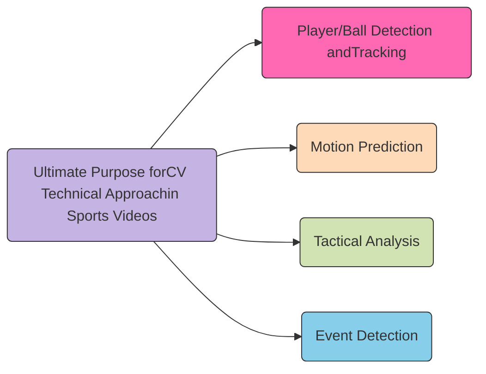
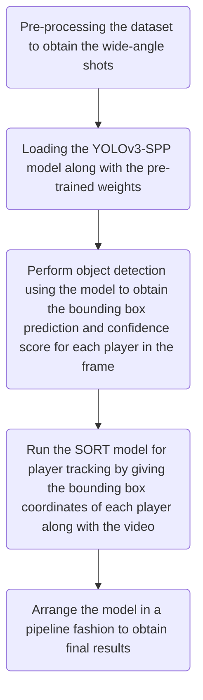
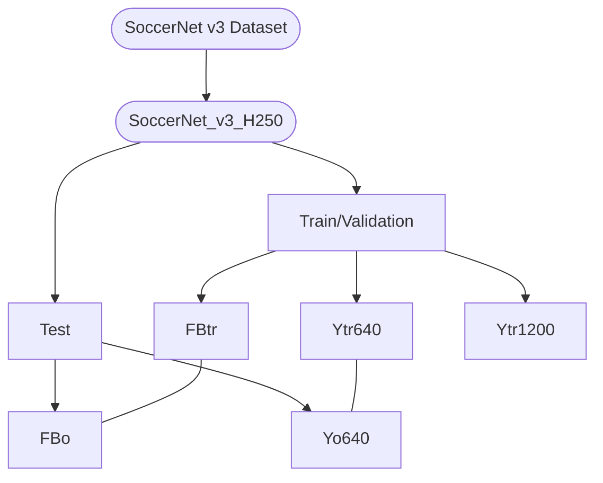
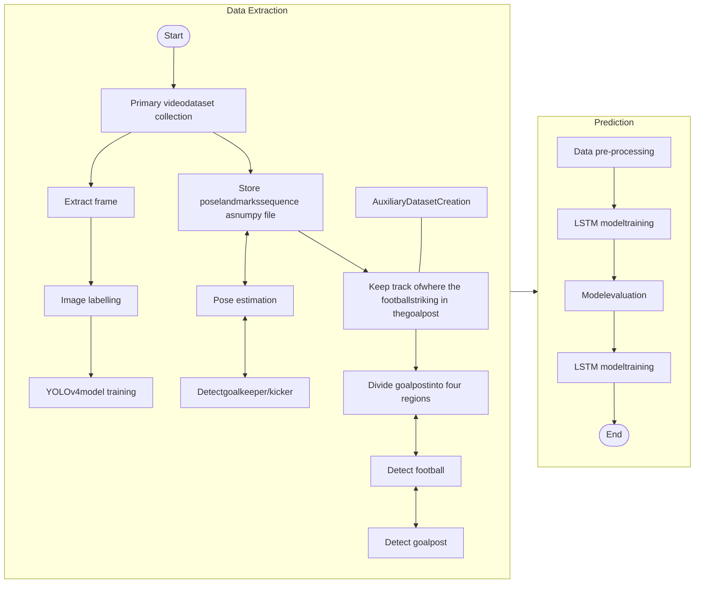
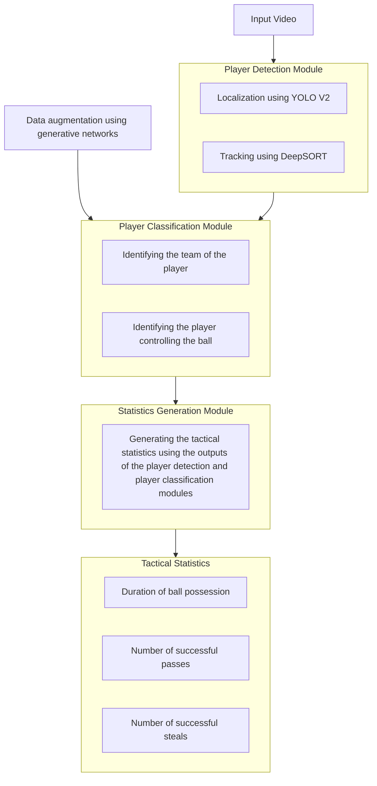
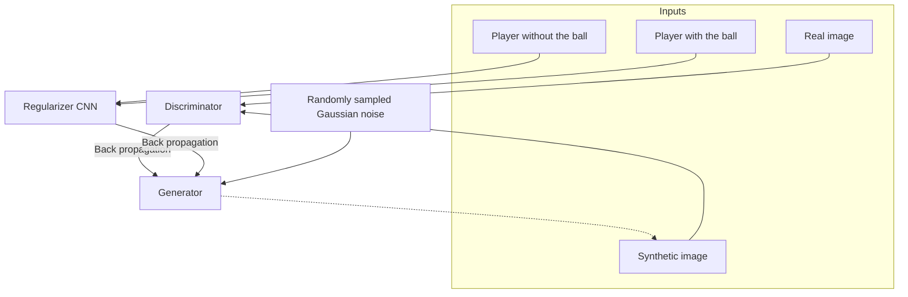
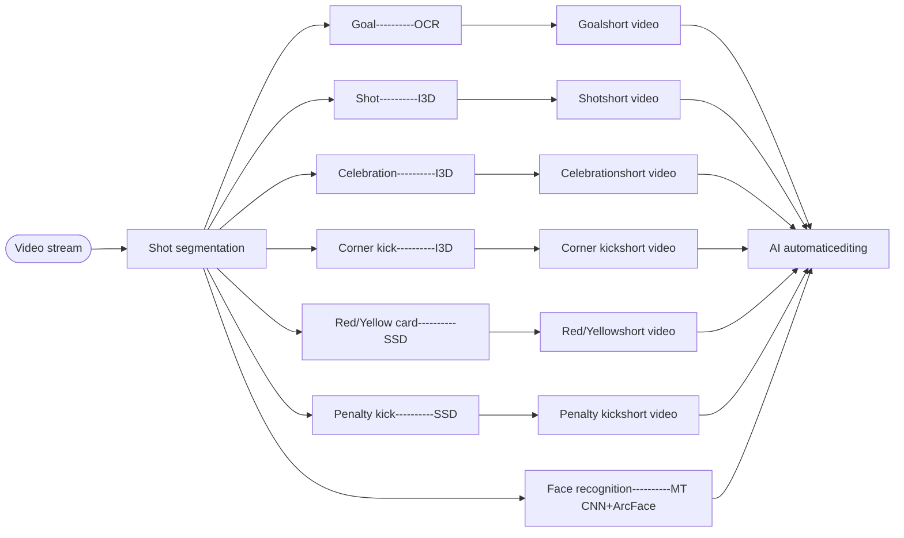

Information logo MDPI logo

Review

# A Review of Computer Vision Technology for Football Videos

Fucheng Zheng <sup>1,\*</sup> ORCID logo, Duaa Zuhair Al-Hamid <sup>2</sup> ORCID logo, Peter Han Joo Chong <sup>1</sup> ORCID logo, Cheng Yang <sup>3</sup> ORCID logo and Xue Jun Li <sup>1</sup> ORCID logo

<sup>1</sup> Department of Electrical and Electronic Engineering, Auckland University of Technology, 55 Wellesley Street East, Auckland 1010, New Zealand; peter.chong@aut.ac.nz (P.H.J.C.); xuejun.li@aut.ac.nz (X.J.L.)

<sup>2</sup> Department of Computer and Information Sciences, Auckland University of Technology, 55 Wellesley Street East, Auckland 1010, New Zealand; duaa.alhamid@aut.ac.nz

<sup>3</sup> Zyetric Technologies Ltd., Auckland 1011, New Zealand; robertyang@ieee.org

\* Correspondence: fucheng.zheng@aut.ac.nz

**Abstract:** In the era of digital advancement, the integration of Deep Learning (DL) algorithms is revolutionizing performance monitoring in football. Due to restrictions on monitoring devices during games to prevent unfair advantages, coaches are tasked to analyze players’ movements and performance visually. As a result, Computer Vision (CV) technology has emerged as a vital non-contact tool for performance analysis, offering numerous opportunities to enhance the clarity, accuracy, and intelligence of sports event observations. However, existing CV studies in football face critical challenges, including low-resolution imagery of distant players and balls, severe occlusion in crowded scenes, motion blur during rapid movements, and the lack of large-scale annotated datasets tailored for dynamic football scenarios. This review paper fills this gap by comprehensively analyzing advancements in CV, particularly in four key areas: player/ball detection and tracking, motion prediction, tactical analysis, and event detection in football. By exploring these areas, this review offers valuable insights for future research on using CV technology to improve sports performance. Future directions should prioritize super-resolution techniques to enhance video quality and improve small-object detection performance, collaborative efforts to build diverse and richly annotated datasets, and the integration of contextual game information (e.g., score differentials and time remaining) to improve predictive models. The in-depth analysis of current State-Of-The-Art (SOTA) CV techniques provides researchers with a detailed reference to further develop robust and intelligent CV systems in football.

**Keywords:** computer vision; football; sport performance; performance analysis

check for updates

Academic Editor: Kohei Arai

Received: 24 March 2025
Revised: 21 April 2025
Accepted: 24 April 2025
Published: 28 April 2025

**Citation:** Zheng, F.; Al-Hamid, D.Z.; Chong, P.H.J.; Yang, C.; Li, X.J. A Review of Computer Vision Technology for Football Videos. *Information* **2025**, *16*, 355. https://doi.org/10.3390/info16050355

**Copyright:** © 2025 by the authors. Licensee MDPI, Basel, Switzerland. This article is an open access article distributed under the terms and conditions of the Creative Commons Attribution (CC BY) license (https://creativecommons.org/licenses/by/4.0/).

## 1. Introduction

In the early stages of Computer Vision (CV) technology, researchers used traditional methods such as Support Vector Machines (SVMs) to classify ten types of sports videos [1]. As Deep Learning (DL) became more popular for image classification, researchers adopted DL techniques to tackle video classification. They applied Deep Convolutional Neural Networks (DCNNs) to classify 487 types of sports [2] achieving an accuracy rate of 63.9% in 2014, which increased to 79.2% in 2019 [3]. Following a breakthrough in video classification, researchers have advanced beyond simply identifying sports videos, such as those featuring volleyball or golf. Their focus has shifted towards enhancing video recognition in the context of sports events, player positions, individual sports, and team sports [4–8]. Furthermore, AI technology has been utilized for image and video analysis to simulate sports commentators’ explanations of sports events [9,10]. Significant progress has been

made in CV for analyzing sports events, and the scope of its applications and research continues to expand. However, current DL approaches have certain limitations. Achieving optimal results often requires extensive and meticulously labeled datasets, which require significant effort. Additionally, existing research primarily focuses on sports with relatively simple rules, leaving more complex and diverse sports underexplored. With technological advancements, CV has increasingly provided professional services for players, coaches, spectators, and other members of the sports community. This review aims to address the research gap in CV for football video analysis, offering a solid theoretical foundation and technical guidelines for future research. By comprehensively analyzing football-related research outcomes, this paper offers valuable insights and guidance for the future development of CV technology. Furthermore, we specifically focus on CV methods because CV provides non-contact, video-based, scalable analysis capabilities that align well with the constraints of professional football environments, where wearable tracking devices are restricted. Recent research in [11] demonstrated that CV approaches using a single camera significantly outperform wearable inertial measurement units (IMUs), achieving a higher accuracy of approximately 10 percentage points, while avoiding common sensor-related issues such as discomfort, calibration complexity, and synchronization problems. In contrast, general AI techniques without CV integration are insufficient for directly extracting rich spatiotemporal features from video data. Therefore, this review systematically addresses the need for football-specific CV analysis, offering a focused and comprehensive evaluation of current advancements in the field.

To understand the research landscape of CV in football, this study explores the application of CV in sports through an extensive literature review. The search process followed a PRISMA-guided approach ensuring transparency and reproducibility. The literature search focused on peer-reviewed articles published between 2020 and 2024 from five prominent publishers: IEEE, Elsevier, Springer, Wiley, and Taylor & Francis. A Boolean search strategy combining key terms was implemented, including “(“computer vision” OR “CV”) AND (“sport” OR “athletes”)”, “(“player/ball tracking” OR “player/ball detection”) AND (“deep learning” OR “neural network”)”, “(“tactical analysis” OR “pattern recognition”) AND “sports analytics””, “(“event detection” OR “action/motion recognition”) AND “video processing””, and “(“motion prediction” OR “trajectory forecasting”) AND “score prediction””. This strategy initially identified 217 articles. Following PRISMA’s four-stage workflow, we carried out the following steps: 1. Identification: A total of 217 records retrieved. 2. Screening: Title and abstract review excluded 95 papers due to non-sports focus (n = 38), non-CV methodologies (n = 29), and non-English language (n = 28), leaving 122 articles for full-text appraisal. 3. Eligibility: Full-text evaluation excluded 73 studies lacking sufficient metrics (n = 41), novelty (n = 22), or reproducible protocols (n = 10). 4. Inclusion: A total of 49 studies met all criteria and were included in the review. The selected studies were categorized into four ultimate purposes: player/ball detection and tracking, motion prediction, tactical analysis, and event detection. By combining these research findings, this review highlights the broad application of CV in sports video analysis and provides a valuable reference for future research directions.

Figure 1 illustrates the overall trend in research activity, highlighting a shift in emphasis from fundamental detection techniques to higher-level objectives. Notably, from 2023 to 2024, there has been a decline in studies focused on player/ball detection and tracking, while research on motion prediction, tactical analysis, and event detection has increased. This transition suggests that the field is advancing beyond object tracking toward more sophisticated decision-making frameworks, aligning with the broader evolution of AI-driven sports analytics.

Trend in Computer Vision Research Publications in Sports (2020-2024)
<table>
  <thead>
    <tr>
        <th>Year</th>
        <th>Player/Ball Detection and Tracking</th>
        <th>Motion Prediction</th>
        <th>Tactical Analysis</th>
        <th>Event Detection</th>
    </tr>
  </thead>
  <tbody>
    <tr>
        <td>2020</td>
        <td>45</td>
        <td>37</td>
        <td>32</td>
        <td>20</td>
    </tr>
    <tr>
        <td>2021</td>
        <td>48</td>
        <td>33</td>
        <td>33</td>
        <td>18</td>
    </tr>
    <tr>
        <td>2022</td>
        <td>51</td>
        <td>34</td>
        <td>29</td>
        <td>17</td>
    </tr>
    <tr>
        <td>2023</td>
        <td>37</td>
        <td>39</td>
        <td>35</td>
        <td>34</td>
    </tr>
    <tr>
        <td>2024</td>
        <td>33</td>
        <td>55</td>
        <td>48</td>
        <td>49</td>
    </tr>
  </tbody>
</table>

Figure 1. CV research trends in sports (2020–2024).

In recent years, CV technology has made significant progress in sports video analysis and has become the focus of researchers and technology developers. Figure 2 shows the papers published by IEEE, Elsevier, Springer, Wiley and Taylor & Francis between 2020 and 2024, categorized by different types of sports for four ultimate purposes. During this period, football-related CV research led the way (49%), followed by basketball (15%), highlighting the broad applicability and critical role of CV techniques in these sports. However, despite football being the most studied sport within this review, this percentage (49%, roughly 24 studies out of 49) is still relatively limited given football’s global popularity, complexity, and the diverse analytical challenges it presents. This comparative underrepresentation clearly highlights a research gap, especially considering that only a few comprehensive reviews explicitly address CV applications uniquely tailored to football scenarios. Conversely, fewer studies have applied CV to less mainstream sports such as rugby and volleyball. This could be due to the complexity and variability of these sports, which pose significant challenges for CV algorithms. Additionally, the limited availability of annotated datasets and lower commercial investment in these sports may contribute to the lesser focus on CV research in these areas.

Research distribution across sports by purpose (2020–2024) treemap

Figure 2. Research distribution across sports by purpose (2020–2024).

To date, several review papers have discussed the application of CV in sports, but only a few have focused specifically on football. Ref. [12] discussed the evolution of player motion tracking, moving from manual notational analysis to automated systems. Despite advancements, challenges persist due to the dynamic and unpredictable nature of player movements and technological limitations. Current systems like TRAKUS and Prozone provide feedback but require manual intervention and specific environments, highlighting

the need for fully automated, reliable tracking in sports contexts. Ref. [13] systematically explored sports video analysis by focusing on content-aware methodologies, contrasting traditional spatiotemporal approaches. The paper emphasized the need for semantic interpretation of sports content, exploring hierarchical models and techniques applied in sportscasts. Future trends highlight the necessity to bridge sensory and content excitement, addressing user demands comprehensively. Ref. [14] explored the application of CV in sports, addressing the inherent challenges of analyzing fast and complex motions. The review covered current commercial applications and ongoing research efforts, emphasizing the potential to enhance experiences for competitors, coaches, and audiences. Additionally, it provided a summary of online datasets for further research. Ref. [15] provided a comprehensive review of video-based techniques for sports action recognition, aiming to establish automated notational analysis systems. The review covered current technologies, general action recognition frameworks, and the implementation of DL in sports analysis. It identified future trends and research directions, offering valuable insights for advancing video-based action recognition in sports. Ref. [16] reviewed recent advancements in video analysis and CV techniques in sports, covering applications like player detection, tracking, trajectory prediction, strategy recognition, and event classification. The review discussed AI applications, GPU-based workstations, and embedded platforms, highlighting publicly available datasets. It identified future research directions, challenges, and trends in sports visual recognition. Ref. [17] reviewed human action recognition in sports, focused on the detection and analysis of player actions in sports like soccer, basketball, volleyball, and tennis. The review highlighted the use of CV to monitor performance, track movements, and recognize actions, proposing a novel systematization based on action complexity. It emphasized methods applied to publicly available datasets, showcasing the growing relevance of human action recognition in sports.

Despite these extensive reviews, our analysis shows that among the existing related sports review articles published between 2020 and 2024—spanning over 250 review papers—fewer than 10% specifically address the use of CV in football, while the majority focus either broadly on multiple sports or other domains such as health monitoring, physiology, and general athletics. Although football-related research constitutes approximately 49% of the selected primary studies in our review, comprehensive reviews exclusively focusing on football are rare. Given football’s global dominance and its unique analytical complexities—such as the simultaneous movements of multiple players, evolving tactical formations, and long-term temporal dependencies—this underrepresentation highlights a critical research gap.

This review paper is structured as follows: First, in Section 2, we aim to provide readers with a comprehensive overview of the industry by identifying four ultimate purposes of CV applications: player/ball detection and tracking, motion prediction, tactical analysis, and event detection. Next, in Section 3, a comprehensive comparative study of the application of CV techniques to football video analysis is presented, focusing on four ultimate purposes. This section evaluates and compares the effectiveness and utility of different approaches, addressing challenges such as low-resolution imagery, motion blur, complex occlusions, and unpredictable activities, while highlighting the advancements and limitations of current methodologies. Additionally, Section 4 summarizes the current research challenges in football, the CV models used for their comparisons, and their limitations. It includes an in-depth analysis of evaluation metrics such as precision, recall, and F1-Score, explaining their significance and how they are calculated using a Confusion Matrix. Finally, in Section 5, a conclusion of this review is presented.

# 2. Four Ultimate Purposes for CV Research in Sports

The evolution of sports, intertwined with human development, has manifested through various physical activities designed for fitness and competition. In this digital age, video has become the primary medium for disseminating sports events globally. The convergence of sports and CV technology has led to the development of diverse techniques and algorithms. After reviewing numerous papers, we identified four key objectives, which we termed the four ultimate purposes—player/ball detection and tracking, motion prediction, tactical analysis, and event detection—to achieve their final objective, as shown in Figure 3.



Figure 3. Classification of existing research into four ultimate purposes: Player/Ball Detection and Tracking [17–20], Motion Prediction [21–24], Tactical Analysis [25–28], and Event Detection [29–32]. The numbers refer to representative studies cited in the main text (see Sections 2.1–2.4).

## 2.1. Player/Ball Detection and Tracking

This section covers research focused on the identification and tracking of players and the ball during sports events. By leveraging CV techniques, these studies aim to improve the precision and reliability of tracking systems. The data obtained are crucial for performance analysis, strategic planning, and gaining deeper insights into the dynamics of the game.

The research study in [18] investigated the enhancement of football video player detection and motion tracking using edge computing and DL. By optimizing the Faster Region-based Convolutional Neural Network (R-CNN) algorithm to tackle small target detection and occlusion issues, the study achieved 89.1% tracking accuracy and a 64.5% success rate. This study demonstrates robust, real-time tracking, significantly improving football video analysis and viewer experience. Ref. [19] introduced a novel method for tracking and reidentifying players in team sports, addressing challenges such as rapid movement, occlusion, and identical jerseys. Their semi-interactive system combines pre-trained detection and reidentification networks with incremental learning through a Transformer. Tested on a rugby sevens dataset, this approach achieved effective full-game tracking with minimal human annotation. The public release of the dataset supports further research. Ref. [20] discussed the application of data analytics and AI in football, focusing on tracking player and ball coordinates using You Only Look Once (YOLO)v5 and Simple Online and Real-Time Tracking with a Deep Association Metric (DeepSORT) for player identification and tracking. A K-Means model was used to identify team jersey colors, and a

perspective transform was applied using a homogenous matrix. The study assessed player decision-making through pitch control and expected threat metrics, enhancing recruitment strategies. Ref. [21] presented a DL-based approach for object detection in sports video analysis using a pre-trained YOLOv3 model. This approach tackles challenges such as occlusion and rapid movement by focusing on a custom hockey dataset featuring teams, the ball, and umpires. Experimental results showed that hyperparameter adjustments lead to competitive performance, highlighting the effectiveness of YOLOv3.

## 2.2. Motion Prediction

This category involves research focused on predicting the outcomes of specific actions in sports, such as ball trajectories and player movements, using CV techniques. By leveraging CV, these studies aim to forecast the trajectory and success of in-game actions, offering valuable insights for performance optimization, strategic planning, and enhancing overall analytical capabilities within sports contexts.

The research study in [22] introduced a method to predict the trajectory of a volleyball toss 0.3 s before it occurs by analyzing the setter’s motion. Using 3D body joint data from Kinect and 2D data from OpenPose, simple neural networks accurately forecast the toss trajectory. This technique enhances live sports broadcasts and aids opponent analysis by highlighting critical body movements. Ref. [23] presented a real-time table tennis forecasting system using a long short-term pose prediction network. By analyzing a player’s motions via a single RGB camera, the system predicts the serve’s landing point before the ball is hit. With a maximum difference of 8.9 cm, this system demonstrates both amateur and expert training by improving prediction skills and serving techniques. Ref. [24] proposed an advanced table tennis analysis system using fractal AI to enhance ball tracking and trajectory prediction. The system integrates a structured output CNN for object tracking and a trajectory prediction model based on Long Short-Term Memory (LSTM) and Mixture Density Networks (MDNs). This innovative approach overcomes the limitations of traditional methods, offering intuitive, flexible solutions optimized through iterative training on extensive data. Practical applications include velocity and spin analysis, data-driven insights, and the potential development of a ping-pong robot. Ref. [25] presented a CV system for enhancing basketball player performance through DL. The system uses YOLOv5 for object detection to analyze kinematic and physiological markers, achieving a 96.8% mean average precision. It calculates the optimal release angle (45–60°) for free throws and employs polynomial regression for accurate real-time shot predictions, providing valuable insights for players and teams.

## 2.3. Tactical Analysis

This section highlights research dedicated to analyzing and enhancing tactical elements in sports by applying CV techniques. These studies aim to provide deeper insights into team strategies, player positioning, and in-game decision-making, ultimately improving the tactical acumen and performance of athletes and coaches.

The research study in [26] presented a DL-based behavior analysis method for basketball game videos. This method includes the automatic extraction of court markings and keyframe capture using a spatiotemporal scoring mechanism. An encoder–decoder framework facilitates real-time behavior recognition and prediction, aiding coaches and analysts in tactical evaluation. Experiments on a large dataset demonstrate high accuracy in motion and behavior analysis. Ref. [27] proposed a fuzzy edge recognition and probabilistic neural network (PNN) model for tactical analysis of table tennis videos in complex environments. The method applies continuous wavelet transform and 3rd-order Haar wavelet decomposition for fuzzy edge detection, uses a PNN for ball recognition and tracking, and

combines recurrent neural networks (RNN) with LSTM networks for trajectory prediction. The model achieved a 98.1% recognition accuracy and a 94.3% tracking precision, outperforming traditional methods by 9.3%. Tested on a self-built dataset, the system demonstrated significant improvements in detection and tracking performance, offering valuable insights for real-time analysis of ball speed and placement in table tennis. Ref. [28] introduced a novel technique for football match assessment, integrating strategic analysis and visual recognition within a virtual reality platform centred on YOLOv5 for real-time player and ball tracking. Using Markov chain models for data processing, it revealed player location correlations and team tactics. The study explored approximation techniques and threshold scaling for optimal detection accuracy and developed Steady-State Analysis for evaluating long-term strategic positions. This comprehensive approach enhanced tactical understanding and served as a valuable tool for coaches and players. Ref. [29] presented ViSTec, a novel video-based model designed to recognize sports techniques in racket sports. This model addresses the limitations of manual annotation and low-level video perception models. By integrating a graph to model strategic stroke sequences and a two-stage reaction perception model, ViSTec enhances technique recognition with contextual insights. Experiments show significant performance improvements, and validations with Chinese national table tennis experts confirm its efficacy in automating technical and tactical analysis.

## 2.4. Event Detection

This section focuses on research on detecting and highlighting significant sports video events using CV techniques. By leveraging CV, these studies aim to accurately identify and highlight key moments, such as goals, fouls, and pivotal plays, thereby enhancing the analysis, understanding, and presentation of sports events for analysts, coaches, and audiences.

The research study in [30] introduced a high-accuracy framework for automatic sports video clipping using a three-level prediction algorithm based on YOLO-v3 and OpenPose. By training on a modest amount of sports video data, the method achieves precise activity highlights clipping, surpassing previous systems in accuracy. This framework enhances video summarization and match analysis in the sports field. Ref. [31] presented a framework for classifying cricket videos into four events: Bowled Out, Caught Behind, Catch Out, and LBW Out. Using keyframe summaries, the feature fusion of Histograms of Oriented Gradients (HOGs) and Local Binary Patterns (LBPs), and multi-class SVM classification, the technique achieves 77.23% precision, 77.86% recall, 77.55% F-measure, and 65.62% accuracy. This novel approach addresses the need for event detection and classification techniques in cricket videos. Ref. [32] explored the development of an automatic system for detecting key events in football videos to create match highlights. Using Faster RCNN and YOLOv5 architectures, the study found that Faster RCNN, particularly with ResNet50 as the base model, achieved a higher-class accuracy of 95.5%, compared to 92% with VGG16, and outperformed YOLOv5. The model successfully reduced a 23-min match video to 4:50 min of highlights, capturing nearly all important events. Ref. [33] introduced SPNet, a DL-based network designed to automatically recognize and generate highlights of exciting activities in sports videos. By leveraging 3D convolution networks and Inception blocks, SPNet accurately identified key moments by analyzing high-level visual feature sequences. Extensive testing on the SP-2 and C-sports datasets demonstrates its effectiveness, achieving 76% accuracy on SP-2 and 82% on C-sports. This method addresses the need for automated highlight generation, reducing the manual effort required in professional sports roadcasting.

# 3. CV for Football Games

According to the statistics in Section 1, football is the most extensively researched sport. Researchers have studied it more than any other ball game. This section will review the use of CV technology in football, exploring all aspects where it is needed. To provide a more intuitive analysis of football games using CV, the research will focus on four ultimate purposes: player/ball detection and tracking, motion prediction, tactical analysis, and event detection. The application of CV in this field faces numerous challenges: low-resolution imagery of distant athletes, motion blur, the ambiguity of similar movements across different sports, complex occlusions, unpredictable activities, erratic camera movements, and the inherently uncontrolled conditions of outdoor sports settings. Continuous detection and tracking of players and the ball are particularly challenging due to the unpredictable nature of sports dynamics, swift player exchanges, and frequent visual obstructions. These challenges highlight the sophisticated demands placed on CV technology to enhance sports analysis.

## 3.1. Player/Ball Detection and Tracking in Football

The papers [34,35] contribute significantly to the field of player and ball detection and tracking in football videos. These two papers were chosen for review because they showcase the use of the YOLO-based architecture in different versions, integrating them with tracking algorithms like SORT and dataset-specific preprocessing techniques. By combining similar models with different data and contexts, these studies offer insights into their performance under varying conditions. This highlights the importance of dataset specificity and model fine-tuning in achieving high accuracy and addressing common challenges in player and ball detection and tracking.

The research study in [34] aimed to enhance the accuracy of detecting and tracking soccer players and the ball in Broadcast Soccer Videos (BSVs). The unique novelty of this paper lies in its integrated approach, which combines YOLOv3 [36] for detection with the SORT [37] algorithm for tracking, as shown in Figure 4. This combination effectively handles occlusions and maintains high accuracy, which addresses common challenges such as occlusion and variability in object appearance.



Figure 4. Player detection and tracking in soccer videos.

The study begins by preprocessing video data to filter out irrelevant frames, such as zoom-ins and replays, allowing the focus to remain on essential action frames. The core detection mechanism employs the YOLOv3 architecture, as shown in Figure 5, which is pre-trained on the COCO dataset for player detection and further trained on several self-annotated frames for ball detection. This approach ensures high accuracy in identifying both players and the ball, despite their varying sizes and speeds.

YOLOv3 architecture diagram showing various blocks and functional layers including Input Image, Concatenation, Addition, Residual Block, Detection Layer, Upsampling Layer, and Further Layer with layer indices 1, 4, 36, 61, 79, 82, 91, 94, 103, and 106.

Figure 5. YOLOv3 architecture: Blocks and functional layers.

The core tracking mechanism uses the SORT algorithm, utilizing Kalman filtering on each video frame and the Hungarian algorithm for data association on successive frames. It also measures bounding box overlap as the association metric. This combination effectively manages occlusions and maintains high tracking accuracy. The experimental results are impressive, with a precision of 97% and a recall of 93% for player detection, and a precision of 97% and a recall of 75% for ball detection. These results indicate a high number of correct identifications for players but a lower recall for ball detection due to a low confidence threshold. The model achieves an F1-Score of 0.95 for players and 0.85 for the ball, highlighting its ability to achieve high accuracy in detection and tracking. Despite its strengths, the model has limitations, particularly in scenarios where the ball is far from the camera or severely occluded. YOLO models exhibit inherent weaknesses specifically in small-object detection due to several architectural and methodological issues. First, YOLO’s grid-based detection approach divides the input frame into fixed grids, and each grid cell can detect only a limited number of objects. Small objects, such as distant players or the football, often occupy only a small fraction of a single-grid cell or fall between multiple-grid cells, resulting in missed or incorrect detections. Second, YOLO networks involve multiple convolutional and downsampling layers, significantly reducing spatial resolution in deep feature maps. This downsampling can cause the loss of fine-grained details necessary for accurately detecting small, distant objects. Third, YOLO uses predefined anchor boxes that are optimized for commonly occurring object sizes. If these anchor boxes are not specifically tuned for very small objects, the model may fail to properly localize or identify these targets. Finally, training data used to develop YOLO models typically contain fewer examples of small, distant objects, leading to inadequate learning and reduced detection accuracy for these cases. These combined factors specifically explain why YOLO-based detection systems struggle to accurately identify and track small objects, a significant challenge in football video analysis. Additionally, preprocessing video data to filter out irrelevant frames, such as zoom-ins and replays, poses challenges for generalization across a full 90-min BSV.

The research study in [35] attempted to set a common baseline and compare the performance of the FootAndBall (FB) architecture [38] and YOLO8n (Y) [39] architecture in detecting players and balls in football matches from distant camera shots. The work sets a

new benchmark using the SoccerNet_v3_H250 dataset [40], addressing previous limitations in datasets and evaluation methods. A unique aspect of the paper is the introduction of the SoccerNet_v3_H250 subset, explicitly designed for long-shot, real-time detection scenarios. The authors ensured consistent and challenging training and evaluation conditions by filtering and preprocessing this dataset, as shown in Figure 6.



Figure 6. Workflow for comparing the DL model’sperformance.

The methodology revolves around the SoccerNet_v3_H250 dataset, which is used to evaluate long-shot player and ball detection models. This dataset consists of frames where the height of the bounding box for a player does not exceed 250 pixels. All compressed .png images from the SoccerNet_v3_dataset are converted to .jpg format. The corresponding bounding box annotations are filtered and converted into a YOLO-compatible format, with two classes: ‘0’ for ball and ‘1’ for person. The dataset includes 14,368 training images, 2726 validation images, and 2692 testing images. As shown in Table 1, the results demonstrate significant improvements in player and ball detection accuracy. ‘FB’ represents the FootAndBall model, and ‘Y’ represents the YOLO8n models. The suffix ‘o’ denotes the original models, while ‘tr’ denotes the trained versions. The number next to the YOLO models indicates the input frame resolution they support.

Table 1. Classifier performance on the SoccerNet_v3_H250 dataset [35].

<table>
  <thead>
    <tr>
        <th> </th>
        <th colspan="2">Person</th>
        <th colspan="4">Ball</th>
        <th> </th>
        <th>I</th>
    </tr>
    <tr>
        <th> </th>
        <th>$AP_{11}$</th>
        <th>COCO mAP</th>
        <th>$AP_{11}$</th>
        <th>COCO mAP</th>
        <th>Avg. Prec.</th>
        <th>Avg. Rec.</th>
        <th>%</th>
        <th>ms</th>
    </tr>
  </thead>
  <tbody>
    <tr>
        <td>FBo</td>
        <td>0.3254</td>
        <td>0.0771</td>
        <td>0.0096</td>
        <td>0.0003</td>
        <td>0.783</td>
        <td>0.022</td>
        <td>0.234</td>
        <td>9.5</td>
    </tr>
    <tr>
        <td>FBtr</td>
        <td>0.3905</td>
        <td>0.1045</td>
        <td>0.0165</td>
        <td>0.0029</td>
        <td>0.843</td>
        <td>0.678</td>
        <td>0.703</td>
        <td>9.4</td>
    </tr>
    <tr>
        <td>Yo640</td>
        <td>0.7127</td>
        <td>0.5195</td>
        <td>0.1333</td>
        <td>0.0370</td>
        <td>0.524</td>
        <td>0.118</td>
        <td>0.284</td>
        <td>7.2/9.0</td>
    </tr>
    <tr>
        <td>Ytr640</td>
        <td>0.9052</td>
        <td>0.6824</td>
        <td>0.3093</td>
        <td>0.1207</td>
        <td>0.856</td>
        <td>0.410</td>
        <td>0.518</td>
        <td>7.3/9.2</td>
    </tr>
    <tr>
        <td><u>Ytr1200</u></td>
        <td><u>0.9058</u></td>
        <td><u>0.7025</u></td>
        <td><u>0.5361</u></td>
        <td><u>0.2362</u></td>
        <td><u>0.877</u></td>
        <td><u>0.707</u></td>
        <td><u>0.724</u></td>
        <td><u>7.4/10.2</u></td>
    </tr>
  </tbody>
</table>

Comparing FBo and FBtr, training on the SoccerNet_v3_H250 dataset offers a modest improvement in player recognition metrics, while ball detection metrics improve substantially. Particularly in ball recall, the metric increased from 2% to 68%, highlighting the difficulty of this task. Similarly, the Yo640 and Ytr640 comparison significantly improves ball detection metrics. Fine-tuning YOLO8n with higher-resolution images (Ytr640 vs. Ytr1200) also shows substantial advancements for ball detection, with negligible improvements for player detection. However, a key limitation of this study is the exclusive focus on long-shot scenarios, which may need to generalize better to other camera perspectives, such as close-ups or mid-range shots. Future work should explore the performance of these models across varied camera angles and more diverse datasets to ensure broader applicability and robustness of the detection algorithms.

Compared to [34], the work of [35] offers advantages by setting a new baseline for long-shot, real-time detection scenarios. While [34] uses a robust combination of YOLOv3 and SORT for detecting and tracking players and the ball, ref. [35] builds on this by employing the more recent YOLOv8 and focusing on long-shot scenarios, which are more challenging. Additionally, ref. [35] introduces the SoccerNet_v3_H250 subset, designed for consistent and challenging training conditions, making it a more comprehensive and rigorous evaluation framework than [34].

## 3.2. Motion Prediction in Football

The papers [41,42] presented different approaches to address the challenge of motion prediction in football. Both employ CV models to predict key aspects of football games but focus on different tasks—pass receiver prediction and penalty shot outcome prediction, respectively. Their shared use of common models, such as LSTM and CNNs, is complemented by unique methodologies tailored to their specific tasks. This exploration helps illuminate the diverse strategies adopted to enhance prediction accuracy in football.

The research study in [41] aimed to develop a predictive model that accurately identifies the pass receiver in soccer by integrating visual data and 2D positional trajectories. The unique novelty of this paper lies in its integration of visual information with positional data for pass prediction, departing from traditional methods that rely solely on trajectory data. The use of a Transformer encoder to learn player interactions further distinguishes this model, enabling it to capture complex player dynamics and enhance prediction accuracy. Compared to other models, this approach provides a more comprehensive and accurate prediction framework, addressing both visual and spatial aspects of player movements, thus offering significant advancement in the field of player and ball detection and tracking in football. The methodology involves four stages to achieve high accuracy in the pass receiver prediction model:

1. Alignment of Video and Trajectory Data: The study uses wide-angle videos and 2D trajectories of players to align the visual and positional data. This alignment involves transforming the players’ 2D positions from the field coordinate system to video frames using homography matrices $H_1$ and $H_2$. YOLOv5 [43] is employed for detecting players in video frames, and iterative closest point (ICP) [44] and coherent point drift (CPD) [45] algorithms refine these positions, as shown in Figure 7.

2. Body Motion Embedding: The authors address player motion embedding by using TV video frames of 20 football players, excluding goalkeepers, captured before a pass. They employ a feature extraction method that relies on individually cropped frames of each player, ensuring no crucial player information is lost. They incorporate temporal context using a 3D CNN, specifically leveraging part of the 3D ResNet [46] architecture. The shared weights of this model enable efficient and consistent feature extraction across all players.

3. Trajectory Embedding: The authors analyze the 2D positions of 20 players and the ball within a field coordinate system for a set duration before a pass. They employ a one-layer LSTM network to extract trajectory features, emphasizing movements immediately preceding the pass. Features are extracted separately for each player and the ball, with shared LSTM weights ensuring consistency across all entities.

4. Combining Trajectory and Body Movement Features: These features, along with the ball’s positional features, are used to model player interactions as a complete graph, leveraging the influence of every player on each other. A Transformer encoder with multi-head attention is employed to learn multiple interaction perspectives, such as offensive and defensive dynamics. The 21 input features (20 players and the ball) are ordered by the passer, potential receivers, opponents, and the ball, with position encoding indicating input order. A residual connection enhances interaction learning, and fully connected layers followed by a SoftMax operation predict the pass receiver’s probability, as shown in Figure 8.

Overview of the processes for alignment between video and tracking data, showing steps like Coordinate Transform, YOLOv5 detection, ICP registration, Hungarian matching, and Point registration by CPD.

Figure 7. Overview of the processes for alignment between video and tracking data.

Overview of the architecture network, showing components like 3D Resnet for cropped images, LSTM for trajectories, Transformer Encoder for player interactions, and FC Layers for prediction.

Figure 8. Overview of the architecture network.

The dataset comprises 25 professional soccer matches with wide-angle videos and tracking data. The data include 15,586 scenes, with 10,911 for training, 1559 for validation, and 3116 for testing. Body movement features are extracted from 15 frames, and trajectory features are extracted from 150 frames. The model uses an ADAM optimizer with a learning rate of 0.0001 and cross-entropy loss. The proposed model significantly improves pass prediction accuracy compared to traditional methods. The top-1 accuracy of the model, which includes both trajectory and visual data, is 62.5%, while the top-3 accuracy reaches 92.3%, and the top-5 accuracy is 97.5%. These results demonstrate a substantial enhancement over models using only trajectory data, which achieved 49.0%, 84.9%, and 95.0% for top-1, top-3, and top-5 accuracies, respectively. Additionally, the inclusion of visual data allows the model to predict longer better passes and those with complex player interactions. The model has several limitations. It primarily focuses on successful passes and may have a bias toward predicting short passes due to the nature of the training data. Additionally, the reliance on high-quality, annotated video data and the computational intensity required for real-time application are significant challenges. The model does not account for game-specific contextual information, such as score differences or remaining time, which could further enhance prediction accuracy.

The research study in [42] aimed to predict the region of the goalpost where the players will shoot during penalty kicks by analyzing the players’ body positioning data. The unique novelty of this paper lies in its dual-phase approach combining YOLOv4 for detection and LSTM for sequential prediction based on pose estimation. This integration allows for accurate tracking and prediction of penalty shots, making it superior to other models that might not incorporate sequential body posture analysis. The model’s high accuracy in real-time processing and its use of BlazePose for detailed body movement analysis set it apart from conventional methods that rely solely on object detection without considering the temporal dynamics of the player’s movements. This comprehensive approach enhances prediction accuracy and provides valuable insights into the kicker’s performance, which can significantly impact coaching strategies and game outcomes. The methodology is divided into two main phases, as shown in Figure 9: data extraction and prediction.



Figure 9. Detection of key objects and shot prediction in football.

In the first phase, the researchers collected 52 high-quality penalty shootout videos from various sources like YouTube and FIFA TV, resulting in 3060 screenshots in JPEG format. Using Makesense.AI, they drew bounding boxes around the kicker, goalkeeper, football, and goalpost. These annotations were exported in YOLO format, creating 3060 text files that describe the coordinates of these objects. YOLOv4, implemented with DarkFlow

(version 2017.02.21), OpenCV 4.5.5, and Python 3.8, was trained with parameters such as a batch size of 64, a subdivision of 64, a width and height of 320 pixels, max_batches of 8000, a filter size of 27, and steps set at 80% and 90% of max_batches. After detecting the kicker’s bounding box with YOLOv4, BlazePose extracted the kicker’s body posture during the penalty shootout. BlazePose computed (x, y, z) coordinates of 33 skeleton keypoints, significantly reducing processing requirements while maintaining high accuracy. The goalpost was divided into four zones and the kicker’s body positioning data were recorded based on where the ball was shot within these zones. The dataset comprised 1560 NumPy files corresponding to the 52 videos, with each frame containing 132 keypoints of the pose estimation structure.

In the second phase, the study employed an LSTM network to predict the football’s target region based on the kicker’s body movement. The model was configured with three LSTM layers and three dense layers, with LSTM units set to 64, 128, and 64, respectively, and dense units set to 64 and 32. Rectified Linear Activation was chosen as the activation function for the first five layers, and the final output layer was shaped for five actions using SoftMax activation. The YOLOv4 model, trained over 6000 epochs, achieved a mean Average Precision (mAP) of 98.90%, with the pose estimation model correctly identifying the goalpost, goalkeeper, and kicker with 100% accuracy, and football with 98% accuracy. The LSTM model was trained for 36 epochs with early stopping to prevent overfitting. The accuracy rate remained constant at around 50% throughout the 36 epochs, and during predictions on 20 penalty clips, it obtained mean accuracies of 9.6%, 26.2%, 52.8%, and 79.05% at 15, 10, 5, and 1 s before the penalty shot, respectively. Despite its promising results, the study faced limitations, primarily due to training and evaluation data scarcity. The custom dataset, created from 52 videos, may have not fully captured the variability and complexity of real-world penalty shootouts, limiting the model’s generalizability.

Compared to [42], which focuses on penalty shootout prediction, the work of [41] offers advantages by addressing the broader task of pass receiver prediction during live game-play. Ref. [41] integrates both visual and trajectory data using a Transformer encoder, which allows it to capture the intricate interactions between multiple players over time. This approach enhances the model’s ability to predict player actions in dynamic and unpredictable scenarios, making it more versatile and applicable to a wide range of motion predictions beyond just penalty events.

## 3.3. Tactical Analysis in Football

The motivation behind reviewing [47,48] arises from their exploration of tactical analysis in football using CV techniques. Both papers integrate common DL models, such as YOLO for object detection and RNN/LSTM for sequential data processing, but they need to be more diverse in how they extend these models. Ref. [47] combined big data analysis with neural networks, incorporating LSTM to handle temporal data, while [48] employed a Triplet CNN with DCGAN for data augmentation. These papers exemplify the trend of enhancing traditional CV architecture with specialized models, reflecting current research directions in football analytics.

The research study in [47] presented an innovative approach to enhancing tactical decision-making in football by leveraging big data and neural network technologies. The primary goal was to develop a decision-making algorithm for football matches that use big data and neural networks to improve tactical and technical decisions. The unique novelty of this paper lies in its use of big data technology to analyze extensive historical football match data, extracting valuable insights and devising novel interactive, quantitative, and evaluation methods. An innovative LSTM network is introduced to learn time series data and a deep neural network model to aid technical and tactical decision-making

in football. Comprehensive comparative experiments and ablation studies validate the proposed big data- and neural network-based algorithm, demonstrating its effectiveness. The methodology consists of three main components: stadium modeling, a RNN, and an LSTM network (Figure 10).

The flowchart of the overall architecture of the algorithm, showing components like Big data feature extraction, Hidden layer, Inputs, Outputs, Loss, Prediction, Ground truth, Coach, and Command decision.

Figure 10. The flowchart of the overall architecture of the algorithm.

1. Stadium Modeling: The authors converted the player’s position from the video perspective to a top view to reduce redundant video information and enable accurate physical fitness and spatial positioning analysis. Perspective transformation adjusted the pixel positions in the video to reflect accurate Euclidean distances in the top view. The transformation matrix used for perspective transformation is defined as

$$
\begin{bmatrix} x' \\ y' \\ w' \end{bmatrix} = \begin{bmatrix} p_{11} & p_{12} & p_{13} \\ p_{21} & p_{22} & p_{23} \\ p_{31} & p_{32} & p_{33} \end{bmatrix} \begin{bmatrix} u \\ v \\ w \end{bmatrix} \eqno(1)
$$

where $(u, v)$ are the pixel coordinates in the original image and $(x = x'/w', y = y'/w')$ are the coordinates in the transformed image.

2. RNN: The RNN used in this study includes input, hidden, and output layers. It established connections between neurons in the same layer, allowing the network to learn from sequential data.

3. LSTM: The authors used LSTM networks to handle the sequential nature of football match data. LSTM networks are designed to capture long-term dependencies and avoid the shortcomings of the general RNN.

The proposed method was compared with existing methods such as SVM, SRC, LRC, LCCR, and RDBLS. The results indicated that the proposed method achieves comparable accuracy with significantly less training time. For instance, the proposed method using low-frequency Fourier transform features (FFTs) achieves a mean probability of 46.9% with a running time of 0.55 s, demonstrating its efficiency. However, football matches are highly dynamic, with constantly changing conditions and strategies. The model’s ability to adapt to these dynamic environments and provide accurate predictions and recommendations in varying contexts must be thoroughly addressed. Ensuring the model’s adaptability to different match situations and opponent strategies remains an area for further research.

The research study in [48] proposed an innovative system to automate the analysis of soccer players’ performances. The primary objective was to overcome the laborious and biased process of manually analyzing video footage to identify top talents. The system

aimed to detect, track, and classify teams, and determine the player controlling the ball, generating three crucial tactical statistics: the duration of ball possession, the number of successful passes, and the number of successful steals. The unique novelty of this paper lies in its integrated approach combining YOLOv2 for detection, DeepSORT for tracking, and a Triplet CNN for fine-grained feature extraction, all enhanced by data augmentation through DCGAN. The inclusion of a regularizer CNN in the DCGAN further distinguishes this work, ensuring the generation of realistic synthetic images that enhance model training. The methodology consisted of four main phases: localization and tracking, team identification, identifying the player controlling the ball, and data augmentation using Triplet CNN-DCGAN (Figure 11).



Figure 11. Overall architecture of the approach.

First, the system employed the YOLOv2 framework for the detection of soccer players, dividing the input frame into an $11 \times 11$ grid. Each grid predicted bounding boxes and confidence scores, ensuring efficient localization. For tracking, the DeepSORT algorithm, enhanced by an 8-dimensional state space vector fed into a Kalman filter, was used. This vector included information such as the velocity and direction of player movement, handling occlusion and player reidentification by assuming linear motion and employing a Hungarian algorithm for tracking consistency.

Next, the paper proposed three approaches for team identification: TI-1 used a Siamese CNN trained on the PETA dataset for pedestrian reidentification, TI-2 fine-tuned the Siamese CNN with soccer-specific data, and TI-3 employed a Triplet CNN with both triplet loss and binary cross-entropy loss to extract fine-grained features, achieving the highest accuracy without the need for template images during inference. To identify the player by controlling the ball, a Triplet CNN was trained to classify whether a player was controlling the ball. The CNN was optimized with stochastic gradient descent and achieved high accuracy by focusing on fine-grained features that distinguish between players with and without the ball. The dataset used includes 49,950 images, annotated into "Players with the ball" (12,585 images) and "Players without the ball" (37,365 images).

For data augmentation, the system incorporated a Deep Convolutional Generative Adversarial Network (DCGAN) to generate synthetic images of players with the ball. The Triplet CNN-DCGAN architecture is shown in Figure 12. It ensures that generated images

include the soccer ball, enhancing the system’s ability to distinguish between relevant player states.



Figure 12. Architecture of the Triplet CNN-DCGAN.

The system pooled outputs from detection, tracking, and classification modules to generate tactical statistics such as ball possession duration, successful passes, and successful steals. A pseudo-code algorithm integrated these outputs to compute statistics across video frames.

The experimental results demonstrate the system’s effectiveness across multiple metrics. YOLOv2 achieves an average IoU accuracy of 84.68% and an inference speed of 17.2 FPS, while Mask R-CNN achieves a slightly higher IoU of 86.47% but with a significantly slower speed of 1.7 FPS. DeepSORT outperforms other tracking algorithms, with the highest MOTA of 76.59% and MT metrics of 63.57% while maintaining a speed of 17.2 FPS. For team identification, the TI-3 (Triplet CNN) model reaches the highest accuracy of 97.46%, significantly outperforming TI-1 at 83.56% and TI-2 at 93.17%. The proposed Triplet CNN also achieves the highest accuracy of 90.66% with a processing speed of 26.7 FPS and a significant reduction in the number of parameters compared to other CNNs. The inclusion of 20,000 synthetic images for the “Player with the Ball” class enhances performance metrics by 2.59% for YOLOv2 and 4.43% for Mask R-CNN. The system successfully detects seven out of eight passes and two out of three steals in moderate complexity scenarios, while in severe complexity scenarios, it detects three out of five passes and one out of three steals. Despite these promising results, the approach has some limitations. Although minimal, match-specific annotations require manual effort, which could be challenging for large-scale implementations. Additionally, the method’s effectiveness heavily depends on the quality and relevance of the annotated images. Variations in team jerseys, environmental conditions, and camera angles can impact performance, requiring continuous adjustments and retraining.

Compared to [47], the study by [48] offers advantages in terms of precision and the potential for real-time performance. While [47] provides a framework for tactical decision-making using big data, ref. [48] focuses on a more granular level of analysis through the integration of YOLOv2 and DeepSORT for accurate player detection and tracking. The Triplet CNN-DCGAN in [48] enhances the model’s ability to generate realistic synthetic data and improve the accuracy of tactical statistics like ball possession and successful passes. This level of detail analysis makes [48] more effective for real-time performance assessment and tactical adjustments during matches.

## 3.4. Event Detection in Football

The motivation behind reviewing the papers [49,50] lies in their exploration of CV techniques for event detection in football. Both papers share similar foundational architectures, such as using models like Two-Stream Inflated 3D ConvNet (I3D) for action recognition. Still, they also integrate different specialized components, such as face recognition and audio analysis, to enhance performance in various aspects.

The research study in [49] proposed an intelligent editing system to extract highlights from live football matches using DL techniques. The system integrated several modules: shot segmentation, object detection, action recognition, and face recognition. The unique novelty of this paper is its integration of multiple specialized DL models to detect and categorize different types of soccer events comprehensively. The use of SSD for object detection, I3D for activity recognition, CTPN for text detection, and ArcFace for face recognition created a robust and versatile system. This multi-model approach ensures high accuracy across various event types, making it superior to other models focused on individual aspects of event detection in football, as shown in Figure 13.



Figure 13. The overall system. The livestream is fed into all modules.

The system uses the Single-Shot Multi-Box Detector (SSD) to detect specific objects like the corner flag and players. When both objects are detected in the same clip, it indicates a corner kick event. Similarly, the presence of a red/yellow card or a goal with more than ten players signifies a penalty card or a goal event, respectively. The I3D model detects dynamic events such as shots and celebrations. The I3D model operates on both spatial and temporal data, capturing motion information critical for recognizing celebrations. The Connectionist Text Proposal Network (CTPN) model focuses on text changes, mainly score updates displayed in the video. The system identifies goal events by detecting changes in the score proportion in the top corners of the video. For star player detection, the ArcFace model is used for face recognition. It compares detected faces in the video with a pre-trained database of star players, ensuring high accuracy in identifying player appearances.

Shot boundary detection from 30,000 video frames identifies 116 frames correctly, with 28 false positives, highlighting the high precision of the histogram-based segmentation method. Celebration detection by the I3D model correctly identifies 17 frames as

celebrations but results in 33 false positives, indicating the need for further refinement to reduce false positive rates. The CTPN model achieves an accuracy of 88.2% in detecting score changes, demonstrating its reliability in identifying goal events. The ArcFace model achieves an impressive average accuracy of 98% in recognizing star players, underscoring its robustness and precision in face detection tasks. However, the system has some limitations, including its dependency on high-quality video input and the computational resources required for real-time processing. While the system achieves high recall, its precision is lower, necessitating manual filtering before uploading the generated highlights. The model’s performance may also vary with different video resolutions and environmental conditions, indicating a need for further refinement and optimization.

The research study in [50] introduced an advanced system for automatic key moment extraction and highlight generation in soccer videos by leveraging comprehensive multi-modal data. This system integrates both visual and audio information to perform three primary tasks: playback detection, soccer event recognition, and commentator excitement recognition. The unique aspect of this paper lies in its comprehensive multimodality approach, combining visual and audio data to enhance event detection and highlight generation. Unlike previous methods that focus solely on visual cues, this system incorporates audio analysis to improve the detection of exciting moments. The methodology comprises three core components, as shown in Figure 14.

```mermaid
graph TD
    subgraph Video_Input
        A[Video icon]
        B[Soccer match frame 1]
        C[Soccer match frame 2]
        D[Soccer match frame 3]
        E[Soccer match frame 4]
        F[Soccer match frame 5]
        G[Soccer match frame 6]
        H[Film strip graphic]
    end

    Video_Input --> SBD[Shot boundary detection]
    Video_Input --> PBD[Play-back detection]

    SBD --> SC[Short cut frames]
    SC --> AR[Action recognition]

    PBD --> LL[LaLiga logo overlay]
    LL --> SEA[Speech emotion analyser]

    AR --> HE[Highlight Extraction(Shot, Class, Score, Time, Play-back and Emotion)]
    SEA --> HE

    HE --> SI[Speech Integrity]
    SI --> FH[Final highlight frames]
    FH --> FHT[Final highlight]
```

Figure 14. The framework of the system in real-world deployment.

The first component, playback detection, identifies playback frames in soccer videos as cues for key moments. Using the efficient MobileNetV2 model, the system classifies video frames into global, close-up, and playback views. Initialized with weights from ImageNet, the model processes frames resized to $256 \times 256$ pixels and extracts $224 \times 224$ patches for training, with a learning rate 0.001 and momentum of 0.9. The dataset consists of 3600 frames manually classified into three view categories: global view, close-up view, and playback view. The second component, soccer event recognition, detects significant soccer events such as goals, cards, celebrations, and passes. Four SOTA action recognition models (I3D, I3D-NL, ECO, and SlowFast) are utilized. The dataset includes 6996 annotated video segments derived from 460 soccer matches, covering four key event types: goal/shoot, yellow/red card, celebrate, and pass. The third component, commentator excitement classification, classifies commentator audio to detect excitement levels as indicators of key moments. This component uses MFCC and VGGish features. Models include a 4-layer fully connected network, CNN, and LSTM for MFCC features, along with VGGish+NN. The dataset comprises 1749 annotated audio segments from 160 soccer videos, categorized as Not Excited and Excited.

The results demonstrate impressive performance. Playback detection achieves over 99% top-1 accuracy in classifying different camera views. The I3D-NL model excels in soccer event recognition, achieving a top-1 accuracy of 92.48% and a mAP of 96.86%. Individual event classes have average precision scores of 99.11% for celebrations, 94.45% for goals, 95.49% for cards, and 98.64% for passes. The VGGish model achieves a top-1 accuracy of 94.4% in commentator excitement classification, surpassing models using MFCC features. Despite its impressive performance, the system faces challenges in real-time implementation due to the high computational demands of the DL models. Additionally, the reliance on large, annotated datasets for training may limit its applicability in scenarios where such data are scarce. Future work could focus on optimizing the models for faster processing and exploring unsupervised or semi-supervised learning techniques to reduce dependency on extensive labeled data.

Compared to [49], the study of [50] demonstrates clear advantages through its multimodal approach, which integrates both visual and audio data for event detection. While ref. [49] employs purely visual methods—including specialized CV models for tasks like face recognition, score-change detection, and object localization—ref. [50] enhances event recognition by additionally analyzing audio signals, such as commentator excitement and playback cues. This multimodal integration allows ref. [50] to produce more contextually rich and accurate event highlights (achieving an impressive top-1 accuracy of 92.48%), thereby more effectively capturing the excitement and dynamic flow of football matches. However, this superior accuracy comes at the cost of increased computational complexity, primarily due to the additional audio processing and the necessity of synchronizing multiple data streams. In contrast, purely visual approaches such as the one presented by [49], although achieving slightly lower accuracy (e.g., 88.2% for score-change detection), generally benefit from faster inference speeds and simpler real-time deployment because of their reliance on a single modality and less complex processing pipelines. To date, a comprehensive comparative analysis explicitly detailing this accuracy-versus-computational complexity trade-off between multimodal and purely visual methods in football event detection remains limited. Therefore, future research should systematically explore under what practical conditions the enhanced accuracy of multimodal methods justifies their higher computational demands and identify scenarios where simpler, more efficient visual-only approaches are preferable.

# 4. Summary of Research Related to Football Games

In comparing DL models, we must recognize precision, recall, and F1-Score, which are several metrics used to evaluate the effect of the DL model. Understanding the meaning and function of these evaluation indexes is essential to fully understand the DL models’ different performances.

*Comparison Measurement*

Before looking at the metrics to evaluate the DL model’s influence, we must understand the concept of a Confusion Matrix, which makes it easier to calculate precision, recall, and F1-Score. True positive and negative examples are correctly predicted data and false positive and negative examples are mispredicted data, as shown in Table 2. Since Table 2 is mainly about these four values, it is essential to understand what they mean:

1. TP (True Positive): The number of positive examples that are correctly predicted, that is, the actual value of the data is a positive example, and the predicted value is also a positive example.

2. TN (True Negative): A negative example that is correctly predicted, that is, the actual value of the data is a negative example, and the predicted value is also a negative example.

3. FP (False Positive): A positive example that is incorrectly predicted. This is when the actual value of the data is a negative example, but it is mispredicted as a positive example.

4. FN (False Negative): A negative example that is incorrectly predicted. This is when the actual value of the data is a positive example, but it is mispredicted as a negative example.

Table 2. Confusion Matrix.

<table>
  <thead>
    <tr>
        <th rowspan="2">Ground-Truth</th>
        <th colspan="2">Predicted</th>
    </tr>
    <tr>
        <th>Positive</th>
        <th>Negative</th>
    </tr>
  </thead>
  <tbody>
    <tr>
        <td>Positive</td>
        <td>True Positive</td>
        <td>False Negative</td>
    </tr>
    <tr>
        <td>Negative</td>
        <td>False Positive</td>
        <td>True Negative</td>
    </tr>
  </tbody>
</table>

5. Recall: The recall represents the ratio between the number of positive samples predicted correctly classified as true positive and the total number of positive examples. Recall measures the ability of a model to predict positive samples. The recall reflects the recognition ability of the model on positive examples, and the higher the recall, the stronger the recognition ability of the model on positive examples.

$$ \text{Recall} = \frac{\text{TP}}{\text{TP} + \text{FN}} \tag{2} $$

6. Precision: The precision represents the ratio between the number of positive samples predicted correctly classified as true positive and the total number of samples classified as positive (either correctly or incorrectly). The precision measures the model’s accuracy in organizing an example as positive. The precision reflects the discrimination ability of the model to negative samples. The higher the precision, the stronger the discrimination ability of the model to negative samples.

$$ \text{Precision} = \frac{\text{TP}}{\text{TP} + \text{FP}} \tag{3} $$

7. F1-Score: Precision and recall are a pair of contradictory measures. The recall value is often low when precision is high. When the precision value is low, the recall value is often high. The F1-Score is the harmonic mean of precision and recall, considering these two indexes comprehensively. The higher the F1-Score, the more robust the

model. The maximum is 1; the minimum is 0. The core idea of F1-Score is that while improving the precision and recall as much as possible, the difference between them should be as slight as possible.

$$ \text{F1-Score} = 2 \times \frac{\text{Precision} \times \text{Recall}}{\text{Precision} + \text{Recall}} \tag{4} $$

Following the foundational understanding provided by Table 2, Tables 3–6 present a comprehensive summary of current football research challenges, CV models, comparative analyses, and their associated limitations. These tables offer a structured overview of recent advancements and demonstrate how precision, recall, and F1-Score are utilized to evaluate model performance across various studies.

Table 3. Summary of current research challenges in player/ball detection and tracking in football.

<table>
  <thead>
    <tr>
        <th>Ref</th>
        <th>Ultimate Purpose</th>
        <th>Technical Approach</th>
        <th>Recall (%)</th>
        <th>Precision (%)</th>
        <th>F1-Score (%)</th>
        <th>Limitation</th>
    </tr>
  </thead>
  <tbody>
    <tr>
        <td>[51]</td>
        <td>Player/Ball Detection and Tracking</td>
        <td>YOLOv4, SORT</td>
        <td>93</td>
        <td>95</td>
        <td>94</td>
        <td>Identity switching occurs when players with similar jerseys occlude each other.</td>
    </tr>
    <tr>
        <td>[52]</td>
        <td>Player/Ball Detection and Tracking</td>
        <td>Modified Scaled-YOLOv4</td>
        <td>92.3</td>
        <td>93.8</td>
        <td>93</td>
        <td>Small white spots, like shoes or distant flags, are sometimes detected as soccer balls.</td>
    </tr>
    <tr>
        <td>[53]</td>
        <td>Player/Ball Detection and Tracking</td>
        <td>YOLOv5, DeepSORT</td>
        <td>79</td>
        <td>94</td>
        <td>85.8</td>
        <td>Struggles with low-resolution frames when objects are far from the camera or clustered players.</td>
    </tr>
    <tr>
        <td>[54]</td>
        <td>Player/Ball Detection and Tracking</td>
        <td>YOLOv5, CNN, temporal shift module (TSM)</td>
        <td>92.9</td>
        <td>21.1</td>
        <td>34.4</td>
        <td>Significant precision drop on independent data, indicating sensitivity to datasets.</td>
    </tr>
  </tbody>
</table>

Table 4. Summary of current research challenges—motion prediction in football.

<table>
  <thead>
    <tr>
        <th>Ref</th>
        <th>Ultimate Purpose</th>
        <th>Technical Approach</th>
        <th>Recall (%)</th>
        <th>Precision (%)</th>
        <th>F1-Score (%)</th>
        <th>Limitation</th>
    </tr>
  </thead>
  <tbody>
    <tr>
        <td>[55]</td>
        <td>Motion Prediction</td>
        <td>CatBoost</td>
        <td>67.7</td>
        <td>68</td>
        <td>67.9</td>
        <td>Reliance on historical data, which may not account for unforeseen factors affecting match outcomes.</td>
    </tr>
    <tr>
        <td>[56]</td>
        <td>Motion Prediction</td>
        <td>Gradient Boosting Decision Tree</td>
        <td>90.5</td>
        <td>85</td>
        <td>87.6</td>
        <td>Dependency on ball touch data, which may need to capture the full tactical context of the game.</td>
    </tr>
    <tr>
        <td>[57]</td>
        <td>Motion Prediction</td>
        <td>CNN + RNN</td>
        <td>75</td>
        <td>79</td>
        <td>76.9</td>
        <td>Difficulty in detecting poses and bounding boxes due to player overlap and smaller players in video frames.</td>
    </tr>
    <tr>
        <td>[58]</td>
        <td>Motion Prediction</td>
        <td>Homographic Perspective Transform (HPT), YOLO with Weighted Intersect Fusion (WIF)</td>
        <td>97.5</td>
        <td>96</td>
        <td>96.7</td>
        <td>Dependency on initial object detection accuracy; reduced performance in occlusions or when the ball is not clearly visible in the frames.</td>
    </tr>
  </tbody>
</table>

Table 5. Summary of current research challenges—*tactical analysis in football*.

<table>
  <thead>
    <tr>
        <th>Ref</th>
        <th>Ultimate Purpose</th>
        <th>Technical Approach</th>
        <th>Recall (%)</th>
        <th>Precision (%)</th>
        <th>F1-Score (%)</th>
        <th>Limitation</th>
    </tr>
  </thead>
  <tbody>
    <tr>
        <td>[59]</td>
        <td>Tactical Analysis</td>
        <td>Linear Discriminant Analysis (LDA)</td>
        <td>71</td>
        <td>71</td>
        <td>71</td>
        <td>Focuses on match outcomes without accounting for draws; limited generalizability due to reliance on a single league dataset.</td>
    </tr>
    <tr>
        <td>[60]</td>
        <td>Tactical Analysis</td>
        <td>Random Forest</td>
        <td>70</td>
        <td>47</td>
        <td>57</td>
        <td>Focuses solely on predicting ball gains as a defensive measure, neglecting the specific defensive tactics of individual teams and potentially limiting the generalizability of the findings.</td>
    </tr>
    <tr>
        <td>[61]</td>
        <td>Tactical Analysis</td>
        <td>HOG, Random Forest</td>
        <td>98.5</td>
        <td>98.5</td>
        <td>98.5</td>
        <td>Dependency on camera angles and frame rates can introduce errors in player detection and classification.</td>
    </tr>
    <tr>
        <td>[62]</td>
        <td>Tactical Analysis</td>
        <td>YOLOv4, Kalman Filter (KF)</td>
        <td>60</td>
        <td>66.7</td>
        <td>63.2</td>
        <td>Dependency on camera calibration and annotation quality introduces noise and errors in the offside detection process.</td>
    </tr>
  </tbody>
</table>

Table 6. Summary of current research challenges—*event detection in football*.

<table>
  <thead>
    <tr>
        <th>Ref</th>
        <th>Ultimate Purpose</th>
        <th>Technical Approach</th>
        <th>Recall (%)</th>
        <th>Precision (%)</th>
        <th>F1-Score (%)</th>
        <th>Limitation</th>
    </tr>
  </thead>
  <tbody>
    <tr>
        <td>[63]</td>
        <td>Event Detection</td>
        <td>Variational Autoencoder (VAE), EfficientNetB0</td>
        <td>92.4</td>
        <td>91.2</td>
        <td>91.8</td>
        <td>Difficulty distinguishing visually similar events like red and yellow cards.</td>
    </tr>
    <tr>
        <td>[64]</td>
        <td>Event Detection</td>
        <td>3D ResNet, 2D ResNet, Log-Mel, SoftMax</td>
        <td>90.1</td>
        <td>92.2</td>
        <td>91.2</td>
        <td>Multimodal integration benefits are inconsistent; goal detection improves, but card and substitution events lag.</td>
    </tr>
    <tr>
        <td>[65]</td>
        <td>Event Detection</td>
        <td>I3D, Transformer</td>
        <td>76.7</td>
        <td>59.3</td>
        <td>65.7</td>
        <td>Short temporal context used for training and testing, which affects the model’s ability to accurately distinguish actions requiring longer temporal understanding, such as a player controlling the ball before making a pass or shot.</td>
    </tr>
    <tr>
        <td>[66]</td>
        <td>Event Detection</td>
        <td>I3D CNN, 2D ConvNet, 3D ConvNet, SoftMax</td>
        <td>96.4</td>
        <td>97</td>
        <td>96.8</td>
        <td>Use of predefined 45 s timestamps may miss the full context of events.</td>
    </tr>
  </tbody>
</table>

Tables 3–6 summarize the current challenges and performance metrics of various CV models in football videos. (Note: The performance metrics reported in Tables 3–6 were obtained directly from the original studies, which may have used different datasets and hardware platforms. While this may introduce variability in absolute performance

values, the primary purpose of these tables is to provide an overview of the techniques used for different ultimate purposes and to facilitate a comparison of technical approaches toward common objectives. Readers are advised not to directly rank methods solely based on reported performance due to underlying differences in evaluation conditions in those tables.) Each table focuses on a specific aspect: player/ball detection, motion prediction, tactical analysis, and event detection. The purpose of presenting these tables is to illustrate the advantages and limitations of different CV models in football videos, showing how they perform in real-world football video scenarios. Readers should understand that although these metrics are crucial for evaluating the models' performance, a higher recall or precision only sometimes translates to overall model superiority. The tables help readers understand how different models perform under various conditions by comparing metrics, technical approaches, and limitations. The goal is to emphasize the importance of these evaluation metrics in assessing model effectiveness and to guide future research in addressing the limitations highlighted.

# 5. Conclusions

This review paper has explored the significant advancements and applications of CV in football video analysis. We identified four ultimate purposes of CV in sports: player and ball detection and tracking, motion prediction, tactical analysis, and event detection. We evaluated various CV techniques through a comprehensive comparative study and thoroughly analyzed the inherent challenges, such as low-resolution imagery, motion blur, complex occlusions, and unpredictable activities. This analysis highlighted both the strengths and limitations of current methodologies. Additionally, we discussed evaluation metrics, including precision, recall, and F1-Score, providing a clear understanding of their significance in assessing the performance of DL models in CV applications. These metrics are crucial in determining the robustness and reliability of the models used in football video analysis. This paper serves as a valuable resource for researchers, offering a detailed frame of reference and summarizing the current SOTA CV techniques in sports. This review aims to guide future research and developments in CV applications in football by highlighting the existing challenges and potential areas for technological innovation. The insights gained from this study are expected to contribute to the continued advancement and refinement of CV technologies, ultimately enhancing their application in sports performance analysis.

## 5.1. Challenges and Limitations

The utilization of CV in football video analysis has a few limitations. First, low resolutions of distant football players are a crucial challenge for detecting and tracking them with the ball. Additionally, motion blur, complex occlusions, and the the small size of te ball further compromise accurate analysis, masking critical visual cues for good detection and tracking. Moreover, the randomness of sports processes (fast movement between player/ball manipulating and occlusion) makes it more difficult to implement continuous detection or tracking. Second, recognizing just two activities out of ten different movements in mainstream sports, coupled with excessive restrictions for more specialized ones, highlights the difficulty of creating CVs that can work with rugby or volleyball. The complex and changing nature of the sports events in these settings make it challenging for CV models to generalize with good accuracy conditions. The rarely remaining annotated datasets in these less mainstream sports slow down CV algorithm development and testing progress. Third, this method requires high-quality labeled video data to train models, which is a significant bottleneck. While this seems simple on paper, the annotation process is labor-intensive and slow to ensure accuracy. Research-grade CV models have a voracious demand for large, labeled datasets, making the feasibility of deploying them across all possible

scenarios in sports unlikely. Fourth, the computational requirement of CV algorithms is also a limiting factor. Processing video data in real-time can require a substantial degree of computing, which is only sometimes possible, especially for livestreaming sports. Additionally, the requirement for high-speed processing to enable real-time analysis is generally beyond what ordinary hardware can accommodate. It would entail large upfront hardware investment and setup costs for clubs, leagues, and broadcasters. Fifth, traditional models also demonstrate a bias for specific play types dictated by the data, such as short passing in football. This bias can produce inaccuracies in predicting the lower prior probability actions, decreasing the overall reliability of the CV systems. These models also usually do not consider other contextual details (e.g., game conditions and scores in a certain number of points down the stretch), which might help predict the time left for plays better than chance. Sixth, variations in environmental factors like lighting conditions, weather, and camera angles influence the performance of CV models. Any changes in the external factors will lead to a loss of model accuracy over time, and continuous adjustments or retraining are required to ensure optimal performance. While much has been achieved through CV in sports video analysis, working on these challenges and limitations is essential for more improvement. To address these challenges, innovation in CV methods is needed to develop more stable algorithms and create datasets with high-density comprehensive information.

## 5.2. Future Directions

Football video analysis with capacity recognition in the field of CV still has a long way to go and offers great potential. A key area for future work involves improving video quality, particularly in terms of resolution and sharpness. Addressing issues related to low-resolution imagery and motion blur will directly benefit the detection of both players and the ball, improving accuracy and the reliability of higher-volume capture systems. Super-resolution techniques and advanced image processing algorithms in OpenCV could help tackle these challenges. Another important area is the expansion and improvement of annotated datasets to progress CV in football. Enriching datasets will enable more robust training for CV models across a broader range of scenarios. Collaboration between sports organizations, scientists, and technology developers is essential to make reliable data available that covers various aspects of the game. Additionally, integrating extra input into CV models is a critical area for future research. Researchers can incorporate contextual information to improve the accuracy of predictive models. Factors such as score differential, remaining game time, and crowd reactions during live matches can be used to improve predictions and analyses. To sum up, the next generation of CV in football video analysis will benefit from higher-resolution algorithms that are more robust, based on scale space and multimodal features, and trained on larger datasets. These advancements will lead to more accurate, dependable, and comprehensive CV applications, ultimately improving the analysis of football games.

**Author Contributions:** Conceptualization, F.Z. and P.H.J.C.; methodology, F.Z. and P.H.J.C.; software, F.Z.; validation, F.Z. and P.H.J.C.; formal analysis, F.Z., D.Z.A.-H. and P.H.J.C.; investigation, F.Z. and P.H.J.C.; resources, X.J.L. and P.H.J.C.; data curation, F.Z. and P.H.J.C.; writing—original draft preparation, F.Z.; writing—review and editing, F.Z., D.Z.A.-H., P.H.J.C., C.Y. and X.J.L.; visualization, F.Z., P.H.J.C. and X.J.L.; supervision, P.H.J.C. and X.J.L.; project administration, F.Z.; funding acquisition, not applicable. All authors have read and agreed to the published version of the manuscript.

**Funding:** This research received no external funding.

**Institutional Review Board Statement:** Not applicable.

**Informed Consent Statement:** Not applicable.

**Data Availability Statement:** This review article does not include any original data. All data discussed in this paper have been obtained from previously published studies, which are fully cited within the text.

**Acknowledgments:** We appreciate the assistance of ChatGPT-4o (OpenAI, San Francisco, CA, USA) in refining the manuscript, enhancing its English language, and improving overall clarity and composition.

**Conflicts of Interest:** Author Cheng Yang was employed by Zyetric Technologies Ltd. The remaining authors declare that the research was conducted in the absence of any commercial or financial relationships that could be construed as a potential conflict of interest.

## Abbreviations

The following abbreviations are used in this manuscript:

<table>
  <tbody>
    <tr>
        <td>BSV</td>
        <td>Broadcast Soccer Video</td>
    </tr>
    <tr>
        <td>CV</td>
        <td>Computer Vision</td>
    </tr>
    <tr>
        <td>CPD</td>
        <td>Coherent Point Drift</td>
    </tr>
    <tr>
        <td>CTPN</td>
        <td>Connectionist Text Proposal Network</td>
    </tr>
    <tr>
        <td>DCNN</td>
        <td>Deep Convolutional Neural Network</td>
    </tr>
    <tr>
        <td>DeepSORT</td>
        <td>Deep Association Metric</td>
    </tr>
    <tr>
        <td>DCGAN</td>
        <td>Deep Convolutional Generative Adversarial Network</td>
    </tr>
    <tr>
        <td>FFT</td>
        <td>Fourier Transform Feature</td>
    </tr>
    <tr>
        <td>HOG</td>
        <td>Histogram of Oriented Gradients</td>
    </tr>
    <tr>
        <td>HPT</td>
        <td>Homographic Perspective Transform</td>
    </tr>
    <tr>
        <td>ICP</td>
        <td>Iterative Closest Point</td>
    </tr>
    <tr>
        <td>I3D</td>
        <td>Inflated 3D ConvNet</td>
    </tr>
    <tr>
        <td>IMUs</td>
        <td>Inertial Measurement Units</td>
    </tr>
    <tr>
        <td>KF</td>
        <td>Kalman Filter</td>
    </tr>
    <tr>
        <td>LSTM</td>
        <td>Long Short-Term Memory</td>
    </tr>
    <tr>
        <td>LDA</td>
        <td>Linear Discriminant Analysis</td>
    </tr>
    <tr>
        <td>LBP</td>
        <td>Local Binary Pattern</td>
    </tr>
    <tr>
        <td>MDN</td>
        <td>Mixture Density Network</td>
    </tr>
    <tr>
        <td>mAP</td>
        <td>Mean Average Precision</td>
    </tr>
    <tr>
        <td>PNN</td>
        <td>Probabilistic Neural Network</td>
    </tr>
    <tr>
        <td>R-CNN</td>
        <td>Region-based Convolutional Neural Network</td>
    </tr>
    <tr>
        <td>RNN</td>
        <td>Recurrent Neural Network</td>
    </tr>
    <tr>
        <td>SOTA</td>
        <td>State Of The Art</td>
    </tr>
    <tr>
        <td>SVM</td>
        <td>Support Vector Machine</td>
    </tr>
    <tr>
        <td>SSD</td>
        <td>Single-Shot Multi-Box Detector</td>
    </tr>
    <tr>
        <td>TSM</td>
        <td>Temporal Shift Module</td>
    </tr>
    <tr>
        <td>VAE</td>
        <td>Variational Autoencoder</td>
    </tr>
    <tr>
        <td>WIF</td>
        <td>Weighted Intersect Fusion</td>
    </tr>
    <tr>
        <td>YOLO</td>
        <td>You Only Look Once</td>
    </tr>
  </tbody>
</table>

## References

1. Rodriguez, M.D.; Ahmed, J.; Shah, M. Action mach a spatio-temporal maximum average correlation height filter for action recognition. In Proceedings of the 2008 IEEE Conference on Computer Vision and Pattern Recognition, Anchorage, AK, USA, 23–28 June 2008; pp. 1–8.

2. Karpathy, A.; Toderici, G.; Shetty, S.; Leung, T.; Sukthankar, R.; Fei-Fei, L. Large-scale video classification with convolutional neural networks. In Proceedings of the IEEE conference on Computer Vision and Pattern Recognition, Columbus, OH, USA, 23–28 June 2014; pp. 1725–1732.

3. Tran, D.; Wang, H.; Torresani, L.; Feiszli, M. Video classification with channel-separated convolutional networks. In Proceedings of the IEEE/CVF International Conference on Computer Vision, Seoul, Republic of Korea, 27 October–2 November 2019; pp. 5552–5561.

4. Ibrahim, M.S.; Muralidharan, S.; Deng, Z.; Vahdat, A.; Mori, G. A hierarchical deep temporal model for group activity recognition. In Proceedings of the IEEE Conference on Computer Vision and Pattern Recognition, Las Vegas, NV, USA, 27–30 June 2016; pp. 1971–1980.

5. Bagautdinov, T.; Alahi, A.; Fleuret, F.; Fua, P.; Savarese, S. Social scene understanding: End-to-end multi-person action localization and collective activity recognition. In Proceedings of the IEEE Conference on Computer Vision and Pattern Recognition, Honolulu, HI, USA, 21–26 July 2017; pp. 4315–4324.

6. Tang, Y.; Wang, Z.; Li, P.; Lu, J.; Yang, M.; Zhou, J. Mining semantics-preserving attention for group activity recognition. In Proceedings of the 26th ACM International Conference on Multimedia, Seoul, Republic of Korea, 22–26 October 2018; pp. 1283–1291.

7. Ramanathan, V.; Huang, J.; Abu-El-Haija, S.; Gorban, A.; Murphy, K.; Li, F.-F. Detecting events and key actors in multi-person videos. In Proceedings of the IEEE Conference on Computer Vision and Pattern Recognition, Las Vegas, NV, USA, 27–30 June 2016; pp. 3043–3053.

8. Li, X.; Chuah, M.C. Rehar: Robust and efficient human activity recognition. In Proceedings of the 2018 IEEE Winter Conference on Applications of Computer Vision (WACV), Lake Tahoe, NV, USA, 12–15 March 2018; pp. 362–371.

9. Yu, H.; Cheng, S.; Ni, B.; Wang, M.; Zhang, J.; Yang, X. Fine-grained video captioning for sports narrative. In Proceedings of the IEEE Conference on Computer Vision and Pattern Recognition, Salt Lake City, UT, USA, 18–22 June 2018; pp. 6006–6015.

10. Alhejaily, R.; Alhejaily, R.; Almdahrsh, M.; Alessa, S.; Albelwi, S. Automatic Team Assignment and Jersey Number Recognition in Football Videos. *Intell. Autom. Soft Comput.* **2023**, *36*, 2669–2684. [CrossRef]

11. Singh, A.; Bevilacqua, A.; Aderinola, T.B.; Nguyen, T.L.; Whelan, D.; O’Reilly, M.; Caulfield, B.; Ifrim, G. An examination of wearable sensors and video data capture for human exercise classification. In Proceedings of the Joint European Conference on Machine Learning and Knowledge Discovery in Databases, Turin, Italy, 18–22 September 2023; Springer: Berlin/Heidelberg, Germany, 2023; pp. 312–329.

12. Barris, S.; Button, C. A review of vision-based motion analysis in sport. *Sport. Med.* **2008**, *38*, 1025–1043. [CrossRef] [PubMed]

13. Shih, H.C. A survey of content-aware video analysis for sports. *IEEE Trans. Circuits Syst. Video Technol.* **2017**, *28*, 1212–1231. [CrossRef]

14. Thomas, G.; Gade, R.; Moeslund, T.B.; Carr, P.; Hilton, A. Computer vision for sports: Current applications and research topics. *Comput. Vis. Image Underst.* **2017**, *159*, 3–18. [CrossRef]

15. Rahmad, N.A.; As’Ari, M.A.; Ghazali, N.F.; Shahar, N.; Sufri, N.A.J. A survey of video based action recognition in sports. *Indones. J. Electr. Eng. Comput. Sci.* **2018**, *11*, 987–993. [CrossRef]

16. Naik, B.T.; Hashmi, M.F.; Bokde, N.D. A comprehensive review of computer vision in sports: Open issues, future trends and research directions. *Appl. Sci.* **2022**, *12*, 4429. [CrossRef]

17. Host, K.; Ivašić-Kos, M. An overview of Human Action Recognition in sports based on Computer Vision. *Heliyon* **2022**, *8*, e09633. [CrossRef]

18. Jin, G. Player target tracking and detection in football game video using edge computing and deep learning. *J. Supercomput.* **2022**, *78*, 9475–9491. [CrossRef]

19. Maglo, A.; Orcesi, A.; Pham, Q.C. Efficient tracking of team sport players with few game-specific annotations. In Proceedings of the IEEE/CVF Conference on Computer Vision and Pattern Recognition, New Orleans, LA, USA, 18–24 June 2022; pp. 3461–3471.

20. Saseendran, S.; Thanalakshmi, S.P.V.; Prabakaran, S.; Ravisankar, P. Analysis of player tracking data extracted from football match feed. *Rom. J. Inf. Technol. Autom. Control* **2023**, *33*, 89–102. [CrossRef]

21. Patel, S.H.; Kamdar, D. Object detection in hockey sport video via pretrained yolov3 based deep learning model. *Ictact J. Image Video Process.* **2023**, *13*, 2893–2898. [CrossRef]

22. Suda, S.; Makino, Y.; Shinoda, H. Prediction of volleyball trajectory using skeletal motions of setter player. In Proceedings of the 10th Augmented Human International Conference 2019, Reims, France, 11–12 March 2019; pp. 1–8.

23. Wu, E.; Koike, H. Futurepong: Real-time table tennis trajectory forecasting using pose prediction network. In Proceedings of the Extended Abstracts of the 2020 CHI Conference on Human Factors in Computing Systems, Honolulu, HI, USA, 25–30 April 2020; pp. 1–8.

24. Li, H.; Ali, S.G.; Zhang, J.; Sheng, B.; Li, P.; Jung, Y.; Wang, J.; Yang, P.; Lu, P.; Muhammad, K.; et al. Video-based table tennis tracking and trajectory prediction using convolutional neural networks. *Fractals* **2022**, *30*, 2240156. [CrossRef]

25. Gowda, M.S.; Shindhe, S.D.; Omkar, S. Free-Throw Prediction in Basketball Sport Using Object Detection and Computer Vision. In Proceedings of the International Conference on Computer Vision and Image Processing, Nagpur, India, 4–6 November 2023; Springer: Berlin/Heidelberg, Germany, 2023; pp. 515–528.

26. Chen, L.; Wang, W. Analysis of technical features in basketball video based on deep learning algorithm. *Signal Process. Image Commun.* **2020**, *83*, 115786. [CrossRef]

27. Li, W. Tactical analysis of table tennis video skills based on image fuzzy edge recognition algorithm. *IEEE Access* **2024**, *12*, 40425–40438. [CrossRef]

28. Jin, B. Original Research Article Video analysis and data-driven tactical optimization of sports football matches: Visual recognition and strategy analysis algorithm. *J. Auton. Intell.* **2024**, *7*, 1–15.

29. He, Y.; Yuan, Z.; Wu, Y.; Cheng, L.; Deng, D.; Wu, Y. ViSTec: Video Modeling for Sports Technique Recognition and Tactical Analysis. In *Proceedings of the AAAI Conference on Artificial Intelligence*, Vancouver, BC, Canada, 26–27 February 2024; Volume 38, pp. 8490–8498.

30. Yan, C.; Li, X.; Li, G. A new action recognition framework for video highlights summarization in sporting events. In *Proceedings of the 2021 16th International Conference on Computer Science & Education (ICCSE)*, Lancaster, UK, 17–19 August 2021; pp. 653–666.

31. Abbas, Q.; Li, Y. Cricket video events recognition using HOG, LBP and multi-class SVM. *J. Phys. Conf. Ser.* **2021**, *1732*, 012036. [[CrossRef]](https://doi.org/10.1088/1742-6596/1732/1/012036)

32. Darapaneni, N.; Kumar, P.; Malhotra, N.; Sundaramurthy, V.; Thakur, A.; Chauhan, S.; Thangeda, K.C.; Paduri, A.R. Detecting key Soccer match events to create highlights using Computer Vision. *arXiv* **2022**, arXiv:2204.02573.

33. Khan, A.A.; Shao, J. SPNet: A deep network for broadcast sports video highlight generation. *Comput. Electr. Eng.* **2022**, *99*, 107779. [[CrossRef]](https://doi.org/10.1016/j.compeleceng.2022.107779)

34. Naik, B.T.; Hashmi, M.F. Ball and player detection & tracking in soccer videos using improved yolov3 model. *Res. Sq.* **2021**. [[CrossRef]](https://doi.org/10.21203/rs.3.rs-561431/v1)

35. Moutselos, K.; Maglogiannis, I. Setting a Baseline for long-shot real-time Player and Ball detection in Soccer Videos. In *Proceedings of the 2023 14th International Conference on Information, Intelligence, Systems & Applications (IISA)*, Volos, Greece, 10–12 July 2023; pp. 1–7.

36. Redmon, J. Yolov3: An incremental improvement. *arXiv* **2018**, arXiv:1804.02767.

37. Bewley, A.; Ge, Z.; Ott, L.; Ramos, F.; Upcroft, B. Simple online and realtime tracking. In *Proceedings of the 2016 IEEE International Conference on Image Processing (ICIP)*, Phoenix, AZ, USA, 25–28 September 2016; pp. 3464–3468.

38. Komorowski, J.; Kurzejamski, G.; Sarwas, G. Footandball: Integrated player and ball detector. *arXiv* **2019**, arXiv:1912.05445.

39. Jocher, G.; Chaurasia, A.; Qiu, J. YOLOv8 by Ultralytics, January 2023; pp. 10–31. Available online: [https://github.com/ultralytics/ultralytics](https://github.com/ultralytics/ultralytics) (accessed on 15 January 2025).

40. Cioppa, A.; Deliege, A.; Giancola, S.; Ghanem, B.; Van Droogenbroeck, M. Scaling up SoccerNet with multi-view spatial localization and re-identification. *Sci. Data* **2022**, *9*, 355. [[CrossRef]](https://doi.org/10.1038/s41597-022-01447-4) [[PubMed]](https://pubmed.ncbi.nlm.nih.gov/35764657/)

41. Honda, Y.; Kawakami, R.; Yoshihashi, R.; Kato, K.; Naemura, T. Pass receiver prediction in soccer using video and players’ trajectories. In *Proceedings of the IEEE/CVF Conference on Computer Vision and Pattern Recognition*, New Orleans, LA, USA, 18–24 June 2022; pp. 3503–3512.

42. Chakraborty, D.; Kaushik, M.M.; Akash, S.K.; Zishan, M.S.R.; Mahmud, M.S. Deep Learning-Based Prediction of Football Players’ Performance During Penalty Shootout. In *Proceedings of the 2023 26th International Conference on Computer and Information Technology (ICCIT)*, Cox’s Bazar, Bangladesh, 13–15 December 2023; pp. 1–6.

43. Jocher, G.; Stoken, A.; Borovec, J.; Chaurasia, A.; Changyu, L.; Hogan, A.; Hajek, J.; Diaconu, L.; Kwon, Y.; Defretin, Y.; et al. *ultralytics/yolov5: V5. 0-YOLOv5-P6 1280 Models, AWS, Supervise.ly and YouTube Integrations*; Zenodo: Geneva, Switzerland, 2021.

44. Zhang, Z. Iterative point matching for registration of free-form curves and surfaces. *Int. J. Comput. Vis.* **1994**, *13*, 119–152. [[CrossRef]](https://doi.org/10.1007/BF01427149)

45. Myronenko, A.; Song, X. Point set registration: Coherent point drift. *IEEE Trans. Pattern Anal. Mach. Intell.* **2010**, *32*, 2262–2275. [[CrossRef]](https://doi.org/10.1109/TPAMI.2010.46)

46. Hara, K.; Kataoka, H.; Satoh, Y. Can spatiotemporal 3d cnns retrace the history of 2d cnns and imagenet? In *Proceedings of the IEEE Conference on Computer Vision and Pattern Recognition*, Salt Lake City, UT, USA, 18–22 June 2018; pp. 6546–6555.

47. Fang, L.; Wei, Q.; Xu, C.J. Technical and tactical command decision algorithm of football matches based on big data and neural network. *Sci. Program.* **2021**, *2021*, 5544071. [[CrossRef]](https://doi.org/10.1155/2021/5544071)

48. Theagarajan, R.; Bhanu, B. An automated system for generating tactical performance statistics for individual soccer players from videos. *IEEE Trans. Circuits Syst. Video Technol.* **2020**, *31*, 632–646. [[CrossRef]](https://doi.org/10.1109/TCSVT.2020.2985588)

49. Wang, B.; Shen, W.; Chen, F.; Zeng, D. Football match intelligent editing system based on deep learning. *KSII Trans. Internet Inf. Syst. (TIIS)* **2019**, *13*, 5130–5143.

50. Gao, X.; Liu, X.; Yang, T.; Deng, G.; Peng, H.; Zhang, Q.; Li, H.; Liu, J. Automatic key moment extraction and highlights generation based on comprehensive soccer video understanding. In *Proceedings of the 2020 IEEE International Conference on Multimedia & Expo Workshops (ICMEW)*, London, UK, 6–10 July 2020; pp. 1–6.

51. Naik, B.T.; Hashmi, M.F.; Geem, Z.W.; Bokde, N.D. DeepPlayer-track: Player and referee tracking with jersey color recognition in soccer. *IEEE Access* **2022**, *10*, 32494–32509. [[CrossRef]](https://doi.org/10.1109/ACCESS.2022.3161193)

52. Naik, B.T.; Hashmi, M.F.; Keskar, A.G. Modified Scaled-YOLOv4: Soccer Player and Ball Detection for Real Time Implementation. In *Proceedings of the International Conference on Computer Vision and Image Processing*, Nagpur, India, 4–6 November 2022; Springer: Berlin/Heidelberg, Germany, 2022; pp. 154–165.

53. Diwan, K.; Bandi, R.; Dicholkar, S.; Khadse, M. Football player and ball tracking system using deep learning. In *Proceedings of the International Conference on Data Science and Applications: ICDSA 2022*; Springer: Berlin/Heidelberg, Germany, 2023; Volume 1, pp. 757–769.

54. Rezaei, A.; Wu, L.C. Automated soccer head impact exposure tracking using video and deep learning. *Sci. Rep.* **2022**, *12*, 9282. [CrossRef]

55. Malamatinos, M.C.; Vrochidou, E.; Papakostas, G.A. On predicting soccer outcomes in the greek league using machine learning. *Computers* **2022**, *11*, 133. [CrossRef]

56. Jo, H.; Matsuoka, H.; Ando, K.; Nishijima, T. Construction of offensive play measurement items and shot prediction model applying machine learning in Japan professional football league. *Footb. Sci.* **2022**, *19*, 1–21.

57. Fang, J.; Yeung, C.; Fujii, K. Foul prediction with estimated poses from soccer broadcast video. *arXiv* **2024**, arXiv:2402.09650.

58. Athanesious, J.J.; Kiruthika, S. Perspective Transform based YOLO with Weighted Intersect Fusion for forecasting the Possession Sequence of the Live Football Game. *IEEE Access* **2024**, *12*, 75542–75558. [CrossRef]

59. Goes, F.; Kempe, M.; Van Norel, J.; Lemmink, K. Modelling team performance in soccer using tactical features derived from position tracking data. *IMA J. Manag. Math.* **2021**, *32*, 519–533. [CrossRef]

60. Forcher, L.; Beckmann, T.; Wohak, O.; Romeike, C.; Graf, F.; Altmann, S. Prediction of defensive success in elite soccer using machine learning-Tactical analysis of defensive play using tracking data and explainable AI. *Sci. Med. Footb.* **2024**, *8*, 317–332. [CrossRef]

61. Madake, J.; Thokal, D.; Ullah, M.A.; Bhatlawande, S. Offside Detection for Better Decision-Making and Gameplay in Football. In *Proceedings of the 2023 IEEE International Conference on Blockchain and Distributed Systems Security (ICBDS)*, New Raipur, India, 6–8 October 2023; pp. 1–7.

62. Uchida, I.; Scott, A.; Shishido, H.; Kameda, Y. Automated offside detection by spatio-temporal analysis of football videos. In *Proceedings of the 4th International Workshop on Multimedia Content Analysis in Sports*, Chengdu, China, 20–24 October 2021; pp. 17–24.

63. Karimi, A.; Toosi, R.; Akhaee, M.A. Soccer event detection using deep learning. *arXiv* **2021**, arXiv:2102.04331.

64. Nergård Rongved, O.A.; Stige, M.; Hicks, S.A.; Thambawita, V.L.; Midoglu, C.; Zouganeli, E.; Johansen, D.; Riegler, M.A.; Halvorsen, P. Automated event detection and classification in soccer: The potential of using multiple modalities. *Mach. Learn. Knowl. Extr.* **2021**, *3*, 1030–1054. [CrossRef]

65. Sanford, R.; Gorji, S.; Hafemann, L.G.; Pourbabaee, B.; Javan, M. Group activity detection from trajectory and video data in soccer. In *Proceedings of the CVF Conference on Computer Vision and Pattern Recognition Workshops (CVPRW)*, Seattle, WA, USA, 14–19 June 2020; pp. 3932–3940.

66. Wagh, A.K.; Ranjan, N.M.; Jainak, S.S.; Pande, S.D.; Pawar, M.D. Self Generated Soccer Highlights Using Inflated 3D Convolutional Neural Network. In *Proceedings of the 2023 7th International Conference On Computing, Communication, Control and Automation (ICCUBEA)*, Pune, India, 18–19 August 2023; pp. 1–6.

**Disclaimer/Publisher’s Note:** The statements, opinions and data contained in all publications are solely those of the individual author(s) and contributor(s) and not of MDPI and/or the editor(s). MDPI and/or the editor(s) disclaim responsibility for any injury to people or property resulting from any ideas, methods, instructions or products referred to in the content.