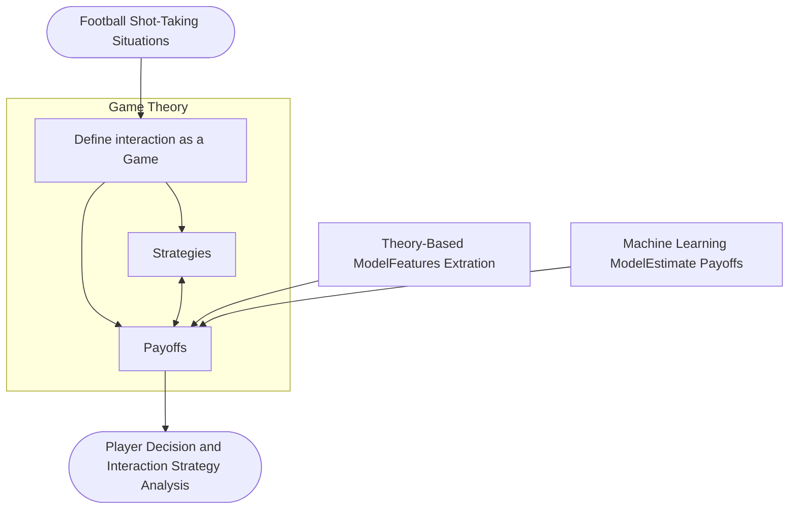

ORIGINAL ARTICLE

Check for updates

# A strategic framework for optimal decisions in football 1-vs-1 shot-taking situations: an integrated approach of machine learning, theory-based modeling, and game theory

Calvin Yeung<sup>1</sup> · Keisuke Fujii<sup>1,2,3</sup> ORCID logo

Received: 28 December 2023 / Accepted: 17 April 2024 / Published online: 27 May 2024

© The Author(s) 2024

### Abstract

Complex interactions between two opposing agents frequently occur in domains of machine learning, game theory, and other application domains. Quantitatively analyzing the strategies involved can provide an objective basis for decision-making. One such critical scenario is shot-taking in football, where decisions, such as whether the attacker should shoot or pass the ball and whether the defender should attempt to block the shot, play a crucial role in the outcome of the game. However, there are currently no effective data-driven and/or theory-based approaches to analyzing such situations. To address this issue, we proposed a novel Shooting Payoff Computation (SPC) framework to analyze such scenarios based on game theory, where we estimate the expected payoff with machine learning (ML) models, and additional features for ML models were extracted with a theory-based shot block model. Conventionally, successes or failures (1 or 0) are used as payoffs, while a success shot (goal) is extremely rare in football. Therefore, we proposed the Expected Probability of Shot On Target (xSOT) metric to evaluate players’ actions even if the shot results in no goal; this allows for effective differentiation and comparison between different shots and even enables counterfactual shot situation analysis. In our experiments, we have validated the SPC framework by comparing it with baseline and ablated models. Furthermore, we have observed a high correlation between the xSOT and existing metrics. This alignment of information suggests that xSOT provides valuable insights. Lastly, as an illustration, we studied optimal strategies in the World Cup 2022 and analyzed a shot situation in EURO 2020.

**Keywords** Machine learning · Game theory · Theory-based · Interaction strategy · Sports · Football

## Introduction

Understanding the interaction between agents, involving the dynamic exchange, communication, and coordination among them, is a fundamental issue in our social activities. It positively affects decision-making and teamwork, providing valuable insights into both the interactions and the agents involved; this holds great significance in various fields,

including artificial intelligence [42], robotics [23], game theory [28], and social sciences [1]. To study such topics, an investigation of the interaction between agents, which occurs between two entities or individuals under a specific context, is required.

In team sports, the interaction between two agents refers to the strategies, movements, and decisions made by two opposing players or teams. It includes factors such as positioning, communication, and cooperation between the players to outwit, outmaneuver, or counter each other’s actions. The interaction between two agents in sports greatly influences the flow of the game, the outcome of specific plays, and even the final outcome.

Football has been one of the most influential team sports [17, 50, 51], where the outcome of the game is greatly influenced by the critical event of taking a shot. However, despite its significance, the existing literature lacks effective, data-driven, and theory-based methods to comprehensively understand and analyze the interaction strategy

✉ Keisuke Fujii
fujii@i.nagoya-u.ac.jp

Calvin Yeung
yeung.chikwong@g.sp.m.is.nagoya-u.ac.jp

<sup>1</sup> Graduate School of Informatics, Nagoya University, Nagoya, Japan

<sup>2</sup> Center for Advanced Intelligence Project, RIKEN, Osaka, Japan

<sup>3</sup> PRESTO, Japan Science and Technology Agency, Saitama, Japan



**Fig. 1** Refined concept of the proposed approach. The assessment of strategies in this study utilizes game theory as its foundation. Machine learning models are employed to estimate the payoffs and value associated with players’ actions. Additionally, a theory-based model is utilized to extract further informative features, enhancing the analysis process

between the shooter and the defender. Compared to research areas where systematic frameworks have been well established, such as engineering [39, 47], financial economics [4, 6], and operation research [7, 10], in which recent studies have predominantly employed data-driven and theory-based methods.

To address these issues, we propose a novel approach for gaining deeper insights into the interaction strategy between the shooter and the closest defender, as well as evaluating the shooter’s decisions in each specific situation. The method employs game theory, which has been conventionally adopted for interaction strategy analysis, to determine the best interaction strategy for both opposing players. Nevertheless, since a goal is rare in football, it would be hard to determine the values of players’ actions (payoff for each strategy under the game theory). Therefore, we employ Machine Learning models to estimate the values of players’ actions. In addition, we proposed a novel theory-based model shot block model to extract more informative features for the machine learning model. Finally, Fig. 1 depicts the concept of the proposed approach.

For a defender, blocking shots from the shooter might seem to be intuitive. However, there might be more effective strategies, for example, not blocking the shot. Recently, a professional football coach pointed out that, not attempting to block shots from long-range might be a smart choice

There are multiple benefits to not blocking long shots: First, tempting the offensive team to shoot from lower-value locations (i.e., locations that are unlikely to score from) rather than seeking a better opportunity to attack the goal; Second, allowing the goalkeeper a clearer line of sight to control and predict the football; Last, when a block is made, it is likely to end up in a second-ball situation and in areas that cannot be predicted. However, as shown in this study, this might not be the optimal strategy that achieves Nash equilibrium [26]. <sup>1,2</sup>

To summarize, this research aims to analyze two-agent interactions in football shot-taking. The contributions of this research are as follows:

(1) A novel Shooting Payoff Computation (SPC) framework and metrics that could analyze attacker and defender strategy, identify the optimal decision and evaluate player action value;

(2) Proposed an effective approach to integrate the machine learning model, theory-based model, and game theory to analyze opposing agents’ interaction under complex situations, typically in sports;

(3) With openly accessible data, we verified our proposed SPC framework and metrics by comparing them with baseline models, ablated models, and existing metrics. Moreover, examples of strategy analysis with World Cup 2022 and in-depth shot-taking situation analysis with EURO 2020 were included.

The remainder of this paper is structured as follows. First, related studies on strategy and decision analysis in football and player action evaluation are discussed in Sect. “Related work”. The proposed SPC framework is then thoroughly explained in Sect. “Methods”. The experimental results, which describe the utilized dataset, validation of the SPC framework, and its practical application on EURO 2020 and World Cup 2022 in Sect. “Experiments and results”. Finally, the paper is discussed and concluded in Sects. “Discussions” and “Conclusion”, respectively.

## Related work

In this section, we delve into the rationale behind employing game theory and incorporating reward modeling using both machine learning and theory-based approaches (the design of the framework). Section “Methods” elaborated on the derivation of the model.

<sup>1</sup> “Are Liverpool breaking a sacred defensive code?” (Summersell, 2022), [https://medium.com/@chris.summersell/are-liverpool-breaking-a-sacred-defensive-code-8c5f806a4c41](https://medium.com/@chris.summersell/are-liverpool-breaking-a-sacred-defensive-code-8c5f806a4c41).

<sup>2</sup> Example from the above article: [https://streamable.com/f88fs8](https://streamable.com/f88fs8).

In Sect. “Strategy and decision analysis in football”, we conducted a comprehensive review of strategy analysis in existing literature, encompassing reinforcement learning and game theory. We emphasized the preference for game theory due to its explicit explanatory power. However, it was noteworthy that game theory remained underutilized in the context of general shooting scenarios in football, hence motivating the need for our proposed framework.

Moving to Sect. Player action evaluation, we scrutinized prior studies evaluating actions, wherein the value of actions was treated as rewards under game theory. Traditionally, actions were often categorized solely as success or failure and predominantly modeled using machine learning techniques. Yet, we argued that such an approach overlooked the nuanced outcomes of actions. By integrating theory-based models with machine learning techniques, we anticipated an enhancement in performance.

## Strategy and decision analysis in football

In the domain of reinforcement learning, simulated football environments have been extensively utilized for studying football-playing strategies. They can be broadly categorized into two types: humans and robots. Firstly, environments developed based on real-world football. These include the Gameplay Football simulator,<sup>3</sup> the older version of DeepMind MuJoCo Multi-Agent Soccer Environment [22], and Google Research Football [16]. Secondly, environments specifically designed for developing football-playing strategies for robots and humanoids. Such as the RoboCup Soccer Simulator [13, 14], and the DeepMind MuJoCo Multi-Agent Soccer Environment [11]. Nonetheless, the strategies developed within these simulated environments have not been verified in real-world football scenarios.

Several efforts have been made to bridge the gap between simulated and real-world football environments. For instance, comparing strategy in simulated and real-world football environments via social network and correlation analysis [34], applying the strategy developed in a simulated robot environment to real-world robot zero-shot [11], and utilizing real-world data to develop the strategy in the simulated environment [8]. Nevertheless, the interaction strategy of both opposing agents involved has not been the focal point.

Conversely, with real-world data, reinforcement learning techniques, such as Markov Decision Processes (MDPs), have been utilized to identify actions that maximize rewards during a possession period [32, 33]. The rewards are based on expected goals (xG) [5, 25]. Advancements have been made by expanding the action space to include shooting and movement options, as well as considering different pitch locations,

enabling a more detailed optimal action analysis [45, 46]. While reinforcement learning in football excels in learning policies (probabilities of actions) and determining optimal decisions, it often lacks the ability to explicitly explain why a specific decision is considered optimal without supplementary manual analysis. On the other hand, game theory emphasizes modeling and considering the strategies of both opposing agents involved. Hence, game theory is applied in this study.

In the domain of game theory, penalty kicks have been the primary focus of interaction strategies. Both goalkeepers’ and shooters’ optimized strategies have been analyzed using statistical methods and game theory [28]. Building upon previous work, the inclusion of a clustering method to differentiate between player roles has allowed for a more in-depth and player role-driven analysis of strategies with game theory [42].

However, it is imperative to note that penalty kicks are rare events in a match and are independent of other outfield players or previous game states. Meanwhile, shots are significantly more frequent, hold equal importance, and involve more complex decision-making processes. Consequently, analyzing shots provides deeper insights into the game dynamics.

## Player action evaluation

Goals have conventionally been employed, whether as rewards for reinforcement learning or for evaluating player and team performance. However, a notable drawback of using goals is their rarity, resulting in a scenario where the value or reward associated with them is often zero. The scarcity of data or suitable environments could present significant challenges for reinforcement learning algorithms. Similarly, when evaluating players, the limited occurrence of goals may hinder the accurate assessment of players’ contributions. To address this limitation, researchers have employed machine learning and theory-based approaches. The approaches aim to model the expected probability of success of specific actions, using them as the value of player action either directly or indirectly.

In the domain of machine learning, the Expected goal (xG) [5, 25] and Expected Goal Value (EGV) [24] have been proposed to estimate the expected probability of a goal. The metrics Valuing Actions by Estimating Probabilities (VAEP) [3] and Goal Impact Metric [20, 21] have extended the idea, where the player action value is the change of expected probability in scoring and/or conceding between actions, as well as variants of VAEP that focus on defense, VDEP [41] and GVDEP [44].

Beyond evaluating players with goals, some metrics evaluate the expected probability of assist Expected Assist (xA),<sup>4</sup>

the likelihood of a successful pass Pass Risk [30], the expected probability that the possession will lead to an attack, Possession Utilization Score (poss-util) [35] and the Holistic Possession Utilization Score (HPUS) [48, 50].

In the domain of theory-based models, important elements are often decomposed based on domain knowledge. Each element is then modeled using theories of statistics and physics. One such model is the Expected Threat (xT),<sup>5</sup> which quantifies the opportunities created by a player. xT breaks down the threat into probabilities of movement, shot, goal, and transition of zones, estimating these probabilities using historical statistics.

The Dangerousity (DA) metric [18] estimates the probability of a player scoring a goal while in possession of the ball. It considers factors such as zone, control, pressure, and density (chance), and models each of these elements using theories of statistics and physics. Based on the DA, the Off-Ball Scoring Opportunity (OBSO) [36, 37] models the probability of an off-ball player scoring. Furthermore, researchers have integrated both machine learning and theory-based approaches. The C-OBSO [40] proposed a modified score model to consider the defenders’ locations.

Nonetheless, most metrics have focused on the success or failure of actions, such as a shot, pass, or cross. However, the outcome of each action can have multiple outcomes; for example, the outcome of a shot can be categorized as shot on target, shot off target, or shot blocked.

Therefore, in this study, we not only considered various factors that influence the outcome of a shot, but we also decomposed the shot outcome and utilized machine learning models to predict each outcome of a shot. This approach can provide us with a deeper understanding of the game and enable more complex analyses.

Furthermore, we utilized an improved theory-based shot block model to estimate the probability of a shot being blocked for the shot block outcome, considering both the shooter and defender features. Subsequently, this shot block probability was incorporated as a feature into the machine learning model for the shot block. Our findings indicated that this approach outperformed directly fitting defender features into the machine learning model. Further details are mentioned in Sect. Rule based model.

# Methods

This section explains how the interaction between the shooter and the closest defender can be formulated as a game, along with the modeling of the relative payoffs. The Shooting Payoff Computation (SPC) framework commences with a feature set derived from event and freeze frame data. Subsequently, a combination of shot-blocking theory-based and

machine learning methods is employed to estimate the value of players’ actions, specifically the probability of action outcomes. Finally, the determined value of a player’s action is utilized to conduct a comprehensive analysis of their decision-making process and optimize interaction strategies using game theory. Figure 2 depicts the details of the proposed SPC framework.

The remainder of this section is structured as follows: First, the formation of the interaction game between the shooter and defender is detailed in Sect. Define interaction as a static game with game theory. Next, we model the reward of the game in Sect. Estimate xSOT with machine learning models, followed by the creation of extra features for the modeling in Sect. Estimate xSOT with machine learning models. Finally, we explore the modeling of rewards in counterfactual scenarios in Sect. Calculate xOSOT.

## Define interaction as a static game with game theory

The initial step in considering the interaction between the shooter and closest defender as a static game is to define the strategy profile $S_i$ for agent $i$ and the corresponding payoff. The strategy profiles for the shooter and closest defender are defined as follows:

$$
\begin{aligned}
S_{shooter} &\in \{\text{Shoot, Pass}\}, \\
S_{defender} &\in \{\text{Blocking, Not Blocking}\}.
\end{aligned}
\eqno(1)
$$

The shooter of the attacking team has two options: either to shoot from their current location or to pass the ball to other players in the attacking team, allowing them to shoot from their respective locations. On the other hand, the closest defender also has two choices: attempting to block the shooter’s shot or applying Liverpool’s strategy, which involves not blocking the shot and potentially gaining certain benefits (as mentioned in Sect. Introduction).

Furthermore, the payoffs for each combination of strategies depend on the current state of the football match game. The ultimate goal of every player is to win the match. Traditionally, the probability of scoring goals has been used as the payoff or reward. However, scoring goals is a rare event that involves randomness, and expecting players to score on every shot they take is unrealistic. Therefore, we focus on the minimum requirement of taking a shot, which is shot on target. We summarize the outcome event space of taking a shot in Table 1 and as follows:

```mermaid
graph TD
    subgraph Features_Set [Features Set]
        Shooter["ShooterPosition, XY Coordinate,Ang2Goal, andDist2Goal"]
        subgraph Freeze_Frame_Data [Freeze Frame Data (360 Data)]
            Closest_Defender["Closest DefenderPosition and XYCoordinate"]
            Other_Defenders["Other DefendersPosition and XYCoordinate"]
            Other_Attackers["Other AttackersPosition and XYCoordinate"]
        end
    end

    subgraph Rule_Based_Deep_ML [Rule Based and Deep Machine Learning Model]
        Theory_Shot_Block["Theory-Based:Shot Block Model"]
        DNN_block["DNN_block"]
        DNN_off["DNN_off"]
    end

    subgraph Value_Players_Actions [Value Players' Actions]
        Theory_PPCF["Theory-Based:PPCF Model"]
        xSOT["xSOT"]
        xOSOT["xOSOT"]
    end

    subgraph Application [Application]
        Player_Decision["Player DecisionIn-Depth Analysis"]
        Optimal_Interaction["OptimalInteraction Strategieswith Game Theory"]
    end

    Shooter --> Theory_Shot_Block
    Shooter --> DNN_block
    Shooter --> DNN_off
    Shooter --> xSOT
    
    Closest_Defender --> Theory_Shot_Block
    Closest_Defender --> DNN_block
    Closest_Defender --> xSOT
    
    Other_Defenders --> Theory_PPCF
    
    Other_Attackers --> Theory_PPCF
    Other_Attackers --> xOSOT

    Theory_Shot_Block -- "$\tilde{P}(S\_block)$" --> DNN_block
    DNN_block -- "$\widehat{P}(S\_block)$" --> xSOT
    DNN_off -- "$\widehat{P}(S\_off)$" --> xSOT
    
    Theory_PPCF -- "$\widehat{P}(Control)$" --> xOSOT
    xSOT -- "$\widehat{P}(S\_on)$" --> xOSOT
    
    xSOT --> Player_Decision
    xSOT --> Optimal_Interaction
    xOSOT --> Optimal_Interaction
```

Fig. 2 Flow chart of the proposed SPC framework. In terms of game theory payoffs, if the closest defender chooses not to block, the xSOT and xOSOT are calculated without incorporating the closest defender

$$
\text{Shot Outcome} \in \{\text{Shot On Target, Shot Off Target, Shot Block}\}. \quad (2)
$$

For the shooter, we define the payoff for shooting as the Expected Probability of Shot On Target (xSOT), representing the likelihood of the shot being on target. Conversely, the payoff for passing is defined as the Expected Probability of Off-Ball Player Shot On Target (xOSOT), indicating the probability of a successful shot from another player on the attacking team. As for the closest defender, their payoff is the negative of the shooter's payoff. When the closest defender chooses not to block (NB), the $xSOT_{(NB)}$ and $xOSOT_{(NB)}$ are calculated without considering the closest defender. The payoffs for the shooter and defender are summarized in Table 2.

The aim of xSOT is to match the performance of metrics typically xG [5, 25] the most utilized metrics in literature [3] and practices, but at the same time be able to analyze

features. For xOSOT, the xSOT<sub>$a$</sub> is calculated using the same method, but instead of the shooter, it was replaced with the other attacker $a$

attacker and defender strategy, identify the optimal decision, and evaluate player action value. Moreover, finding the optimal interaction strategy for both the shooter and closest defender is equivalent to identifying the Nash equilibrium. The Nash equilibrium is defined as follows [26, 28, 38, 42]:

Let $s^* = (s_i^*, s_{-i}^*)$, $s_i \in S_i$ be a strategy profile with a strategy for each agent, where $s_{-i}$ denotes the strategy for agents other than agent $i$ and $i \in \{\text{attacker, defender}\}$. Let $u_i(s_i, s_{-i}^*)$ be the payoff for agent $i$. The strategy profile $s^*$ is a Nash equilibrium if and only if,

$$
\mathbb{E}[u_i(s_i^*, s_{-i}^*)] \geq \mathbb{E}[u_i(s_i', s_{-i}^*)] \quad \forall s_i' \in S_i \ i \in \{\text{attacker, defender}\} \quad (3)
$$

Lastly, the following assumptions are made for the game:

*   Relational decision maker: Each agent will make rational decisions by choosing the best strategy available to them [38].

**Table 1** Shot outcome grouping

<table>
  <thead>
    <tr>
        <th>Group</th>
        <th>Shot outcome</th>
    </tr>
  </thead>
  <tbody>
    <tr>
        <td>Shot on target</td>
        <td>Goal</td>
    </tr>
    <tr>
        <td> </td>
        <td>Saved: saved by goal keeper</td>
    </tr>
    <tr>
        <td>Shot Off Target</td>
        <td>Off T: off target</td>
    </tr>
    <tr>
        <td> </td>
        <td>Wayward: an unthreatening shot</td>
    </tr>
    <tr>
        <td> </td>
        <td>Post: a shot that hit one of the three posts</td>
    </tr>
    <tr>
        <td> </td>
        <td>Saved off target: a shot that was saved by the goalkeeper but was not on target</td>
    </tr>
    <tr>
        <td>Shot block</td>
        <td>Blocked: blocked by defender</td>
    </tr>
    <tr>
        <td>Removed</td>
        <td>Saved to post: goalkeeper saves the shot and bounces off the goal frame</td>
    </tr>
  </tbody>
</table>

Further details available on [https://github.com/statsbomb/open-data](https://github.com/statsbomb/open-data)

**Table 2** Game theory payoff table

<table>
  <thead>
    <tr>
        <th> </th>
        <th> </th>
        <th colspan="2">Defender</th>
    </tr>
    <tr>
        <th> </th>
        <th> </th>
        <th>Blocking (B)</th>
        <th>Not blocking (NB)</th>
    </tr>
  </thead>
  <tbody>
    <tr>
        <td>Shooter</td>
        <td>Shoot</td>
        <td>$xSOT_{(B)}, -xSOT_{(B)}$</td>
        <td>$xSOT_{(NB)}, -xSOT_{(NB)}$</td>
    </tr>
    <tr>
        <td> </td>
        <td>Pass</td>
        <td>$xOSOT_{(B)}, -xOSOT_{(B)}$</td>
        <td>$xOSOT_{(NB)}, -xOSOT_{(NB)}$</td>
    </tr>
  </tbody>
</table>

The left value indicates the payoffs for the shooter and the right value indicates the payoffs for the closest defender. The underscript denotes the scenarios for the xSOT and xOSOT calculation, which includes counterfactual scenarios

* **Complete information**: All agents possess complete knowledge of the game, and this knowledge is common among all participants [38].

* **Static one-stage game**: The nature of the game, whether static or dynamic, is discussed in section Data independence test. However, for the current analysis, we assume a static one-stage game due to the unavailability of players' velocity and other detailed data required to model and analyze their future movements.

# Estimate xSOT with machine learning models

When modeling the xSOT, we consider all possible outcomes of a shot, including shot on target ($S_{on}$), shot off target ($S_{off}$), and shot block ($S_{block}$) (details explanation in Table 1). Since the set {$S_{on}, S_{off}, S_{block}$} is taken as the sample space of shot outcomes, we can model the xSOT using the law of total probability. Consequently, the xSOT can be represented by the following equations:

$$xSOT = \mathbb{E}[P(S_{on})] \approx \mathbb{E}[1 - min(\hat{P}(S_{off}) + \hat{P}(S_{block}), 1)],$$
$$\hat{P}(S_{off}) = MLP_{off}(\vec{x}_{off}, y_{off}),$$
$$\hat{P}(S_{block}) = MLP_{block}(\vec{x}_{block}, y_{block}), \tag{4}$$

where the $P(S_{off})$ and $P(S_{block})$ are estimated with a multilayer perceptron (MLP) (also known as Neural Network) for classification respectively, trained with cross-entropy loss (CEL), and implemented with python package Pytorch.<sup>6</sup> The 

 hyperparameters for the MLP and the optimized values are listed in Sect. Appendix B. Further, the $min()$ function was to avoid the model estimation exceeding 1, and the expected sign emphasizes the shot-on-target probability of average players was considered instead of a particular player, similar to the concept of xG [5, 25].

Moreover, $\vec{x}, y$ are the input features vector and target features for the MLP model, respectively. Both $\vec{x}_{off}$ and $\vec{x}_{block}$ consist of the following basic shooter features, where the first three features are the event data and adhere to the definition from StatsBomb<sup>7</sup>:

* **player role**: The role of the player, for instance, center forward, center back, goalkeeper, etc. StatBomb has named this feature as position.

* **location x**: Football pitch coordinate x of the shooter. Represent the length dimension of the football pitch ranging from 0 to 120.

* **location y**: Football pitch coordinate y of the shooter. Represent the width dimension of the football pitch ranging from 0 to 80.

* **Dist2Goal**: Distance from the shooter to the middle of the goal line. Calculated with Eq. 11.

* **Ang2Goal**: Absolute angle from the shooter to the middle of the goal line. Calculated with Eq. 11.

For $\vec{x}_{block}$, in addition to the previously mentioned features, we incorporate the location and position data of the off-ball

<table>
  <tbody>
    <tr>
        <td colspan="11">graph TD</td>
    </tr>
    <tr>
        <td colspan="11">subgraph Step1 [Step 1: Filtering players]</td>
    </tr>
    <tr>
        <td colspan="11">S1_Img1[Pitch map showing shooter Daniel Olmo Carvajal and other players in Spain vs. Italy EURO 2020 match]</td>
    </tr>
    <tr>
        <td colspan="11">S1_Img2[Pitch map showing Feasible Block Zone and Feasible Shot Angle]</td>
    </tr>
    <tr>
        <td colspan="11">end</td>
    </tr>
    <tr>
        <td colspan="11">subgraph Step2 [Step 2: Consider angle to the goal]</td>
    </tr>
    <tr>
        <td>S2_Eq["$$\begin{aligned}</td>
        <td>ilde{P}(S_{block}) &amp;= c_3 \int_0^n P(S_{block}|</td>
        <td>heta)P(</td>
        <td>heta) \, d</td>
        <td>heta \\ &amp;= \frac{c_3}{n} \int_0^n P(S_{block}|</td>
        <td>heta) \, d</td>
        <td>heta \end{aligned}$$"]</td>
        <td colspan="4"></td>
    </tr>
    <tr>
        <td colspan="11">end</td>
    </tr>
    <tr>
        <td colspan="11">subgraph Step3 [Step 3: Consider each defender]</td>
    </tr>
    <tr>
        <td>S3_Eq["$$\begin{aligned}</td>
        <td>ilde{P}(S_{block}|</td>
        <td>heta) &amp;= P(</td>
        <td>ext{defender 1 block}|</td>
        <td>heta) \\ &amp;+ P(</td>
        <td>ext{defender 1 fails} \cap</td>
        <td>ext{defender 2 block}|</td>
        <td>heta) \\ &amp;+ \dots \\ &amp;+ P(</td>
        <td>ext{defender 1 fails} \cap \dots \cap</td>
        <td>ext{defender n block}|</td>
        <td>heta). \end{aligned}$$"]</td>
    </tr>
    <tr>
        <td colspan="11">end</td>
    </tr>
    <tr>
        <td colspan="11">subgraph Step4 [Step 4: Model each defender]</td>
    </tr>
    <tr>
        <td colspan="11">S4_Img[Normal distribution curve representing defender model]</td>
    </tr>
    <tr>
        <td colspan="11">end</td>
    </tr>
    <tr>
        <td colspan="11">subgraph Step5 [Step 5: Model calculation and optimization]</td>
    </tr>
    <tr>
        <td colspan="11">S5_Img[Line chart showing Probability of Shot Block vs Shot Angle]</td>
    </tr>
    <tr>
        <td>S5_Result["$$</td>
        <td>ilde{P}(S_{block}) = 0.4252$$"]</td>
        <td colspan="9"></td>
    </tr>
    <tr>
        <td colspan="11">end</td>
    </tr>
    <tr>
        <td colspan="11">Step1 --&gt; Step2</td>
    </tr>
    <tr>
        <td colspan="11">Step2 --&gt; Step3</td>
    </tr>
    <tr>
        <td colspan="11">Step3 --&gt; Step4</td>
    </tr>
    <tr>
        <td colspan="11">Step4 --&gt; Step5</td>
    </tr>
  </tbody>
</table>

Fig. 3 Flow chart of the theory-based shot block model. Each step is explained in detail in this section, Sect. Rule based model

players using StatsBomb freeze frame 360 data<sup>8</sup>; this allows us to create the following additional features:

* **Theory-based shot block feature**: Shot block probability estimation from a theory-based shot block model (Explained in Sect. Rule based model) that utilizes the StatsBomb freeze frame 360 data.<sup>8</sup> The freeze frame 360 data includes the role, location x,y of other players on the pitch. However, since the data was collected from a video frame, data for any players that were not in the frame were not included.

The target variables $y_{off}$ and $y_{block}$ will take the value 1 when the outcome is shot off target and shot block, respectively. For all other outcomes, the target variables will have a value of 0.

We assess the performance of the $MLP_{block}$ and $MLP_{off}$ models by comparing them with baseline models that utilize the same feature set. These baselines include common statistical models, historical percentages derived from the dataset, and ElasticNet [52]. Additionally, we consider tree-boosting models, namely XGBoost [2] and CatBoost [31], which have been commonly employed in previous studies to model the expected probability of a goal [5, 25] as well as scoring and conceding patterns [3, 41, 44], among others.

In Sect. Player action evaluation, it was noted that previous studies had not given significant attention to modeling shot off and shot block probability. Consequently, there was currently no state-of-the-art model specifically tailored to

this task. Regarding model architecture, comparisons among tree-based models, regression, and neural networks fundamental approaches in machine learning were conducted. Despite their relatively simple architectures compared to deep learning models, these models exhibited signs of overfitting, as illustrated in Tables 3 and 5. This suggested that the models tended to capture the variability within the sample data rather than discerning the underlying patterns or relationships.

Therefore, a more complex model would have demanded a substantial amount of data, and some might have necessitated additional features. It is important to highlight that the data necessary for this analysis was exclusively available from professional data vendors. Acquiring further data beyond what had been utilized in this study entailed a substantial cost.

## Create additional feature with theory-based shot block model

To better utilize the location and position data of off-ball players (StatsBomb freeze frame 360 data<sup>8</sup>), we proposed the theory-based shot block model that captures the information in the 360 data. The theory-based model estimates the probability $P(S_{block})$. The estimated probability was later used as a feature for the machine learning model $MLP_{block}$ and named the theory-based shot block feature. Figure 3 depicts the detailed steps of the theory-based shot block model. This theory-based model draws inspiration from the scoring probability model and shot block value in C-OBSO [40]. The main idea of this method is that the farther the ball is from

Fig. 4 Shot-taking situation example image. The image included all players who appeared in the freeze frame from the match Spain vs. Italy, EURO 2020

**Shooter**: Daniel Olmo Carvajal
**Match**: Spain vs. Italy (EURO 2020)

Shot-taking situation example image from Spain vs. Italy match showing shooter, defenders, and goalkeeper positions.

the defender, and the larger the difference in angle, the more difficult it becomes for the defender to block the shot.

More specifically, the probability of a single defender blocking a shot is modeled using a normal distribution probability density function (PDF) as in [40]. Additionally, the shot block probability is calculated by summing a discrete set of angles from the shooter to the goal line, bounded by the goal posts.

We have made several improvements compared with the C-OBSO approach. Primarily, we excluded the goalkeeper from our considerations, as a saved shot (details in Table 1) is still counted as being on target. Moreover, we consider the angle to the goal as continuous rather than discrete. This change allows us to achieve a more precise value of the PDF function.

Moreover, we introduced a more realistic event space, in addition to assuming the probability of each defender is independent, to better reflect the realistic scenario. If one defender has already blocked the shot, other defenders won't be able to block it subsequently. Furthermore, we substituted the normal PDF with a truncated normal PDF. The truncated version restricts the reachable location of the defender rather than extending it infinitely.

Finally, to ensure the robust and rigorous foundation for our methodology. We explain a specific shot-taking situation as in Fig. 4 and provide a statistical theory-based and detailed derivation of the theory-based shot block model as follows:

**Step 1: Filtering players.** The filtering process begins by excluding the goalkeeper, players on the same team as the shooter, and defenders located outside the feasible block zone bounded by the coordinates of the shooter and the two intersection points between the penalty area line and the goal line (Expanded spaces between the shooter and the goal to encompass all defenders whom may obstruct the shot, as indicated by

the blue lines in Fig. 5). The defenders that remain after this filtering process are labeled as defender $1, 2, \dots, n = D$ and are sorted in ascending order based on their distance from the shooter.

**Step 2: Consider angle to the goal.** By applying the law of total probability, the shot block probability can be conditioned on the shot angle $\theta$ that the shooter takes. We assume that the shots are taken in straight lines, and each degree within the feasible angle corresponds to a specific shot angle. The feasible shot angle is defined as the angle formed with the straight line from the shooter to the left goalpost (as indicated by the left boundary or the red area in Fig. 5) and the straight line from the shooter to the right post (as indicated by the right boundary or the red area in Fig. 5). The total degree, equivalent to shot angle $n$, can be calculated using the law of cosines.

The shot block probability can be represented by the following equation for a continuous shot angle $\theta \in [0, n]$:

$$
\begin{aligned}
\tilde{P}(S_{block}) &= c_3 \int_0^n \tilde{P}(S_{block} | \theta) \tilde{P}(\theta) \, d\theta \\
&= \frac{c_3}{n} \int_0^n \tilde{P}(S_{block} | \theta) \, d\theta
\end{aligned}
\eqno(5)
$$

where $\tilde{P}(\theta)$ represents the estimated probability of the shooter selecting shot angle $\theta$ to shoot. $\tilde{P}$ were used to differentiate the estimation from the theory-based shot block model and estimation $\hat{P}$ from the MLP model, but they are both the estimated probability of shot block.

To simplify the analysis, we assume that $\tilde{P}(\theta)$ follows a continuous uniform distribution within the range of $[0, n]$, resulting in the second equation. $\tilde{P}(S_{block} | \theta)$ denotes the probability that the shot will be blocked by defenders in set $D$, given that shot angle $\theta$ is selected. The term $c_3$ represents

**Fig. 5** Theory-based shot block model feasible block zone and feasible angle. The shot-taking situation is based on the one in Fig. 4. Defenders inside the feasible block zone bounded by blue lines are considered. The probability of block is calculated based on shot angles inside red regions. The line from the left goalpost to the shooter is considered as shot angle 0, and from the right goalpost to the shooter is considered as shot angle $n$

Theory-based shot block model diagram showing feasible block zone (blue lines), feasible shot angle (red region), defenders (green circles 13 and 19), and shooter (soccer ball icon).

a constant term, which gives an extra degree of freedom and was shown to improve the shot block probability estimation experimentally.

**Step 3: Consider each defender.** After considering each shot angle, we can incorporate each defender in set $D$. It is important to note that only one defender can block the shot. For instance, defender $d$ (e.g., defender 13 in Fig. 5) will have the opportunity to block the shot only if defender $d - 1$ (e.g., defender 19 in Fig. 5) fails to block it, this allows us to partition the event space and utilize the law of total probability to expend $\tilde{P}(S_{\text{block}}|\theta)$ as follows:

$$
\begin{aligned}
\tilde{P}(S_{\text{block}}|\theta) = & \tilde{P}(\text{defender 1 block}|\theta) \\
& + \tilde{P}(\text{defender 1 fails} \cap \text{defender 2 block}|\theta) \\
& + \dots + \tilde{P}(\text{defender 1 fails} \\
& \cap \dots \cap \text{defender } n \text{ block}|\theta).
\end{aligned} \eqno(6)
$$

If $|D| = 0$, indicating that there are no defenders in set $D$, the estimated probability $\tilde{P}(S_{\text{block}}|\theta)$ becomes 0. Consequently, the overall shot block probability $P(S_{\text{block}})$ is also 0.

Furthermore, we assume that the defenders' probabilities to block the shot are independent. With this assumption, the components of the above equation can be further dissected using the following equation:

$$
\begin{aligned}
& \tilde{P}(\text{defender 1 fails} \cap \dots \cap \text{defender } d \text{ block}|\theta) \\
& = (1 - \tilde{P}(\text{defender 1 block}|\theta)) \\
& \quad (1 - \tilde{P}(\text{defender 2 block}|\theta)) \dots \tilde{P}(\text{defender } d \text{ block}|\theta).
\end{aligned} \eqno(7)
$$

While Eq. 7 could be utilized to model the probability of shot blocks, as illustrated in Table 5, verifying the block probabilities for individual defenders proved challenging due to

the absence of publicly available data identifying the specific player responsible for blocking the shot, as well as the defenders attempting the block.

**Step 4: Model each defender.** We model each defender's expected probability of blocking shots using a truncated normal distribution probability density function (PDF). In this case, we treat the PDF as a simple function without statistical meanings. The use of a truncated normal PDF is preferred because it does not have a tail that extends to infinity, unlike the normal PDF; this ensures that the range of a defender's reach is bounded and helps avoid unrealistic assumptions. The function is as follows:

$\tilde{P}(\text{defender } d \text{ block}|\theta) = f(x; \mu, \sigma, a, b)$

$$
\begin{aligned}
& = \frac{1}{\sigma} \frac{\varphi(\frac{x-\mu}{\sigma})}{\Phi(\frac{b-\mu}{\sigma}) - \Phi(\frac{a-\mu}{\sigma})}, \\
& x = \frac{(\theta - \theta_d)}{c_1}, \mu = 0, \sigma = c_4 + l_d * c_2,
\end{aligned} \eqno(8)
$$

where $(a, b = -a)$ defines the interval that bounds the function. In the equation, $\theta_d$ represents the shot angle at which defender $d$ is positioned, $l_d$ represents the distance between defender $d$ and the shooter (measured in real-world football pitch distance), and $c_1$, $c_2$, and $c_4$ are constant terms. Furthermore, $\varphi(x)$ represents the probability density function (PDF) and $\Phi(x)$ represents the cumulative distribution function (CDF) for the standard normal distribution. The equations are given as follows:

$$
\varphi(x) = \frac{1}{\sqrt{2\pi}} e^{-\frac{1}{2}x^2}, \quad \Phi(x) = \frac{1}{2} \left( 1 + \text{erf} \left( \frac{x}{\sqrt{2}} \right) \right), \eqno(9)
$$

where, $\text{erf}(x)$ is the error function and is approximated numerically.

**Step 5: Model calculation and optimization.** For the shot-taking situation in Fig. 4, the probability of shot block at

**Fig. 6** Probability of Shot Block for each feasible shot angle. The shot-taking situation is based on the one in Fig. 4

<table>
  <tbody>
    <tr>
        <td>Shot Angle</td>
        <td>Probability of Shot Block</td>
    </tr>
    <tr>
        <td>0</td>
        <td>0.58</td>
    </tr>
    <tr>
        <td>7.16</td>
        <td>0.58</td>
    </tr>
    <tr>
        <td>14.33</td>
        <td>0.42</td>
    </tr>
    <tr>
        <td>21.5</td>
        <td>0.28</td>
    </tr>
    <tr>
        <td>28.66</td>
        <td>0.28</td>
    </tr>
  </tbody>
</table>

each shot angle is shown in Fig. 6. In Fig. 6, the probability of shot-blocking might appear to decrease or increase at the extreme ends of the x-axis. Specifically, the decrease on the left side was influenced by the positioning of defender 19 at approximately an angle of 3.5. Conversely, the increase on the right side was impacted by defender 13, situated outside the shot angle but still capable of affecting angles on the right side. It’s worth noting that the y-axis spans from 0.3 to 0.6, indicating a moderate change in probability rather than an extreme shift.

To ensure computational efficiency, the trapezoidal rule is employed to approximate $P(S_{block})$ when $|D| > 0$ and set it equal to 0 otherwise. Various common optimization methods were compared to optimize the parameters and constant terms $c_1, c_2, c_3, c_4, a$, the optimized values are listed in Sect. Appendix B. These included iterative-based methods: Powell [29] and Nelder-Mead [27], as well as gradient-based methods: CG [12], L-BFGS-B [19], and SLSQP [15].

The results of the optimization process, including the comparison between different optimization methods, can be found in Sect. Shot block probability model validation. Powell was selected as the optimal choice after evaluating the performance of each method due to its superior performance, and the value for the optimized parameters are listed in Table 13.

**Limitation:** The proposed method is subject to three primary limitations. Firstly, it assumes that the shooter shot in a straight line, secondly, it assumes the defenders act independently, and thirdly, it treats the interaction between the shooter and defender as a static, one-stage game. To address these limitations, additional data such as the trajectory of shots, whether defenders attempted to block them, the success of such attempts, and player velocity data are essential. However, gathering this information poses challenges, particularly in professional football where such 

 data is not routinely recorded and extraction would be difficult.

## Calculate xOSOT

The xOSOT is calculated by determining the off-ball attacker who has the highest expected probability to shoot on target. The probability of the off-ball attacker being able to control the ball will also be considered since it first requires the shooter to pass the football to the off-ball attacker. This approach modifies the concept of OBSO introduced in Spearman [36], and further explained in Sect. Appendix C. However, in this case, we consider only the off-ball attacker $a \in A$ and the corresponding location that has the highest expected probability to shoot on target, rather than considering all locations on the pitch. The equation for xOSOT is as follows:

$$xOSOT = \max_{a \in A} \mathbb{E}[P(S_{on} \mid Control_a) * P(Control_a)],$$
$$\hat{P}(S_{on} \mid Control_a) = xSOT_a, \tag{10}$$
$$\hat{P}(Control_a) = PPCF_a,$$

where $P(S_{on} \mid Control_a)$ denotes the probability of a shot on target from the location of the off-ball attacker $a$, given that attacker $a$ has controlled the football. Meanwhile, in Eq. 4 the given part of $\hat{P}(S_{on})$ was ignored since the player must have control of the football in order to take a shot. Additionally, $P(Control_a)$ represents the probability that the ball will be controlled by the off-ball player $a$. This factored in the risk of passing instead of shooting. Lastly, the expected sign emphasizes the shot-on-target probability of average off-ball players was considered instead of a particular player, similar to the concept of xG [5, 25].

Furthermore, $xSOT_a$ represents the xSOT calculated with the off-ball attacker $a$. Additionally, $PPCF_a$ denotes the

theory-based PPCF model (Potential Pitch Control Field) [36], it was selected as the estimation of $P(\text{Control}_a)$ since DA [18] and PPCF are the only existing model for modeling the probability of football player controlling the football and PPCF was improved based on DA. Meanwhile, the PPCF in xOSOT is calculated from time 0 to $T$, where $T$ is the travel time of the football from the shooter to the off-ball attacker $a$. This is in contrast to the approach in [36] where $T \rightarrow \infty$. Considering the finite travel time $T$ is more suitable, as it accounts for the fact that even if the off-ball attacker $a$ gains control of the ball after time $T$, it is unlikely that they can shoot from their current location. The PPCF is further explained in Sect. Appendix C, providing more details on how it is computed.

# Experiments and results

This section aims to verify the xSOT and xOSOT metrics, determine the optimized strategy for the interaction between the shooter and closest defender, and showcase the analysis of each shot-taking situation using xSOT and xOSOT. The code for this study is accessible on GitHub through the following link: [https://github.com/calvinyeungck/Football-1-vs-1-Shot-Taking-Situations-Analysis](https://github.com/calvinyeungck/Football-1-vs-1-Shot-Taking-Situations-Analysis).

For implementation, our methodology, which involved analyzing both attacker and defender strategies to identify optimal decisions and evaluate player actions, could be replicated for various football matches. The necessary features (as outlined in Sect. Dataset and preprocessing) were typically available to most football teams. Alternatively, for those without access to proprietary data, the framework could be adapted to utilize publicly available datasets, as described in Sect. Dataset and preprocessing.

In terms of computational requirements, the provided code and fitted parameters enabled straightforward CPU-based calculations, without the need for GPU acceleration. However, should fine-tuning or additional training be desired, a standard GPU would have been sufficient due to the model's relative simplicity. Validation and implementation of our proposed method were detailed in Sects. Models and framework validation through xSOT and xOSOT verification and Optimal strategy in world cup 2022 through EURO 2020 shot-taking situations analysis with xSOT and xOSOT, respectively.

# Dataset and preprocessing

**Dataset:** The dataset used for this study was based on the on-ball events and freeze frame data from the World Cup 2022 and EURO 2020 tournaments. This dataset is the only publicly available dataset that consists of the feature (player positional data, collected per event, not per 10hz) required 

 for this study. The football events and freeze frame data were obtained from StatsBomb's free data<sup>8</sup>, available at [https://statsbomb.com/what-we-do/hub/free-data/](https://statsbomb.com/what-we-do/hub/free-data/).

The Euro 2020 dataset comprised 51 matches, while the World Cup 2022 dataset included 64 matches. In total, there were 2575 shot-taking events recorded, with 1043 shots off target, 850 shots on target, and 682 shots blocked. Additionally, the xG (expected goals) data was sourced from [https://footystats.org/international/world-cup/xg](https://footystats.org/international/world-cup/xg), while the number of goals data was obtained from [https://www.mykhel.com/football/fifa-world-cup-2022-team-stats-l4/](https://www.mykhel.com/football/fifa-world-cup-2022-team-stats-l4/).

**Preprocessing:** In order to address the limited amount of data, we performed data preprocessing by splitting the dataset into a train and valid set and a test set using the `train_test_split()` function from the Python package sklearn. The ratio was set to 80/20, and the splitting was stratified based on the grouped shot outcome (for more details, refer to Table 1). For training the MLP and baseline models, we utilized the train and valid set with 5-fold cross-validation, implemented using the `StratifiedKFold()` function from the sklearn package.

Furthermore, it is important to note that StatsBomb employs a football pitch coordinate system with x ranging from 0 to 120 and y ranging from 0 to 80. However, a professional football pitch typically has a size of 105 m in length and 68 m in width. Therefore, we appropriately scaled the xy coordinates. Additionally, we calculated the distance to the goal (Dist2Goal) and angle to the goal (Ang2Goal) features when computing xSOT. The equations for Dist2Goal and Ang2Goal are as follows:

$$
\begin{aligned}
Dist2Goal &= \sqrt{((x - 120) * 105/120)^2 + ((y - 40) * 68/80)^2} \\
Ang2Goal &= \left| \left( arctan \left( \frac{(40 - y) * 68/80}{(120 - x) * 105/120} \right) \right) \right|
\end{aligned}
\tag{11}
$$

Where (x, y) represents the player coordinates, and (120, 40) corresponds to the midpoint of the defending team's goal line in the StatsBomb coordinate system.

# Models and framework validation

Here, we validate the effectiveness of using the MLP for modeling the probability of shot off in Sect. Shot off probability model validation and shot block in Sect. Shot block probability model validation. Additionally, we identify the optimal optimization methods for the theory-based shot block model in Sect. Shot block probability model validation and highlight the necessity of the theory-based shot block model in the SPC framework in Sect. Necessity of the theory-based shot block model.

Table 3 The performance of shot off probability prediction models with machine learning

<table>
  <thead>
    <tr>
        <th>Model</th>
        <th>Avg CEL</th>
        <th>Std</th>
    </tr>
  </thead>
  <tbody>
    <tr>
        <td>Ours ($MLP_{off}$)</td>
        <td><strong>0.6696</strong></td>
        <td>0.0065</td>
    </tr>
    <tr>
        <td>Historical percentage</td>
        <td>0.6749</td>
        <td>0.0004</td>
    </tr>
    <tr>
        <td>ElasticNet</td>
        <td>0.6759</td>
        <td>0.0007</td>
    </tr>
    <tr>
        <td>XGBoost</td>
        <td>0.9108</td>
        <td>0.0832</td>
    </tr>
    <tr>
        <td>CatBoost</td>
        <td>0.9416</td>
        <td>0.0422</td>
    </tr>
  </tbody>
</table>

The table shows the average (Avg) CEL and standard deviation (Std) on the 5 cross-validations split validation set CEL. The table is ordered with the Avg CEL (the lower the better) in ascending order. The best results in each column were bold.

## Shot off probability model validation

Beginning with the $MLP_{off}$ models, we assess their performance by comparing them against baseline models: historical percentage, ElasticNet, xGBoost, and CatBoost, using the same features set as the proposed model. These baseline models have been commonly used to model football event data in previous studies (see details in Sect. Estimate xSOT with machine learning models). The evaluation was based on the binary Cross-Entropy Loss (CEL), where a lower CEL indicates better performance. The CEL is a commonly used scoring rule for probability estimation in a 2-class event.

In Table 3, the performance of the MLP model was compared with other models in estimating the probability of a shot off target. Our model, $MLP_{off}$, had outperformed all baseline models, and achieved the lowest average CEL of 0.6696. However, it is important to note that $MLP_{off}$ did not possess an overwhelming advantage compared to other baseline models. More informative features could be engineered in future works. Meanwhile, the historical percentages were not utilized as the prediction value will always be a constant, meaning the probability of shotoff would be the same under all situations which may not make sense.

## Shot block probability model validation

Subsequently, for the theory-based shot block model, we compare the performance of different optimization methods: Powell, Nelder-Mead, CG, and SLSQP. These methods are commonly used in function optimization (see details in Sect. Create Additional Feature with Theory-Based Shot Block Model). The evaluation was based on the binary Cross-Entropy Loss (CEL), where a lower CEL indicates better performance. The CEL is a commonly used scoring rule for probability estimation in a 2-class event. Moreover, since the aim of xSOT and xOSOT is to estimate the expected probability, therefore, the shot block probability prediction models aimed to learn the

Table 4 Theory-based shot block model optimization methods performance

<table>
  <thead>
    <tr>
        <th>Optimization methods</th>
        <th>Avg CEL</th>
        <th>Std</th>
    </tr>
  </thead>
  <tbody>
    <tr>
        <td>Powell</td>
        <td><strong>0.9220</strong></td>
        <td>0.2544</td>
    </tr>
    <tr>
        <td>CG</td>
        <td>0.9229</td>
        <td>0.2540</td>
    </tr>
    <tr>
        <td>L-BFGS-B</td>
        <td>0.9230</td>
        <td>0.2540</td>
    </tr>
    <tr>
        <td>SLSQP</td>
        <td>0.9230</td>
        <td>0.2540</td>
    </tr>
    <tr>
        <td>Nelder-Mead</td>
        <td>0.9345</td>
        <td>0.2552</td>
    </tr>
  </tbody>
</table>

The table shows the average (Avg) CEL and standard deviation (Std) on the 5 cross-validations split validation set CEL. The table is ordered with the Avg CEL (the lower the better) in ascending order. The best results in each column were bold.

Table 5 The performance of shot block probability prediction models with machine learning and different feature sets

<table>
  <thead>
    <tr>
        <th>Model</th>
        <th>Avg CEL</th>
        <th>Std</th>
    </tr>
  </thead>
  <tbody>
    <tr>
        <td>Ours (proposed features)</td>
        <td><strong>0.4876</strong></td>
        <td>0.0259</td>
    </tr>
    <tr>
        <td>ElasticNet</td>
        <td>0.5417</td>
        <td>0.0077</td>
    </tr>
    <tr>
        <td>Ours (Basic shooter features only)</td>
        <td>0.5545</td>
        <td>0.0168</td>
    </tr>
    <tr>
        <td>Ours (Unprocessed players features)</td>
        <td>0.5684</td>
        <td>0.0081</td>
    </tr>
    <tr>
        <td>Historical percentage</td>
        <td>0.5783</td>
        <td>0.0011</td>
    </tr>
    <tr>
        <td>XGBoost</td>
        <td>0.6354</td>
        <td>0.0372</td>
    </tr>
    <tr>
        <td>CatBoost</td>
        <td>0.7096</td>
        <td>0.0272</td>
    </tr>
  </tbody>
</table>

The proposed features are described in Sect. Estimate xSOT with machine learning models and Fig. 2. The table shows the average (Avg) CEL and standard deviation (Std) on the 5 cross-validations split validation set CEL. The table is ordered with the Avg CEL (the lower the better) in ascending order. The best results in each column were bold.

distribution of shot block. As such the CEL is a proper measure, but not the accuracy as it focuses on single instants.

Table 4 presents a comparison of the performance of various optimization methods for the theory-based shot block model. Among the optimization methods considered, the Powell method [29] achieved the lowest CEL of 0.9220. Overall, all five optimization methods exhibited similar performance, indicating that the choice of optimization method had a minimal impact on the performance of the theory-based shot block model.

For the $MLP_{block}$ models, we assess their performance by comparing them against baseline models: historical percentage, ElasticNet, xGBoost, and CatBoost, using the same features set as the proposed model, as the above shot off model verification. The evaluation will be based on the binary Cross-Entropy Loss (CEL), where a lower CEL indicates better performance. The CEL is a commonly used scoring rule for probability estimation in a 2-class event.

Table 5 provides a summary of the performance comparison between models in estimating the probability of a shot being blocked. Our model, $MLP_{block}$, had outperformed all baseline models and achieved the lowest average CEL of

0.4876. This result validated that $MLP_{block}$ effectively provided inference for shot block probability and performed better than the baseline models.

## Necessity of the theory-based shot block model

Additionally, we assess the necessity of the theory-based shot block model and compare the performance of the $MLP_{block}$ when fitted with different sets of features. Specifically, we consider the methodology features (details in Sect. Estimate xSOT with machine learning models), an ablated version with only basic shooter features (details in Sect. Estimate xSOT with machine learning models), advanced shooter features (details in Sect. Shot off probability model validation), and direct utilization of non-shooter player’s role and xy coordinates<sup>9</sup> (Unprocessed player features).

Furthermore, we verify the importance of combining the theory-based shot block and MLP models instead of using them independently. We compare their performance when used in combination and when used independently. The evaluation will be based on the binary cross-entropy loss (CEL), where a lower CEL indicates better performance. CEL is a commonly used scoring rule for probability estimation in a 2-class event.

In Table 5, we demonstrated the necessity of the theory-based shot block model by comparing the use of different feature sets. The results indicate that the proposed shot block MLP model with the proposed features, utilized the theory-based shot block model’s predicted shot block probability as features, achieved the best performance of 0.49. This provided evidence for the necessity of the theory-based shot block model in the SPC framework.

Finally, we validated the importance of combining the theory-based shot block and MLP models. From Table 4, we observed that the theory-based shot block model alone achieved an average CEL of 0.92, and the $MLP_{block}$ alone achieved an average CEL of 0.55. However, when combined with the MLP model in the proposed method using the proposed features, as shown in Table 5, the average CEL largely improved to 0.49. This comparison highlighted the need for integrating both models, as it enhanced performance in estimating the probability of shot block.

In summary, our analysis provided evidence of the effectiveness of $MLP_{off}$ and $MLP_{block}$ in estimating the probabilities of shot off target and shot block, respectively. Additionally, we validated the necessity of the theory-based

<sup>9</sup> An additional vector of size $22 \times 4$ was created to represent all 22 players, and their corresponding features (player role, location x, and location y, a teammate with the shooter or not (0 or 1)). This vector was concatenated with the basic shooter features from Sect. Estimate xSOT with machine learning models, resulting in 22*4+5 features. For players who did not appear in the freeze frame data, we assigned a value of 0.

Table 6 Shot off prediction test set confusion matrix

<table>
  <thead>
    <tr>
        <th> </th>
        <th>Predicted 0</th>
        <th>Predicted 1</th>
    </tr>
  </thead>
  <tbody>
    <tr>
        <td>Actual 0</td>
        <td><strong>51.96%</strong> (159)</td>
        <td>48.04% (147)</td>
    </tr>
    <tr>
        <td>Actual 1</td>
        <td>46.89% (98)</td>
        <td><strong>53.11%</strong> (111)</td>
    </tr>
  </tbody>
</table>

The best results in each column were bold

Table 7 Shot block prediction test set confusion matrix

<table>
  <thead>
    <tr>
        <th> </th>
        <th>Predicted 0</th>
        <th>Predicted 1</th>
    </tr>
  </thead>
  <tbody>
    <tr>
        <td>Actual 0</td>
        <td><strong>67.11%</strong> (203)</td>
        <td>32.89% (100)</td>
    </tr>
    <tr>
        <td>Actual 1</td>
        <td>32.60% (36)</td>
        <td><strong>67.40%</strong> (74)</td>
    </tr>
  </tbody>
</table>

The best results in each column were bold

shot block model and demonstrated the importance of combining it with $MLP_{block}$ to achieve improved performance.

## Predicted probability validation

After verifying the models and SPC framework, we proceeded to validate the predicted probabilities of shot off and shot block from the models with the test set. The $MLP_{off}$ and $MLP_{block}$ models were trained using inverse class weighted CEL. The model parameters were open-sourced and were applied for the analysis hereafter.

The probabilities were then converted to binary values using a threshold of 0.5. The resulting confusion matrices for shot off and shot block could be found in Tables 6 and 7, respectively. On average, the correctly assigned class had the highest probability, showing the models are not random classifiers. Even though the performance for $MLP_{off}$ could still be improved, given the small amount of data and no previous literature, it was the best model we could utilize. Meanwhile, the $MLP_{block}$ could provide valuable information.

The trained networks could be applied to matches that were not part of the training data. The performance of the model was validated using both validation sets and a test set in Sects. Models and framework validation and Predicted probability validation. A validation set was a portion of the dataset used to assess how well the model generalized to new, unseen data. It helped to tune hyperparameters and avoid overfitting. Similarly, a test set was another portion of the dataset used to provide an unbiased evaluation of a final model’s performance after hyperparameter tuning. Tables 3 and 5 displayed the model’s performance on the validation set, while Tables 6 and 7 showcased its performance on the test set. This validation process ensured that the model’s effectiveness extended beyond the matches it was trained on, allowing for reliable application to new data.

**Table 8** Correlation between the proposed metrics and the existing metrics

<table>
  <thead>
    <tr>
        <th>Correlation between</th>
        <th>Correlation coefficient</th>
    </tr>
  </thead>
  <tbody>
    <tr>
        <td>Avg Goal, xG</td>
        <td>0.46</td>
    </tr>
    <tr>
        <td>Avg Goal, xSOT</td>
        <td>0.58</td>
    </tr>
    <tr>
        <td>xG, xSOT</td>
        <td>0.88</td>
    </tr>
    <tr>
        <td>xG, xOSOT</td>
        <td>0.93</td>
    </tr>
    <tr>
        <td>xG, max_prob</td>
        <td>0.95</td>
    </tr>
  </tbody>
</table>

Avg Goal (average goal), xG, xSOT, xOSOT, and max_prob, represent the average match statistics of the teams involved in World Cup 2022. Result and further correlation data could be replicated with data in Table 14

## xSOT and xOSOT verification

Furthermore, to validate the proposed metrics, we calculated the total xSOT (expected Shot On Target), xOSOT (expected Offense Shot On Target), and an additional metric called $max\_prob = max(xSOT, xOSOT)$, representing the maximum shot on probability a team could produce under a shot-taking situation. These calculations were performed for each team in the World Cup 2022, and averaged across matches (the final results were presented in Table 14).

We employed the Pearson correlation metric to evaluate the information provided by the proposed metrics, existing metrics, and statistics due to the absence of ground truth data regarding the value of player actions and the probability of a shot being on target. The Pearson correlation enabled us to evaluate their respective relationships. This analysis helped determine which metrics aligned with each other and provided consistent insights.

In Table 8, we observed that the xSOT metric exhibited a higher correlation 0.58 with the average goal compared to the correlation between xG and the average goal (0.46). This suggested that xSOT was a better metric for approximating the final performance of a team in terms of goal scoring.

Additionally, the proposed metrics, xSOT, xOSOT, and $max\_prob$, demonstrated high correlations with xG of 0.88, 0.93, and 0.95, respectively. This indicates that these metrics could effectively capture the attacking abilities of both teams and individual players, similar to how xG reflects the expected goal-scoring capability. Thus, the proposed metrics could provide valuable insights for evaluating the value of a player's action and the attacking prowess of teams and aligned with the established xG metric.

## Optimal strategy in World Cup 2022

After successfully verifying the proposed models, metrics, and framework, we could now utilize them to uncover the optimal strategy for both the shooter and the closest defender in a shot-taking situation. By utilizing all available data, we

**Table 9** Payoff table for all attackers and closest defenders

<table>
  <thead>
    <tr>
        <th> </th>
        <th> </th>
        <th colspan="2">Closest defender</th>
    </tr>
    <tr>
        <th> </th>
        <th> </th>
        <th>Blocking</th>
        <th>Not blocking</th>
    </tr>
  </thead>
  <tbody>
    <tr>
        <td rowspan="2">Shooter</td>
        <td>Shoot</td>
        <td>0.0866, −0.0866</td>
        <td><u>0.2508, −0.2508</u></td>
    </tr>
    <tr>
        <td>Pass</td>
        <td><u>0.2456, −0.2456</u></td>
        <td>0.2481, −0.2481</td>
    </tr>
  </tbody>
</table>

The underline indicates the highest payoff for attackers, given defenders select the strategy in the column, and the overline indicates the highest payoff for defenders, given attackers select the strategy in the row. For more details regarding the calculation of Nash Equilibrium, please refer to [38]

filtered out situations where the set of filtered defenders $D$, with $|D| = 0$, indicating no defender being considered in the baseline model; we were left with 1468 shot-taking situations for analysis. The filtering was performed since defenders in a blocking position had the option to either move out of the way (not blocking) or not (blocking). On the other hand, it would be challenging to block the shot if the defender was not in a blocking position initially.

To determine the optimal strategy, we calculated the expected payoffs (details in Sect. 3.1) for each possible strategy profile and summarized them in Table 9. According to the Nash equilibrium [26], the optimal strategy for the shooter was to pass the ball, while the optimal strategy for the closest defender was to block the shot. Deviating from this strategy would not yield a higher expected reward for either agent. Mixed strategies need not be considered since we had a pure strategy in this case. Moreover, with more data, the above analysis can be performed per team or even per player role as in [42].

Furthermore, it is worth noting that the payoff difference between shooting and passing was significant ($\pm 0.15$) when the closest defender decided to block the shot. This suggested that, under expectation, there was an off-ball player who had a higher chance of successfully shooting on target. Therefore, passing became a more favorable option for the shooter, as it maximized the potential reward and could increase the team's chances of scoring.

## EURO 2020 shot-taking situations analysis with xSOT and xOSOT

As previously mentioned, it was expected that there was an off-ball attacking player (illustrated with the blue color dots in Fig. 7) who had a higher chance of shooting on target in shot-taking situations. By utilizing xSOT and xOSOT, we could determine whether the shooter should take the shot or make a pass for the off-ball attacker to shoot (counterfactual), as well as identify the optimal recipient of the pass.

Additionally, through the construction of xSOT and xOSOT, it became possible to estimate the probabilities of shot off, shot block, and control for each attacker involved

Fig. 7 Shot-taking situation example image. The image included all players who appeared in the freeze frame from the match Italy vs. Wales, EURO 2020

Shooter: Emerson Palmieri dos Santos
Match: Italy vs. Wales (EURO 2020)

Shot-taking situation diagram showing player positions and shot trajectory

Table 10 Shot-taking situation example statistics for individual players

<table>
  <thead>
    <tr>
        <th>Jersey number</th>
        <th>P ($S_{on}$)</th>
        <th>P ($S_{off}$)</th>
        <th>P ($S_{block}$)</th>
        <th>P (Control)</th>
    </tr>
  </thead>
  <tbody>
    <tr>
        <td>9</td>
        <td>0.27</td>
        <td>0.32</td>
        <td>0.22</td>
        <td>0.59</td>
    </tr>
    <tr>
        <td>20</td>
        <td>0.23</td>
        <td>0.60</td>
        <td>0.03</td>
        <td>0.63</td>
    </tr>
    <tr>
        <td>14</td>
        <td>0.17</td>
        <td>0.67</td>
        <td>0.16</td>
        <td>0.99</td>
    </tr>
    <tr>
        <td>12</td>
        <td>0.15</td>
        <td>0.63</td>
        <td>0.20</td>
        <td>0.89</td>
    </tr>
    <tr>
        <td>6</td>
        <td>0.05</td>
        <td>0.53</td>
        <td>0.18</td>
        <td>0.17</td>
    </tr>
    <tr>
        <td>Shooter</td>
        <td>0.03</td>
        <td>0.51</td>
        <td>0.46</td>
        <td>—</td>
    </tr>
    <tr>
        <td>8</td>
        <td>0.00</td>
        <td>0.61</td>
        <td>0.40</td>
        <td>0.60</td>
    </tr>
  </tbody>
</table>

Ordered by P($S_{on}$) descendingly. The P($S_{on}$) for the shooter is estimated with the xSOT value, and for off-ball attacker is estimated with xOSOT without the maximization function, P($S_{off}$) and P($S_{block}$) are the estimations from MLPs, and P(Control), are estimated with PPCF. $S_{on}$, $S_{off}$, and $S_{block}$ represent shot on, shot off, and shot block, respectively

in the situation. This information could help us understand why the off-ball attacker had a higher expected probability of shooting on target. By analyzing these probabilities, football players and analysts could gain insights into the positioning and other factors that contributed to the off-ball attacker’s increased probability of shooting on target.

Figure 7 illustrates a shot-taking situation from the EURO 2020 match between Italy and Wales. Table 10 provides the values of the proposed metrics for each attacker involved in the freeze frame. In this scenario, Attacker 9 (Jersey number) exhibited the highest probability of shooting on target 0.27 and the lowest probability of shooting off target 0.32, since Attacker 9 is closer to the goal line. On the other hand, Attacker 20 had the second-best probability of shooting on target 0.23, and the lowest probability of the shot being blocked by defenders 0.03, because Attacker 20 faced fewer defenders but was positioned farther from the goal line.

Furthermore, Attacker 14 demonstrated the highest probability of controlling the ball 0.99, as no defenders were around. Therefore, passing to Attacker 14 would be the optimal choice to maintain possession and increase the team’s chances of retaining control of the ball.

By analyzing these metrics, we could gain valuable insights into the shooting, blocking, and controlling probabilities of each attacker, which could guide decision-making in shot-taking situations and enhance the team’s overall performance.

# Discussions

In this study, we proposed a comprehensive Shooting Payoff Computation (SPC) framework for analyzing shot-taking situations in football matches, aiming to enhance decision-making for both attackers and defenders. Through the utilization of machine learning models and game theory concepts, we evaluated the effectiveness of our framework in estimating the probabilities of shots being on target $S_{on}$, off target $S_{off}$, and being blocked $S_{block}$, as well as determining the optimal strategies for shooters and defenders.

Our results demonstrated the efficacy of the machine learning models, particularly the Multi-Layer Perceptron (MLP), in predicting the probabilities of shots off target and shots being blocked. The performance of these models was superior to traditional baseline models commonly used in football event data analysis, indicating the potential of our approach in providing more accurate estimations of shot outcomes.

Furthermore, our analysis revealed the importance of integrating theory-based shot block models with machine learning models. By combining these approaches, we were

able to achieve better performance in predicting shot block probabilities, highlighting the complementary nature of these methods in capturing the complexities of shot-taking situations.

The proposed metrics, xSOT and xOSOT, showed strong correlations with expected goals (xG), indicating their effectiveness in assessing the attacking capabilities of teams and individual players. Additionally, our analysis of shot-taking situations in the EURO 2020 and World Cup 2022 tournaments provided valuable insights into the distribution of shot probabilities among different players and the optimal strategies for shooters and defenders.

Our study identified the optimal strategies for shooters and defenders in shot-taking situations. Revealed that passing the ball to an off-ball attacker was often the optimal strategy for shooters, particularly when facing a defender in a blocking position. By understanding the incentives and payoffs associated with different strategies, coaches, and players can make more informed decisions on the field.

While the study provides valuable insights into shot-taking situations in football matches, several limitations warrant acknowledgment, offering avenues for future research and improvement. One notable limitation is the reliance on data from specific tournaments, namely the World Cup 2022 and EURO 2020. While these tournaments feature high-level competitive matches, the findings may not fully generalize to other competitions or leagues with different playing styles, team compositions, and tactical approaches. Future research could address this limitation by including data from a wider range of tournaments and leagues, facilitating a more comprehensive analysis across different contexts.

Another limitation contributing to the performance of the machine learning models is the relatively small size of the training dataset. The effectiveness of machine learning models is heavily reliant on the quality and quantity of the data used for training. In this study, although efforts were made to collect comprehensive match data, the training dataset may not have been large enough to capture the full complexity and variability of shot-taking situations in football matches. Consequently, the models may not have learned robust representations of the underlying patterns, leading to limitations in their predictive accuracy and generalization. Addressing this limitation would require expanding the training dataset to include a more extensive range of match scenarios and player behaviors, which could enhance the models' ability to capture the nuances of shot-taking dynamics. Future research should prioritize efforts to collect and annotate larger datasets to improve the performance and reliability of machine learning models in analyzing football match data.

In conclusion, our study presents a novel framework for analyzing shot-taking situations in football matches, combining machine learning models with game theory concepts to provide insights into decision-making for both attackers and 

defenders. Our findings contribute to the growing body of research on sports analytics and offer practical implications for improving performance on the field. Further research could explore the application of our framework in real-time decision support systems for coaches and players, as well as the integration of additional features and data sources to enhance model accuracy and predictive power.

## Conclusion

In summary, this research aims to provide an effective and data-driven method to comprehensively analyze the interaction strategy between the shooter and defender. To achieve this objective, we have proposed a novel SPC framework that integrates the use of machine learning, a theory-based approach, and game theory. We have validated the models $MLP_{off}$ and $MLP_{block}$ for estimating event outcomes, the metrics xSOT and xOSOT for valuing players' actions, and provided examples to analyze team strategies and shot-taking situations with open-access data. We expect this framework to help teams gain a more in-depth understanding of shot-taking situations. Specifically, in difficult or controversial situations, xSOT would help perform an objective analysis, ultimately enhancing teams' performance.

In the future, since the metric xSOT provides the expected probability for all players in the data, the skill level of each player would affect the probabilities in the metric. It would be possible to estimate team or player-specific xSOT by incorporating player skills-related features into the MLP models, as demonstrated in Yeung, Bunker, and Fujii (2023) [49]. Additionally, we assumed the interaction was a static one-stage game due to the lack of velocity and other detailed data. If velocity and other detailed data become available, it would be possible to define a multi-stage game that incorporates the expected movement of the players. In conclusion, with more data related to players, shot-taking situations, and football matches, a more comprehensive version of this framework could be developed. Nevertheless, we expect that this framework will serve as inspiration for analyzing complex interaction situations, particularly in the realm of sports.

## Apendix A. Data independence test

It is important to understand if the outcome of the previous shots affects the following shots. Since it shows if the interaction between the shooter and the defender is a static or dynamic game. However, given that we defined the shot outcome as three discrete classes, most common statistical tests have certain limitations on testing the sequential independence of the shot outcome.

In tests for discrete outcomes, the Runs Test [9] is applicable for two classes only, and the Runs Up and Down Test

Table 11 Contingency table for the shot outcome

<table>
  <thead>
    <tr>
        <th colspan="2">Grouped outcome</th>
        <th colspan="3">Following outcome</th>
    </tr>
    <tr>
        <th> </th>
        <th> </th>
        <th>Shot off</th>
        <th>Shot on</th>
        <th>Shot block</th>
    </tr>
  </thead>
  <tbody>
    <tr>
        <td rowspan="3">Previous outcome</td>
        <td>Shot off</td>
        <td>427</td>
        <td>341</td>
        <td>275</td>
    </tr>
    <tr>
        <td>Shot on</td>
        <td>343</td>
        <td>286</td>
        <td>220</td>
    </tr>
    <tr>
        <td>Shot block</td>
        <td>273</td>
        <td>222</td>
        <td>187</td>
    </tr>
  </tbody>
</table>

Table 12 Proposed models hyperparameters

<table>
  <thead>
    <tr>
        <th>Hyperparameters</th>
        <th>Grid searched value</th>
        <th>Shot off model</th>
        <th>Shot block model</th>
    </tr>
  </thead>
  <tbody>
    <tr>
        <td>Num_layers</td>
        <td>1, 2, 3</td>
        <td>1</td>
        <td>2</td>
    </tr>
    <tr>
        <td>Hidden_dim</td>
        <td>32, 64, 128</td>
        <td>128</td>
        <td>64</td>
    </tr>
    <tr>
        <td>Dropout_rate</td>
        <td>0.0, 0.1, 0.2</td>
        <td>0</td>
        <td>0</td>
    </tr>
    <tr>
        <td>Activation</td>
        <td>nn.ReLU, nn.Sigmoid, nn.Tanh</td>
        <td>nn.Tanh</td>
        <td>nn.Sigmoid</td>
    </tr>
    <tr>
        <td>Embedding1</td>
        <td>1, 2, 3</td>
        <td>2</td>
        <td>1</td>
    </tr>
  </tbody>
</table>

The columns Shot Off Model and Shot Block Model indicate the best hyperparameters for the respective model

Table 13 Theory-based shot block model optimized parameter

<table>
  <thead>
    <tr>
        <th>Parameters</th>
        <th>Optimize value</th>
    </tr>
  </thead>
  <tbody>
    <tr>
        <td>c_1</td>
        <td>36.9463</td>
    </tr>
    <tr>
        <td>c_2</td>
        <td>12.3579</td>
    </tr>
    <tr>
        <td>c_3</td>
        <td>0.4998</td>
    </tr>
    <tr>
        <td>c_4</td>
        <td>0.1577</td>
    </tr>
    <tr>
        <td>a</td>
        <td>−2.3098</td>
    </tr>
  </tbody>
</table>

[9] is for ordered outcome only. Moreover, the Chi-Square Test and Markov chain-based test ignore the order of the events. Lastly, the Ljung-Box test, Durbin-Watson test, Autocorrelation, or Time series based test requires distribution assumption, and for continuous variables only.

Nonetheless, we perform the Chi-Square Test for Independence (ne previous outcome), the hypothesis as follows:

* Null Hypothesis (H0): The outcomes in the sequence are independent of each other.

* Alternative Hypothesis (H1): The outcomes in the sequence are dependent on each other.

Table 11 was the contingency table for shots outcome, with 4 Degrees of freedom. The chi-square test gave a test statistic of 0.6163 and a p-value of 0.9612. Since the p-value was greater than 0.05, the null hypothesis was not rejected, therefore, the current outcome was independent of the previous outcome. However, this did not imply that the outcomes were sequentially independent, and therefore, we had to assume sequential independence (Static game).

## Apendix B. Hyperparmeters

This section presents the details and best grid searched values of the hyperparameters for the MLP models and the parameters value of the theory-based shot block model. For MLP models and theory-based shot block models, the specific details can be found in Tables 12 and 13 respectively.

Where the explanation for each hyperparameter for the MLP model is as follows:

* num_layer: Numbers of hidden layers in the MLP.

* hidden_dim: Numbers of nodes in each hidden layer.

* dropout_rate: Dropout rate for each hidden layer.

* activation: Activation function for each hidden node.

* embedding1: embedding layer output dimension, for embedding the position feature.

## Apendix C. OBSO and PPCF

The off-ball scoring opportunity (OBSO) [36] was modeled using the following equation:

$$ P(G|D) = \sum_{r \in R \times R} P(G_r|C_r, T_r, D)P(C_r|T_r, D)P(T_r|D) $$

(12)

where,

* D represents the current game stats.

* $G_r$ represents a goal scored from location r.

* $C_r$ represents the passing team controls the ball at location r.

* $T_r$ represents the next event that happens at location r.

The potential pitch control field (PPCF) model is represented by the second term $P(C_r|T_r, D)$ in the aforementioned equation. The equation for PPCF is as follows:

$$ \frac{dPPCF_j}{dT}(t, \overrightarrow{r}, T|s, \lambda_j) = \left( 1 - \sum_k PPCF_k(t, \overrightarrow{r}, T|s, \lambda_j) \right) f_j(t, \overrightarrow{r}, T|s) \lambda_j $$

$$ f_j(t, \overrightarrow{r}, T|s) = \left[ 1 + e^{-\pi \frac{T - \tau_{exp}(t, \overrightarrow{r})}{\sqrt{3}s}} \right]^{-1} \eqno(13) $$

where $f_j(t, \overrightarrow{r}, T|s)$ denotes the probability that player $j$ will reach location $\overrightarrow{r}$ and control the football within time $T$. $\lambda_j$ and $s$ are optimizable parameters, and $\tau_{exp}(t, \overrightarrow{r})$ is the expected interception time, calculated based on the player's initial location, acceleration, and maximum speed.

In this study, the PPCF is calculated by integrating Eq. 13 from time 0 to time $T$, where $T$ represents the travel time required from the shooter's location to the off-ball attacker.

Moreover, as the StatsBomb data doesn't support velocity calculation and was replaced with zero, this affects the computation of reaction time, which will now rely solely on the player's positional data. Further discussion of player's speed and velocity could be found in Umemoto and Fujii (2023) [43].

## Appendix D. Would Cup 2022 statistics

This section provides detailed statistics and metrics of teams in the World Cup 2022. The specific details can be found in Table 14.

Table 14 World Cup 2022 team statistics

<table>
  <thead>
    <tr>
        <th>Team</th>
        <th>Placement</th>
        <th>xSOT</th>
        <th>xOSOT</th>
        <th>Max Prob</th>
        <th>Avg Goal</th>
        <th>xG</th>
    </tr>
  </thead>
  <tbody>
    <tr>
        <td>Argentina</td>
        <td>Final</td>
        <td>2.47</td>
        <td>3.07</td>
        <td>4.05</td>
        <td>2.14</td>
        <td>1.76</td>
    </tr>
    <tr>
        <td>Australia</td>
        <td>Round of 16</td>
        <td>1.38</td>
        <td>1.83</td>
        <td>2.43</td>
        <td>1.00</td>
        <td>0.74</td>
    </tr>
    <tr>
        <td>Belgium</td>
        <td>Group Stage</td>
        <td>1.75</td>
        <td>2.29</td>
        <td>3.27</td>
        <td>0.33</td>
        <td>1.37</td>
    </tr>
    <tr>
        <td>Brazil</td>
        <td>Quarter-finals</td>
        <td>2.91</td>
        <td>4.57</td>
        <td>5.67</td>
        <td>1.60</td>
        <td>2.44</td>
    </tr>
    <tr>
        <td>Cameroon</td>
        <td>Group Stage</td>
        <td>1.96</td>
        <td>2.22</td>
        <td>3.16</td>
        <td>1.33</td>
        <td>1.37</td>
    </tr>
    <tr>
        <td>Canada</td>
        <td>Group Stage</td>
        <td>1.90</td>
        <td>2.87</td>
        <td>3.77</td>
        <td>0.67</td>
        <td>1.31</td>
    </tr>
    <tr>
        <td>Costa Rica</td>
        <td>Group Stage</td>
        <td>0.91</td>
        <td>0.72</td>
        <td>1.25</td>
        <td>1.00</td>
        <td>0.56</td>
    </tr>
    <tr>
        <td>Croatia</td>
        <td>3rd Place Final</td>
        <td>1.86</td>
        <td>2.73</td>
        <td>3.32</td>
        <td>1.14</td>
        <td>1.40</td>
    </tr>
    <tr>
        <td>Denmark</td>
        <td>Group Stage</td>
        <td>2.35</td>
        <td>2.83</td>
        <td>3.80</td>
        <td>0.33</td>
        <td>1.62</td>
    </tr>
    <tr>
        <td>Ecuador</td>
        <td>Group Stage</td>
        <td>1.56</td>
        <td>2.43</td>
        <td>3.11</td>
        <td>1.33</td>
        <td>1.33</td>
    </tr>
    <tr>
        <td>England</td>
        <td>Quarter-finals</td>
        <td>2.17</td>
        <td>2.48</td>
        <td>3.55</td>
        <td>2.60</td>
        <td>1.77</td>
    </tr>
    <tr>
        <td>France</td>
        <td>Final</td>
        <td>2.32</td>
        <td>3.34</td>
        <td>4.29</td>
        <td>2.29</td>
        <td>1.91</td>
    </tr>
    <tr>
        <td>Germany</td>
        <td>Group Stage</td>
        <td>3.75</td>
        <td>5.78</td>
        <td>7.13</td>
        <td>2.00</td>
        <td>2.87</td>
    </tr>
    <tr>
        <td>Ghana</td>
        <td>Group Stage</td>
        <td>1.67</td>
        <td>2.00</td>
        <td>2.68</td>
        <td>1.67</td>
        <td>1.04</td>
    </tr>
    <tr>
        <td>Iran</td>
        <td>Group Stage</td>
        <td>1.78</td>
        <td>2.46</td>
        <td>3.26</td>
        <td>1.33</td>
        <td>1.32</td>
    </tr>
    <tr>
        <td>Japan</td>
        <td>Round of 16</td>
        <td>1.81</td>
        <td>2.83</td>
        <td>3.37</td>
        <td>1.25</td>
        <td>1.11</td>
    </tr>
    <tr>
        <td>Mexico</td>
        <td>Group Stage</td>
        <td>1.84</td>
        <td>3.21</td>
        <td>3.83</td>
        <td>0.67</td>
        <td>1.78</td>
    </tr>
    <tr>
        <td>Morocco</td>
        <td>3rd Place Final</td>
        <td>1.40</td>
        <td>2.11</td>
        <td>2.62</td>
        <td>0.86</td>
        <td>1.00</td>
    </tr>
    <tr>
        <td>Netherlands</td>
        <td>Quarter-finals</td>
        <td>1.76</td>
        <td>1.66</td>
        <td>2.58</td>
        <td>2.00</td>
        <td>1.06</td>
    </tr>
    <tr>
        <td>Poland</td>
        <td>Round of 16</td>
        <td>1.39</td>
        <td>1.82</td>
        <td>2.25</td>
        <td>0.75</td>
        <td>0.78</td>
    </tr>
    <tr>
        <td>Portugal</td>
        <td>Quarter-finals</td>
        <td>2.35</td>
        <td>3.33</td>
        <td>4.25</td>
        <td>2.40</td>
        <td>1.56</td>
    </tr>
    <tr>
        <td>Qatar</td>
        <td>Group Stage</td>
        <td>1.05</td>
        <td>1.86</td>
        <td>2.07</td>
        <td>0.33</td>
        <td>0.70</td>
    </tr>
    <tr>
        <td>Saudi Arabia</td>
        <td>Group Stage</td>
        <td>1.86</td>
        <td>2.10</td>
        <td>3.03</td>
        <td>1.00</td>
        <td>1.27</td>
    </tr>
    <tr>
        <td>Senegal</td>
        <td>Round of 16</td>
        <td>1.85</td>
        <td>3.04</td>
        <td>3.68</td>
        <td>1.25</td>
        <td>1.55</td>
    </tr>
    <tr>
        <td>Serbia</td>
        <td>Group Stage</td>
        <td>2.50</td>
        <td>2.87</td>
        <td>3.93</td>
        <td>1.67</td>
        <td>1.32</td>
    </tr>
    <tr>
        <td>South Korea</td>
        <td>Round of 16</td>
        <td>1.54</td>
        <td>2.94</td>
        <td>3.52</td>
        <td>1.25</td>
        <td>1.72</td>
    </tr>
    <tr>
        <td>Spain</td>
        <td>Round of 16</td>
        <td>2.90</td>
        <td>3.36</td>
        <td>4.29</td>
        <td>2.25</td>
        <td>1.70</td>
    </tr>
    <tr>
        <td>Switzerland</td>
        <td>Round of 16</td>
        <td>1.60</td>
        <td>1.89</td>
        <td>2.54</td>
        <td>1.25</td>
        <td>1.04</td>
    </tr>
    <tr>
        <td>Tunisia</td>
        <td>Group Stage</td>
        <td>1.47</td>
        <td>2.48</td>
        <td>3.00</td>
        <td>0.33</td>
        <td>1.24</td>
    </tr>
    <tr>
        <td>United States</td>
        <td>Round of 16</td>
        <td>1.98</td>
        <td>2.78</td>
        <td>3.56</td>
        <td>0.75</td>
        <td>1.50</td>
    </tr>
    <tr>
        <td>Uruguay</td>
        <td>Group Stage</td>
        <td>2.04</td>
        <td>3.02</td>
        <td>3.61</td>
        <td>0.67</td>
        <td>1.41</td>
    </tr>
    <tr>
        <td>Wales</td>
        <td>Group Stage</td>
        <td>1.05</td>
        <td>2.13</td>
        <td>2.58</td>
        <td>0.33</td>
        <td>0.95</td>
    </tr>
  </tbody>
</table>

The xG were obtained from dfrom [https://footystats.org/international/world-cup/xg](https://footystats.org/international/world-cup/xg), the xSOT and xOSOT were accumulated within each match and averaged per match

**Acknowledgements** This work was financially supported by JST SPRING, Grant Number JPMJSP2125. The author, would like to take this opportunity to thank the “Interdisciplinary Frontier Next-Generation Researcher Program of the Tokai Higher Education and Research System.”

**Funding** This work was financially supported by JST SPRING, Grant Number JPMJSP2125.

**Availability of data and materials** The data of the research is publicly available with details in [https://github.com/statsbomb/statsbombpy](https://github.com/statsbomb/statsbombpy).

**Code availability** The code for the model is available at https://github.com/calvinyeungck/Football-1-vs-1-Shot-Taking-Situations-Analysis.

# Declarations

**Conflict of interest** The authors have no Conflict of interest to declare that are relevant to the content of this article.

**Ethics approval** Not applicable

**Consent to participate** Not applicable

**Consent for publication** Not applicable

**Open Access** This article is licensed under a Creative Commons Attribution 4.0 International License, which permits use, sharing, adaptation, distribution and reproduction in any medium or format, as long as you give appropriate credit to the original author(s) and the source, provide a link to the Creative Commons licence, and indicate if changes were made. The images or other third party material in this article are included in the article’s Creative Commons licence, unless indicated otherwise in a credit line to the material. If material is not included in the article’s Creative Commons licence and your intended use is not permitted by statutory regulation or exceeds the permitted use, you will need to obtain permission directly from the copyright holder. To view a copy of this licence, visit [http://creativecommons.org/licenses/by/4.0/](http://creativecommons.org/licenses/by/4.0/).

# References

1. Axelrod R, Hamilton WD (1981) The evolution of cooperation. Science 211(4489):1390–1396

2. Chen T, Guestrin C (2016) Xgboost: a scalable tree boosting system. In: Proceedings of the 22nd acm sigkdd international conference on knowledge discovery and data mining (785–794)

3. Decroos T, Bransen L, Van Haaren J, Davis J (2019) Actions speak louder than goals: Valuing player actions in soccer. In: Proceedings of the 25th acm sigkdd international conference on knowledge discovery and data mining (1851–1861)

4. Dessaint O, Foucault T, Frésard L (2021) Does alternative data improve financial forecasting? the horizon effect

5. Eggels H, van Elk R, Pechenizkiy M (2016) Expected goals in soccer: explaining match results using predictive analytics. In: Machine learning and data mining for sports analytics workshop (16)

6. Fournier M, Jacobs K, Orłowski P (2023) Modeling conditional factor risk premia implied by index option returns. In: Proceedings of paris december 2021 finance meeting eurofidai-essec, Journal of Finance, Forthcoming

7. Fragapane G, Ivanov D, Peron M, Sgarbossa F, Strandhagen JO (2022) Increasing flexibility and productivity in industry 4.0 production networks with autonomous mobile robots and smart intralogistics. Ann Oper Res 308(1):125–143

8. Fujii K, Tsutsui K, Scott A, Nakahara H, Takeishi N, Kawahara Y (2024) Adaptive action supervision in reinforcement learning from real-world multi-agent demonstrations. In: International Conference on Agents and Artificial Intelligence (ICAART 2024) 227-39

9. Gibbons JD, Chakraborti S (2020) Nonparametric statistical inference. CRC Press, Boca Raton

10. Grover P, Kar AK, Dwivedi YK (2022) Understanding artificial intelligence adoption in operations management: insights from the review of academic literature and social media discussions. Ann Oper Res 308(1):177–213

11. Haarnoja T, Moran B, Lever G, Huang SH, Tirumala D, Wulfmeier M et al. (2023) Learning agile soccer skills for a bipedal robot with deep reinforcement learning. arXiv preprint arXiv:2304.13653

12. Hestenes MR, Stiefel E (1952) Methods of conjugate gradients for solving linear systems. J Res Natl Bureau Stand 49(6):409–436

13. Kitano H, Asada M, Kuniyoshi Y, Noda I, Osawa E (1997) Robocup: The robot world cup initiative. In: Proceedings of the first international conference on autonomous agents (340–347)

14. Kitano H, Tambe M, Stone P, Veloso M, Coradeschi S, Osawa E, Asada M (1998) The robocup synthetic agent challenge 97. In: Robocup-97: Robot soccer world cup i 1 (62–73)

15. Kraft D (1988) A software package for sequential quadratic programming. Forschungsbericht- Deutsche Forschungs- und Versuchsanstalt fur Luft- und Raumfahrt

16. Kurach K, Raichuk A, Stańczyk P, Zając M, Bachem O, Espeholt L et al. (2020) Google research football: A novel reinforcement learning environment, vol 34. in: Proceedings of the aaai conference on artificial intelligence, pp. 4501–4510

17. Li H (2020) Analysis on the construction of sports match prediction model using neural network. Soft Comput 24(11):8343–8353

18. Link D, Lang S, Seidenschwarz P (2016) Real time quantification of dangerousity in football using spatiotemporal tracking data. PLoS One 11(12):e0168768

19. Liu DC, Nocedal J (1989) On the limited memory bfgs method for large scale optimization. Math Program 45(1):503–528

20. Liu G, Luo Y, Schulte O, Kharrat T (2020) Deep soccer analytics: learning an action-value function for evaluating soccer players. Data Min Knowl Discov 34:1531–1559

21. Liu G, Schulte O (2018) Deep reinforcement learning in ice hockey for context-aware player evaluation. arXiv preprint arXiv:1805.11088

22. Liu S, Lever G, Merel J, Tunyasuvunakool S, Heess N, Graepel T (2019) Emergent coordination through competition. arXiv preprint arXiv:1902.07151

23. Liu S, Lever G, Wang Z, Merel J, Eslami S, Hennes D, et al. (2021) From motor control to team play in simulated humanoid football. arXiv preprint arXiv:2105.12196

24. Lucey P, Bialkowski A, Monfort M, Carr P, Matthews I (2015) quality vs quantity: improved shot prediction in soccer using strategic features from spatiotemporal data

25. Macdonald B (2012) An expected goals model for evaluating nhl teams and players. In: Proceedings of the 2012 mit sloan sports analytics conference

26. Nash J (1951) Non-cooperative games. Ann Math: 286–295

27. Nelder JA, Mead R (1965) A simplex method for function minimization. Comput J 74:308–313

28. Palacios-Huerta I (2003) Professionals play minimax. Rev Econ Stud 702:395–415

29. Powell MJ (1964) An efficient method for finding the minimum of a function of several variables without calculating derivatives. Comput J 72:155–162

30. Power P, Ruiz H, Wei X, Lucey P (2017) Not all passes are created equal: objectively measuring the risk and reward of passes in soccer from tracking data. In: Proceedings of the 23rd acm sigkdd international conference on knowledge discovery and data mining (1605–1613)

31. Prokhorenkova L, Gusev G, Vorobev A, Dorogush AV, Gulin A (2018) Catboost: unbiased boosting with categorical features. Adv Neural Inform Process Syst: 31

32. Rahimian P, Van Haaren J, Abzhanova T, Toka L (2022) Beyond action valuation: a deep reinforcement learning framework for optimizing player decisions in soccer. In: 16th annual mit sloan sports analytics conference. Boston, USA: Mit (25)

33. Rahimian P, Van Haaren J, Toka L (2023) Towards maximizing expected possession outcome in soccer. Int J Sports Sci Coach 19(1):230–244

34. Scott A, Fujii K, Onishi M (2022) How does ai play football? An analysis of rl and real-world football strategies. In: International Conference on Agents and Artificial Intelligence (ICAART 2022) 142-52

35. Simpson I, Beal RJ, Locke D, Norman TJ (2022) Seq2event: learning the language of soccer using transformer-based match event prediction. In: Proceedings of the 28th acm sigkdd conference on knowledge discovery and data mining (3898–3908)

36. Spearman W (2018) Beyond expected goals. In: Proceedings of the 12th mit sloan sports analytics conference (1–17)

37. Spearman W, Basye A, Dick G, Hotovy R, Pop P (2017) Physics-based modeling of pass probabilities in soccer. In: Proceeding of the 11th mit sloan sports analytics conference

38. Tadelis S (2013) Game theory: an introduction. Princeton University Press, Princeton

39. Tao H, Cheng L, Qiu J, Stojanovic V (2022) Few shot cross equipment fault diagnosis method based on parameter optimization and feature mertic. Measur Sci Technol 33(11):115005

40. Teranishi M, Tsutsui K, Takeda K, Fujii K (2023) Evaluation of creating scoring opportunities for teammates in soccer via trajectory prediction. In: Machine learning and data mining for sports analytics: 9th international workshop, mlsa 2022, grenoble, france, september 19, 2022, revised selected papers (53–73)

41. Toda K, Teranishi M, Kushiro K, Fujii K (2022) Evaluation of soccer team defense based on prediction models of ball recovery and being attacked: a pilot study. Plos One 171:e0263051

42. Tuyls K, Omidshafiei S, Muller P, Wang Z, Connor J, Hennes D et al (2021) Game plan: what AI can do for football, and what football can do for AI. J Artif Intell Res 71:41–88

43. Umemoto R, Fujii K (2023) Evaluation of team defense positioning by computing counterfactuals using statsbomb 360 data. In: Statsbomb conference proceedings

44. Umemoto R, Tsutsui K, Fujii K (2022) Location analysis of players in uefa euro 2020 and 2022 using generalized valuation of defense by estimating probabilities. arXiv preprint arXiv:2212.00021

45. Van Roy M, Robberechts P, Yang W-C, De Raedt L, Davis J (2021) Learning a markov model for evaluating soccer decision making. In: Reinforcement learning for real life (rl4reallife) workshop at icml 2021

46. Van Roy M, Yang W-C, De Raedt L, Davis J (2021) Analyzing learned markov decision processes using model checking for providing tactical advice in professional soccer. In: Ai for sports analytics (aisa) workshop at ijcai 2021

47. Wang R, Zhuang Z, Tao H, Paszke W, Stojanovic V (2023) Q-learning based fault estimation and fault tolerant iterative learning control for mimo systems. ISA Trans 142:123–135

48. Yeung C, Bunker R (2023) An events and 360 data-driven approach for extracting team tactics and evaluating performance in football. In: Statsbomb Conference Proceedings

49. Yeung C, Bunker R, Fujii K (2023) A framework of interpretable match results prediction in football with fifa ratings and team formation. Plos One 184:e0284318

50. Yeung C, Sit T, Fujii K (2023) Transformer-based neural marked spatiotemporal point process model for football match events analysis. arXiv preprint arXiv:2302.09276

51. Zhang Q, Zhang X, Hu H, Li C, Lin Y, Ma R (2022) Sports match prediction model for training and exercise using attention-based lstm network. Digit Commun Netw 84:508–515

52. Zou H, Hastie T (2005) Regularization and variable selection via the elastic net. J R Stat Soc Ser B Stat Methodol 672:301–320

**Publisher's Note** Springer Nature remains neutral with regard to jurisdictional claims in published maps and institutional affiliations.